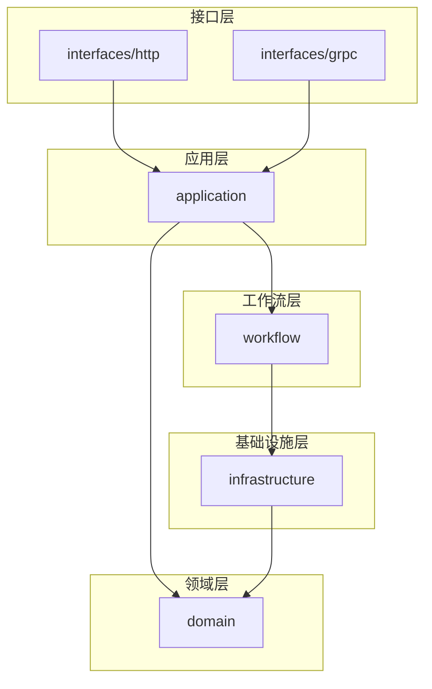

# 01 - 项目初始化与目录结构规范

> AI 小说生成后端 Go 项目标准目录结构与初始化规范

## 1. 概述

本文档定义了 AI 小说生成后端项目的标准目录结构、模块划分原则以及开发环境搭建指南。遵循 Go 社区最佳实践，采用分层微服务架构。

---

## 2. 技术栈要求

| 组件 | 版本要求 | 说明                      |
| ---- | -------- | ------------------------- |
| Go   | ≥ 1.21   | 支持泛型、slog 结构化日志 |
| Gin  | v1.9+    | HTTP 框架                 |
| Eino | latest   | 字节跳动 LLM 编排框架     |
| gRPC | v1.60+   | 内部服务通信              |
| Wire | v0.6+    | 依赖注入                  |

---

## 3. 项目目录结构

```
z-novel-ai-api/
├── cmd/                          # 应用入口
│   ├── api-gateway/              # API 网关服务
│   │   └── main.go
│   ├── story-gen-svc/            # 小说生成服务
│   │   └── main.go
│   ├── rag-retrieval-svc/        # RAG 检索服务
│   │   └── main.go
│   ├── validator-svc/            # 校验服务
│   │   └── main.go
│   ├── memory-svc/               # 记忆服务
│   │   └── main.go
│   ├── job-worker/               # 异步任务服务
│   │   └── main.go
│   ├── file-svc/                 # 文件服务
│   │   └── main.go
│   └── admin-svc/                # 管理服务
│       └── main.go
│
├── internal/                     # 私有应用代码
│   ├── domain/                   # 领域模型
│   │   ├── entity/               # 实体定义
│   │   ├── repository/           # 仓储接口
│   │   └── service/              # 领域服务
│   │
│   ├── application/              # 应用层
│   │   ├── dto/                  # 数据传输对象
│   │   ├── command/              # 命令处理
│   │   └── query/                # 查询处理
│   │
│   ├── infrastructure/           # 基础设施层
│   │   ├── persistence/          # 数据持久化
│   │   │   ├── postgres/         # PostgreSQL 实现
│   │   │   ├── redis/            # Redis 实现
│   │   │   └── milvus/           # 向量数据库实现
│   │   ├── llm/                  # LLM 客户端
│   │   ├── embedding/            # Embedding 服务
│   │   └── messaging/            # 消息队列
│   │
│   ├── interfaces/               # 接口适配层
│   │   ├── http/                 # HTTP 处理器
│   │   │   ├── handler/          # 请求处理器
│   │   │   ├── middleware/       # 中间件
│   │   │   └── router/           # 路由配置
│   │   └── grpc/                 # gRPC 服务
│   │       ├── server/           # gRPC 服务端
│   │       └── client/           # gRPC 客户端
│   │
│   ├── workflow/                 # Eino 工作流
│   │   ├── pipeline/             # Pipeline 定义
│   │   ├── node/                 # 工作流节点
│   │   └── chain/                # Chain 编排
│   │
│   └── config/                   # 配置加载
│
├── pkg/                          # 可导出的公共库
│   ├── errors/                   # 错误定义
│   ├── logger/                   # 日志封装
│   ├── tracer/                   # 追踪封装
│   ├── validator/                # 校验工具
│   └── utils/                    # 通用工具
│
├── api/                          # API 定义
│   ├── proto/                    # Protobuf 定义
│   │   ├── story/                # 故事服务
│   │   ├── retrieval/            # 检索服务
│   │   ├── validator/            # 校验服务
│   │   └── memory/               # 记忆服务
│   └── openapi/                  # OpenAPI/Swagger 定义
│
├── configs/                      # 配置文件
│   ├── config.yaml               # 主配置
│   ├── config.dev.yaml           # 开发环境
│   ├── config.staging.yaml       # 预发布环境
│   └── config.prod.yaml          # 生产环境
│
├── deployments/                  # 部署配置
│   ├── docker/                   # Dockerfile
│   ├── helm/                     # Helm Charts
│   └── k8s/                      # Kubernetes 清单
│
├── migrations/                   # 数据库迁移
│   ├── postgres/                 # PostgreSQL 迁移脚本
│   └── milvus/                   # 向量库初始化脚本
│
├── scripts/                      # 构建与工具脚本
│   ├── build.sh                  # 构建脚本
│   ├── lint.sh                   # 代码检查
│   └── gen-proto.sh              # Proto 代码生成
│
├── test/                         # 测试相关
│   ├── integration/              # 集成测试
│   ├── e2e/                      # 端到端测试
│   └── fixtures/                 # 测试数据
│
├── docs/                         # 文档目录
│
├── go.mod
├── go.sum
├── Makefile
└── README.md
```

---

## 4. 模块依赖规则



**依赖原则**：

- 上层依赖下层，禁止反向依赖
- `domain` 层不依赖任何其他层
- `infrastructure` 实现 `domain` 中定义的接口
- `workflow` 编排业务流程，依赖 `infrastructure`

---

## 5. Makefile 模板

```makefile
# Go 参数
GO := go
GOFMT := gofmt
GOLINT := golangci-lint

# 版本信息
VERSION := $(shell git describe --tags --always --dirty)
BUILD_TIME := $(shell date -u +"%Y-%m-%dT%H:%M:%SZ")
LDFLAGS := -ldflags "-X main.Version=$(VERSION) -X main.BuildTime=$(BUILD_TIME)"

# 服务列表
SERVICES := api-gateway story-gen-svc rag-retrieval-svc validator-svc memory-svc job-worker file-svc admin-svc

.PHONY: all build clean test lint proto wire

all: lint test build

## 构建
build:
	@for svc in $(SERVICES); do \
		echo "Building $$svc..."; \
		$(GO) build $(LDFLAGS) -o bin/$$svc ./cmd/$$svc; \
	done

build-%:
	$(GO) build $(LDFLAGS) -o bin/$* ./cmd/$*

## 测试
test:
	$(GO) test -race -cover ./...

test-integration:
	$(GO) test -tags=integration -race ./test/integration/...

## 代码质量
lint:
	$(GOLINT) run ./...

fmt:
	$(GOFMT) -s -w .

## 代码生成
proto:
	./scripts/gen-proto.sh

wire:
	@for svc in $(SERVICES); do \
		wire ./cmd/$$svc; \
	done

## 数据库迁移
migrate-up:
	migrate -path migrations/postgres -database "$(DATABASE_URL)" up

migrate-down:
	migrate -path migrations/postgres -database "$(DATABASE_URL)" down

## Docker
docker-build:
	@for svc in $(SERVICES); do \
		docker build -t z-novel-ai/$$svc:$(VERSION) -f deployments/docker/Dockerfile.$$svc .; \
	done

## 清理
clean:
	rm -rf bin/
	$(GO) clean -cache
```

---

## 6. 开发环境搭建

### 6.1 工具链安装

```bash
# Go 安装 (macOS)
brew install go

# 开发工具
go install github.com/golangci/golangci-lint/cmd/golangci-lint@latest
go install github.com/google/wire/cmd/wire@latest
go install github.com/cosmtrek/air@latest  # 热重载
go install google.golang.org/protobuf/cmd/protoc-gen-go@latest
go install google.golang.org/grpc/cmd/protoc-gen-go-grpc@latest

# 数据库迁移工具
brew install golang-migrate
```

### 6.2 本地服务依赖

```bash
# Docker Compose 启动依赖服务
docker compose -f deployments/docker/docker-compose.dev.yaml up -d

# 服务列表：
# - PostgreSQL: localhost:5432
# - Redis: localhost:6379
# - Milvus: localhost:19530
# - MinIO: localhost:9000
```

### 6.3 项目初始化

```bash
# 克隆项目
git clone <repo-url>
cd z-novel-ai-api

# 安装依赖
go mod download

# 生成代码
make proto
make wire

# 运行数据库迁移
make migrate-up

# 启动服务（开发模式）
air -c .air.toml
```

---

## 7. 服务启动顺序

按依赖关系启动服务：

1. **基础设施**：PostgreSQL → Redis → Milvus → MinIO
2. **核心服务**：memory-svc → rag-retrieval-svc → validator-svc → story-gen-svc
3. **入口服务**：api-gateway
4. **辅助服务**：job-worker → file-svc → admin-svc

---

## 8. 相关文档

- [02-配置管理与环境变量规范](./02-配置管理与环境变量规范.md)
- [03-日志与可观测性规范](./03-日志与可观测性规范.md)
