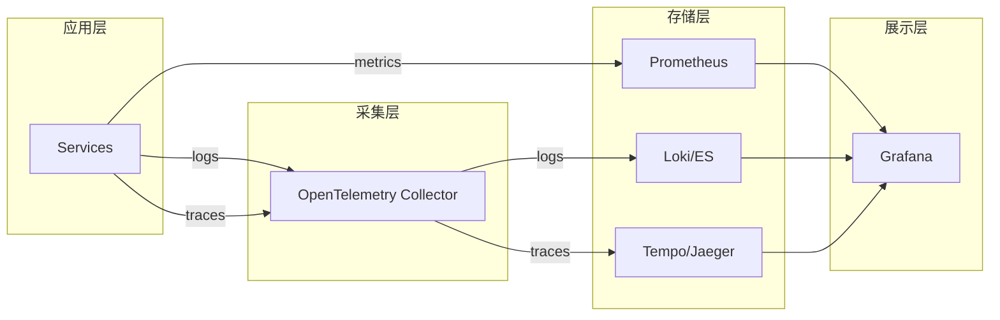

# 03 - 日志与可观测性规范

> AI 小说生成后端结构化日志、分布式追踪与指标监控规范

## 1. 概述

本文档定义了项目的可观测性三支柱（Logs、Traces、Metrics）的实现规范，确保系统具备完整的诊断、审计与性能监控能力。

---

## 2. 可观测性架构



---

## 3. 结构化日志规范

### 3.1 日志级别定义

| 级别    | 用途               | 生产环境 |
| ------- | ------------------ | -------- |
| `DEBUG` | 调试信息、变量值   | 关闭     |
| `INFO`  | 正常业务流程       | 关键路径 |
| `WARN`  | 可恢复错误、降级   | 开启     |
| `ERROR` | 业务错误、异常     | 开启     |
| `FATAL` | 致命错误、进程退出 | 开启     |

### 3.2 日志字段规范

**必填字段**：

```json
{
  "timestamp": "2026-01-02T10:00:00.123Z",
  "level": "info",
  "msg": "chapter generation completed",
  "trace_id": "abc123def456",
  "span_id": "789xyz",
  "service": "story-gen-svc",
  "tenant_id": "tenant_001",
  "project_id": "proj_abc",
  "request_id": "req_123"
}
```

**可选业务字段**：

```json
{
  "chapter_id": "chap_456",
  "user_id": "user_789",
  "duration_ms": 1234,
  "word_count": 2500,
  "model": "gpt-4o",
  "tokens_used": 8192,
  "error_code": "E1001",
  "error_detail": "validation failed"
}
```

### 3.3 日志实现

```go
// pkg/logger/logger.go
package logger

import (
    "context"
    "log/slog"
    "os"
)

var defaultLogger *slog.Logger

func Init(level string, format string) {
    var handler slog.Handler

    opts := &slog.HandlerOptions{
        Level: parseLevel(level),
        AddSource: true,
    }

    if format == "json" {
        handler = slog.NewJSONHandler(os.Stdout, opts)
    } else {
        handler = slog.NewTextHandler(os.Stdout, opts)
    }

    defaultLogger = slog.New(handler)
    slog.SetDefault(defaultLogger)
}

// 从 Context 提取追踪信息
func FromContext(ctx context.Context) *slog.Logger {
    logger := defaultLogger

    if traceID := ctx.Value("trace_id"); traceID != nil {
        logger = logger.With("trace_id", traceID)
    }
    if spanID := ctx.Value("span_id"); spanID != nil {
        logger = logger.With("span_id", spanID)
    }
    if tenantID := ctx.Value("tenant_id"); tenantID != nil {
        logger = logger.With("tenant_id", tenantID)
    }
    if projectID := ctx.Value("project_id"); projectID != nil {
        logger = logger.With("project_id", projectID)
    }
    if requestID := ctx.Value("request_id"); requestID != nil {
        logger = logger.With("request_id", requestID)
    }

    return logger
}

// 业务日志快捷方法
func Info(ctx context.Context, msg string, args ...any) {
    FromContext(ctx).Info(msg, args...)
}

func Error(ctx context.Context, msg string, err error, args ...any) {
    args = append(args, "error", err.Error())
    FromContext(ctx).Error(msg, args...)
}

func Warn(ctx context.Context, msg string, args ...any) {
    FromContext(ctx).Warn(msg, args...)
}
```

### 3.4 日志使用示例

```go
// 业务代码中使用
func (s *StoryGenService) GenerateChapter(ctx context.Context, req *GenerateRequest) error {
    log := logger.FromContext(ctx).With(
        "chapter_id", req.ChapterID,
        "operation", "generate_chapter",
    )

    log.Info("starting chapter generation",
        "outline", req.Outline,
        "word_target", req.WordTarget,
    )

    start := time.Now()

    // 业务逻辑...

    log.Info("chapter generation completed",
        "duration_ms", time.Since(start).Milliseconds(),
        "word_count", result.WordCount,
        "tokens_used", result.TokensUsed,
    )

    return nil
}
```

---

## 4. 分布式追踪规范

### 4.1 OpenTelemetry 集成

```go
// pkg/tracer/tracer.go
package tracer

import (
    "context"
    "go.opentelemetry.io/otel"
    "go.opentelemetry.io/otel/exporters/otlp/otlptrace/otlptracegrpc"
    "go.opentelemetry.io/otel/propagation"
    "go.opentelemetry.io/otel/sdk/resource"
    sdktrace "go.opentelemetry.io/otel/sdk/trace"
    semconv "go.opentelemetry.io/otel/semconv/v1.21.0"
    "go.opentelemetry.io/otel/trace"
)

var tracer trace.Tracer

func Init(ctx context.Context, serviceName, endpoint string, sampleRate float64) (func(), error) {
    // 创建 OTLP exporter
    exporter, err := otlptracegrpc.New(ctx,
        otlptracegrpc.WithEndpoint(endpoint),
        otlptracegrpc.WithInsecure(),
    )
    if err != nil {
        return nil, err
    }

    // 创建资源
    res, _ := resource.Merge(
        resource.Default(),
        resource.NewWithAttributes(
            semconv.SchemaURL,
            semconv.ServiceName(serviceName),
        ),
    )

    // 创建 TracerProvider
    tp := sdktrace.NewTracerProvider(
        sdktrace.WithBatcher(exporter),
        sdktrace.WithResource(res),
        sdktrace.WithSampler(sdktrace.TraceIDRatioBased(sampleRate)),
    )

    otel.SetTracerProvider(tp)
    otel.SetTextMapPropagator(propagation.NewCompositeTextMapPropagator(
        propagation.TraceContext{},
        propagation.Baggage{},
    ))

    tracer = tp.Tracer(serviceName)

    return func() { tp.Shutdown(ctx) }, nil
}

func StartSpan(ctx context.Context, name string, opts ...trace.SpanStartOption) (context.Context, trace.Span) {
    return tracer.Start(ctx, name, opts...)
}
```

### 4.2 Gin 中间件集成

```go
// internal/interfaces/http/middleware/trace.go
package middleware

import (
    "github.com/gin-gonic/gin"
    "go.opentelemetry.io/contrib/instrumentation/github.com/gin-gonic/gin/otelgin"
    "go.opentelemetry.io/otel/trace"
)

func TraceMiddleware(serviceName string) gin.HandlerFunc {
    return otelgin.Middleware(serviceName)
}

// 自定义扩展：注入 trace_id 到 Context
func TraceContextMiddleware() gin.HandlerFunc {
    return func(c *gin.Context) {
        span := trace.SpanFromContext(c.Request.Context())
        if span.SpanContext().IsValid() {
            traceID := span.SpanContext().TraceID().String()
            spanID := span.SpanContext().SpanID().String()

            c.Set("trace_id", traceID)
            c.Set("span_id", spanID)
            c.Header("X-Trace-ID", traceID)
        }

        c.Next()
    }
}
```

### 4.3 Span 命名规范

| 操作类型  | 命名格式                  | 示例                     |
| --------- | ------------------------- | ------------------------ |
| HTTP 入口 | `HTTP {method}`           | `HTTP POST /v1/chapters` |
| gRPC 调用 | `gRPC {service}/{method}` | `gRPC StoryGen/Generate` |
| 数据库    | `DB {operation}`          | `DB query chapters`      |
| 缓存      | `Cache {operation}`       | `Cache get entity`       |
| LLM 调用  | `LLM {provider}`          | `LLM openai generate`    |
| 业务逻辑  | `{service}.{method}`      | `StoryGen.buildContext`  |

### 4.4 Span 属性规范

```go
// 添加业务属性到 Span
span.SetAttributes(
    attribute.String("tenant_id", tenantID),
    attribute.String("project_id", projectID),
    attribute.String("chapter_id", chapterID),
    attribute.Int("word_count", wordCount),
    attribute.String("llm.model", "gpt-4o"),
    attribute.Int("llm.tokens_used", 8192),
)

// 记录错误
span.RecordError(err)
span.SetStatus(codes.Error, err.Error())
```

---

## 5. 指标监控规范

### 5.1 指标分类

| 类别 | 指标类型            | 说明                 |
| ---- | ------------------- | -------------------- |
| 系统 | Gauge               | CPU、内存、Goroutine |
| 请求 | Counter + Histogram | QPS、延迟分布        |
| 业务 | Counter + Gauge     | 生成次数、活跃用户   |
| 依赖 | Histogram           | DB/Redis/LLM 延迟    |

### 5.2 指标命名规范

```
# 格式：{namespace}_{subsystem}_{name}_{unit}

# 示例
z_novel_http_requests_total                    # 总请求数
z_novel_http_request_duration_seconds          # 请求延迟
z_novel_story_generation_total                 # 章节生成总数
z_novel_story_generation_duration_seconds      # 生成耗时
z_novel_llm_tokens_used_total                  # Token 使用量
z_novel_milvus_search_duration_seconds         # 向量检索延迟
z_novel_redis_stream_lag                       # 队列积压
z_novel_active_writers_gauge                   # 当前活跃写入者
```

### 5.3 指标实现

```go
// pkg/metrics/metrics.go
package metrics

import (
    "github.com/prometheus/client_golang/prometheus"
    "github.com/prometheus/client_golang/prometheus/promauto"
)

var (
    // HTTP 请求指标
    HTTPRequestsTotal = promauto.NewCounterVec(
        prometheus.CounterOpts{
            Namespace: "z_novel",
            Subsystem: "http",
            Name:      "requests_total",
            Help:      "Total number of HTTP requests",
        },
        []string{"method", "path", "status"},
    )

    HTTPRequestDuration = promauto.NewHistogramVec(
        prometheus.HistogramOpts{
            Namespace: "z_novel",
            Subsystem: "http",
            Name:      "request_duration_seconds",
            Help:      "HTTP request duration in seconds",
            Buckets:   []float64{.005, .01, .025, .05, .1, .25, .5, 1, 2.5, 5, 10},
        },
        []string{"method", "path"},
    )

    // 业务指标
    StoryGenerationTotal = promauto.NewCounterVec(
        prometheus.CounterOpts{
            Namespace: "z_novel",
            Subsystem: "story",
            Name:      "generation_total",
            Help:      "Total number of story generations",
        },
        []string{"tenant_id", "status"},
    )

    StoryGenerationDuration = promauto.NewHistogramVec(
        prometheus.HistogramOpts{
            Namespace: "z_novel",
            Subsystem: "story",
            Name:      "generation_duration_seconds",
            Help:      "Story generation duration in seconds",
            Buckets:   []float64{1, 5, 10, 30, 60, 120, 300},
        },
        []string{"tenant_id"},
    )

    // LLM 指标
    LLMTokensUsed = promauto.NewCounterVec(
        prometheus.CounterOpts{
            Namespace: "z_novel",
            Subsystem: "llm",
            Name:      "tokens_used_total",
            Help:      "Total tokens used for LLM calls",
        },
        []string{"provider", "model", "type"}, // type: prompt/completion
    )

    LLMCallDuration = promauto.NewHistogramVec(
        prometheus.HistogramOpts{
            Namespace: "z_novel",
            Subsystem: "llm",
            Name:      "call_duration_seconds",
            Help:      "LLM call duration in seconds",
            Buckets:   []float64{1, 5, 10, 30, 60, 120},
        },
        []string{"provider", "model"},
    )

    // 向量检索指标
    MilvusSearchDuration = promauto.NewHistogramVec(
        prometheus.HistogramOpts{
            Namespace: "z_novel",
            Subsystem: "milvus",
            Name:      "search_duration_seconds",
            Help:      "Milvus search duration in seconds",
            Buckets:   []float64{.01, .05, .1, .25, .5, 1},
        },
        []string{"collection"},
    )

    // 队列指标
    RedisStreamLag = promauto.NewGaugeVec(
        prometheus.GaugeOpts{
            Namespace: "z_novel",
            Subsystem: "redis",
            Name:      "stream_lag",
            Help:      "Redis stream consumer lag",
        },
        []string{"stream", "consumer_group"},
    )
)
```

### 5.4 指标中间件

```go
// internal/interfaces/http/middleware/metrics.go
package middleware

import (
    "strconv"
    "time"
    "github.com/gin-gonic/gin"
    "z-novel-ai-api/pkg/metrics"
)

func MetricsMiddleware() gin.HandlerFunc {
    return func(c *gin.Context) {
        start := time.Now()
        path := c.FullPath()
        method := c.Request.Method

        c.Next()

        status := strconv.Itoa(c.Writer.Status())
        duration := time.Since(start).Seconds()

        metrics.HTTPRequestsTotal.WithLabelValues(method, path, status).Inc()
        metrics.HTTPRequestDuration.WithLabelValues(method, path).Observe(duration)
    }
}
```

---

## 6. Grafana 看板模板

### 6.1 系统健康看板

| 面板       | 查询                                                                                           | 告警阈值 |
| ---------- | ---------------------------------------------------------------------------------------------- | -------- |
| 请求 QPS   | `rate(z_novel_http_requests_total[5m])`                                                        | > 1000   |
| P99 延迟   | `histogram_quantile(0.99, rate(z_novel_http_request_duration_seconds_bucket[5m]))`             | > 2s     |
| 错误率     | `rate(z_novel_http_requests_total{status=~"5.."}[5m]) / rate(z_novel_http_requests_total[5m])` | > 1%     |
| Goroutines | `go_goroutines`                                                                                | > 10000  |

### 6.2 业务监控看板

| 面板           | 查询                                                                                                    |
| -------------- | ------------------------------------------------------------------------------------------------------- |
| 章节生成速率   | `rate(z_novel_story_generation_total[5m])`                                                              |
| 生成成功率     | `rate(z_novel_story_generation_total{status="success"}[5m]) / rate(z_novel_story_generation_total[5m])` |
| Token 消耗趋势 | `increase(z_novel_llm_tokens_used_total[1h])`                                                           |
| 向量检索 P99   | `histogram_quantile(0.99, rate(z_novel_milvus_search_duration_seconds_bucket[5m]))`                     |

---

## 7. 告警规则

```yaml
# prometheus/alerts/z-novel.yaml
groups:
  - name: z-novel-alerts
    rules:
      - alert: HighErrorRate
        expr: |
          rate(z_novel_http_requests_total{status=~"5.."}[5m]) 
          / rate(z_novel_http_requests_total[5m]) > 0.01
        for: 5m
        labels:
          severity: critical
        annotations:
          summary: "High error rate detected"
          description: "Error rate is {{ $value | humanizePercentage }}"

      - alert: HighLatency
        expr: |
          histogram_quantile(0.99, rate(z_novel_http_request_duration_seconds_bucket[5m])) > 2
        for: 5m
        labels:
          severity: warning
        annotations:
          summary: "High request latency"
          description: "P99 latency is {{ $value }}s"

      - alert: LLMTimeout
        expr: |
          rate(z_novel_llm_call_duration_seconds_count{le="+Inf"}[5m]) 
          - rate(z_novel_llm_call_duration_seconds_count{le="60"}[5m]) > 0.1
        for: 5m
        labels:
          severity: warning
        annotations:
          summary: "LLM calls timing out"

      - alert: QueueBacklog
        expr: z_novel_redis_stream_lag > 1000
        for: 10m
        labels:
          severity: warning
        annotations:
          summary: "Redis stream backlog growing"
          description: "Stream {{ $labels.stream }} has {{ $value }} pending messages"
```

---

## 8. 相关文档

- [01-项目初始化与目录结构规范](./01-项目初始化与目录结构规范.md)
- [02-配置管理与环境变量规范](./02-配置管理与环境变量规范.md)
- [18-Kubernetes 部署与运维规范](./18-Kubernetes部署与运维规范.md)
