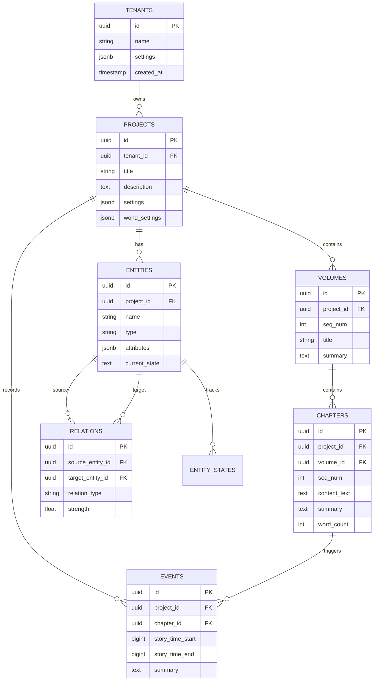

# 04 - PostgreSQL 数据库设计详细文档

> AI 小说生成后端关系型数据库完整设计与实现规范

## 1. 概述

本文档定义了项目的 PostgreSQL 数据库设计，包括完整的表结构、索引策略、分区方案、Row-Level Security (RLS) 实现以及数据库迁移流程。

---

## 2. 数据库架构总览



---

## 3. 完整 DDL 脚本

### 3.1 租户表

```sql
-- 租户管理
CREATE TABLE tenants (
    id UUID PRIMARY KEY DEFAULT gen_random_uuid(),
    name VARCHAR(128) NOT NULL,
    slug VARCHAR(64) NOT NULL UNIQUE,
    settings JSONB DEFAULT '{}',
    quota JSONB DEFAULT '{
        "max_projects": 100,
        "max_chapters_per_project": 1000,
        "max_tokens_per_day": 1000000
    }',
    status VARCHAR(32) DEFAULT 'active',
    created_at TIMESTAMPTZ DEFAULT NOW(),
    updated_at TIMESTAMPTZ DEFAULT NOW()
);

CREATE INDEX idx_tenants_slug ON tenants(slug);
CREATE INDEX idx_tenants_status ON tenants(status);
```

### 3.2 用户表

```sql
-- 用户账户
CREATE TABLE users (
    id UUID PRIMARY KEY DEFAULT gen_random_uuid(),
    tenant_id UUID NOT NULL REFERENCES tenants(id) ON DELETE CASCADE,
    external_id VARCHAR(128),                      -- OAuth 外部 ID
    email VARCHAR(255) NOT NULL,
    name VARCHAR(128),
    avatar_url TEXT,
    role VARCHAR(32) DEFAULT 'member',             -- admin, member, viewer
    settings JSONB DEFAULT '{}',
    last_login_at TIMESTAMPTZ,
    created_at TIMESTAMPTZ DEFAULT NOW(),
    updated_at TIMESTAMPTZ DEFAULT NOW(),
    UNIQUE(tenant_id, email)
);

CREATE INDEX idx_users_tenant ON users(tenant_id);
CREATE INDEX idx_users_email ON users(email);
CREATE INDEX idx_users_external_id ON users(external_id);
```

### 3.3 项目表

```sql
-- 小说项目
CREATE TABLE projects (
    id UUID PRIMARY KEY DEFAULT gen_random_uuid(),
    tenant_id UUID NOT NULL REFERENCES tenants(id) ON DELETE CASCADE,
    owner_id UUID REFERENCES users(id),
    title VARCHAR(255) NOT NULL,
    description TEXT,
    genre VARCHAR(64),                             -- 题材类型
    target_word_count INT,                         -- 目标字数
    current_word_count INT DEFAULT 0,
    settings JSONB DEFAULT '{}',
    world_settings JSONB DEFAULT '{
        "time_system": "linear",
        "calendar": "custom",
        "locations": []
    }',
    status VARCHAR(32) DEFAULT 'draft',            -- draft, writing, completed, archived
    created_at TIMESTAMPTZ DEFAULT NOW(),
    updated_at TIMESTAMPTZ DEFAULT NOW()
);

CREATE INDEX idx_projects_tenant ON projects(tenant_id);
CREATE INDEX idx_projects_owner ON projects(owner_id);
CREATE INDEX idx_projects_status ON projects(status);
CREATE INDEX idx_projects_genre ON projects(genre);
```

### 3.4 卷表

```sql
-- 卷/部
CREATE TABLE volumes (
    id UUID PRIMARY KEY DEFAULT gen_random_uuid(),
    project_id UUID NOT NULL REFERENCES projects(id) ON DELETE CASCADE,
    seq_num INT NOT NULL,
    title VARCHAR(255),
    description TEXT,
    summary TEXT,
    word_count INT DEFAULT 0,
    status VARCHAR(32) DEFAULT 'draft',
    created_at TIMESTAMPTZ DEFAULT NOW(),
    updated_at TIMESTAMPTZ DEFAULT NOW(),
    UNIQUE(project_id, seq_num)
);

CREATE INDEX idx_volumes_project_seq ON volumes(project_id, seq_num);
```

### 3.5 章节表

```sql
-- 章节
CREATE TABLE chapters (
    id UUID PRIMARY KEY DEFAULT gen_random_uuid(),
    project_id UUID NOT NULL REFERENCES projects(id) ON DELETE CASCADE,
    volume_id UUID REFERENCES volumes(id) ON DELETE SET NULL,
    seq_num INT NOT NULL,
    title VARCHAR(255),
    outline TEXT,                                  -- 大纲
    content_text TEXT,                             -- 正文内容
    summary TEXT,                                  -- AI 生成摘要
    notes TEXT,                                    -- 作者备注
    story_time_start BIGINT,                       -- 故事时间线起点
    story_time_end BIGINT,                         -- 故事时间线终点
    word_count INT DEFAULT 0,
    status VARCHAR(32) DEFAULT 'draft',            -- draft, generating, review, completed
    generation_metadata JSONB,                     -- 生成元数据（模型、Token等）
    version INT DEFAULT 1,
    created_at TIMESTAMPTZ DEFAULT NOW(),
    updated_at TIMESTAMPTZ DEFAULT NOW(),
    UNIQUE(project_id, volume_id, seq_num)
);

CREATE INDEX idx_chapters_project_seq ON chapters(project_id, seq_num);
CREATE INDEX idx_chapters_volume ON chapters(volume_id);
CREATE INDEX idx_chapters_status ON chapters(status);
CREATE INDEX idx_chapters_story_time ON chapters(project_id, story_time_start, story_time_end);
```

### 3.6 实体表（角色/物品/地点）

```sql
-- 实体（角色、物品、地点等）
CREATE TABLE entities (
    id UUID PRIMARY KEY DEFAULT gen_random_uuid(),
    project_id UUID NOT NULL REFERENCES projects(id) ON DELETE CASCADE,
    name VARCHAR(128) NOT NULL,
    aliases TEXT[],                                -- 别名列表
    type VARCHAR(32) NOT NULL,                     -- character, item, location, organization, concept
    description TEXT,
    attributes JSONB DEFAULT '{}',                 -- 属性（年龄、性别、能力等）
    current_state TEXT,                            -- 当前状态描述
    first_appear_chapter_id UUID REFERENCES chapters(id),
    last_appear_chapter_id UUID REFERENCES chapters(id),
    appear_count INT DEFAULT 0,
    importance VARCHAR(16) DEFAULT 'secondary',    -- protagonist, major, secondary, minor
    vector_id VARCHAR(64),                         -- 向量库 ID
    created_at TIMESTAMPTZ DEFAULT NOW(),
    updated_at TIMESTAMPTZ DEFAULT NOW(),
    UNIQUE(project_id, name)
);

CREATE INDEX idx_entities_project ON entities(project_id);
CREATE INDEX idx_entities_type ON entities(project_id, type);
CREATE INDEX idx_entities_name ON entities(project_id, name);
CREATE INDEX idx_entities_importance ON entities(project_id, importance);
CREATE INDEX idx_entities_attributes ON entities USING GIN (attributes);
CREATE INDEX idx_entities_aliases ON entities USING GIN (aliases);
```

### 3.7 实体状态历史表

```sql
-- 实体状态变更历史
CREATE TABLE entity_states (
    id UUID PRIMARY KEY DEFAULT gen_random_uuid(),
    entity_id UUID NOT NULL REFERENCES entities(id) ON DELETE CASCADE,
    chapter_id UUID REFERENCES chapters(id),
    story_time BIGINT,                             -- 故事时间点
    state_description TEXT NOT NULL,
    attribute_changes JSONB,                       -- 属性变更
    event_summary TEXT,                            -- 触发事件摘要
    created_at TIMESTAMPTZ DEFAULT NOW()
);

CREATE INDEX idx_entity_states_entity ON entity_states(entity_id);
CREATE INDEX idx_entity_states_chapter ON entity_states(chapter_id);
CREATE INDEX idx_entity_states_time ON entity_states(entity_id, story_time);
```

### 3.8 关系表

```sql
-- 实体关系
CREATE TABLE relations (
    id UUID PRIMARY KEY DEFAULT gen_random_uuid(),
    project_id UUID NOT NULL REFERENCES projects(id) ON DELETE CASCADE,
    source_entity_id UUID NOT NULL REFERENCES entities(id) ON DELETE CASCADE,
    target_entity_id UUID NOT NULL REFERENCES entities(id) ON DELETE CASCADE,
    relation_type VARCHAR(64) NOT NULL,            -- friend, enemy, family, lover, subordinate, etc.
    strength FLOAT DEFAULT 0.5,                    -- 关系强度 0-1
    description TEXT,
    attributes JSONB DEFAULT '{}',
    first_chapter_id UUID REFERENCES chapters(id),
    last_chapter_id UUID REFERENCES chapters(id),
    created_at TIMESTAMPTZ DEFAULT NOW(),
    updated_at TIMESTAMPTZ DEFAULT NOW(),
    UNIQUE(project_id, source_entity_id, target_entity_id, relation_type)
);

CREATE INDEX idx_relations_project ON relations(project_id);
CREATE INDEX idx_relations_source ON relations(source_entity_id);
CREATE INDEX idx_relations_target ON relations(target_entity_id);
CREATE INDEX idx_relations_type ON relations(project_id, relation_type);
```

### 3.9 事件表

```sql
-- 故事事件（时间轴）
CREATE TABLE events (
    id UUID PRIMARY KEY DEFAULT gen_random_uuid(),
    project_id UUID NOT NULL REFERENCES projects(id) ON DELETE CASCADE,
    chapter_id UUID REFERENCES chapters(id) ON DELETE SET NULL,
    story_time_start BIGINT NOT NULL,
    story_time_end BIGINT,
    event_type VARCHAR(64),                        -- plot, dialogue, action, description
    summary TEXT NOT NULL,
    description TEXT,
    involved_entities UUID[],                      -- 涉及的实体 ID 列表
    location_id UUID REFERENCES entities(id),
    importance VARCHAR(16) DEFAULT 'normal',       -- critical, major, normal, minor
    tags TEXT[],
    vector_id VARCHAR(64),                         -- 向量库 ID
    created_at TIMESTAMPTZ DEFAULT NOW()
);

CREATE INDEX idx_events_project ON events(project_id);
CREATE INDEX idx_events_chapter ON events(chapter_id);
CREATE INDEX idx_events_story_time ON events(project_id, story_time_start);
CREATE INDEX idx_events_type ON events(project_id, event_type);
CREATE INDEX idx_events_involved ON events USING GIN (involved_entities);
CREATE INDEX idx_events_tags ON events USING GIN (tags);
```

### 3.10 生成任务表

```sql
-- 生成任务记录
CREATE TABLE generation_jobs (
    id UUID PRIMARY KEY DEFAULT gen_random_uuid(),
    tenant_id UUID NOT NULL REFERENCES tenants(id),
    project_id UUID NOT NULL REFERENCES projects(id),
    chapter_id UUID REFERENCES chapters(id),
    job_type VARCHAR(32) NOT NULL,                 -- chapter_gen, summary, entity_extract
    status VARCHAR(32) DEFAULT 'pending',          -- pending, running, completed, failed, cancelled
    priority INT DEFAULT 5,
    input_params JSONB NOT NULL,
    output_result JSONB,
    error_message TEXT,
    llm_provider VARCHAR(32),
    llm_model VARCHAR(64),
    tokens_prompt INT,
    tokens_completion INT,
    duration_ms INT,
    retry_count INT DEFAULT 0,
    idempotency_key VARCHAR(128) UNIQUE,
    created_at TIMESTAMPTZ DEFAULT NOW(),
    started_at TIMESTAMPTZ,
    completed_at TIMESTAMPTZ
);

CREATE INDEX idx_jobs_tenant ON generation_jobs(tenant_id);
CREATE INDEX idx_jobs_project ON generation_jobs(project_id);
CREATE INDEX idx_jobs_status ON generation_jobs(status);
CREATE INDEX idx_jobs_created ON generation_jobs(created_at);
CREATE INDEX idx_jobs_idempotency ON generation_jobs(idempotency_key);
```

### 3.11 审计日志表

```sql
-- 审计日志
CREATE TABLE audit_logs (
    id UUID PRIMARY KEY DEFAULT gen_random_uuid(),
    tenant_id UUID NOT NULL,
    user_id UUID,
    action VARCHAR(64) NOT NULL,                   -- create, update, delete, generate, export
    resource_type VARCHAR(64) NOT NULL,            -- project, chapter, entity, etc.
    resource_id UUID,
    request_id VARCHAR(64),
    trace_id VARCHAR(64),
    ip_address INET,
    user_agent TEXT,
    changes JSONB,                                 -- 变更内容
    metadata JSONB,
    created_at TIMESTAMPTZ DEFAULT NOW()
) PARTITION BY RANGE (created_at);                 -- 按时间分区

-- 创建月度分区
CREATE TABLE audit_logs_2026_01 PARTITION OF audit_logs
    FOR VALUES FROM ('2026-01-01') TO ('2026-02-01');
CREATE TABLE audit_logs_2026_02 PARTITION OF audit_logs
    FOR VALUES FROM ('2026-02-01') TO ('2026-03-01');

CREATE INDEX idx_audit_tenant ON audit_logs(tenant_id, created_at);
CREATE INDEX idx_audit_user ON audit_logs(user_id, created_at);
CREATE INDEX idx_audit_resource ON audit_logs(resource_type, resource_id);
CREATE INDEX idx_audit_action ON audit_logs(action, created_at);
```

---

## 4. Row-Level Security (RLS)

### 4.1 启用 RLS

```sql
-- 启用 RLS 的表
ALTER TABLE projects ENABLE ROW LEVEL SECURITY;
ALTER TABLE volumes ENABLE ROW LEVEL SECURITY;
ALTER TABLE chapters ENABLE ROW LEVEL SECURITY;
ALTER TABLE entities ENABLE ROW LEVEL SECURITY;
ALTER TABLE relations ENABLE ROW LEVEL SECURITY;
ALTER TABLE events ENABLE ROW LEVEL SECURITY;
ALTER TABLE entity_states ENABLE ROW LEVEL SECURITY;
ALTER TABLE generation_jobs ENABLE ROW LEVEL SECURITY;
```

### 4.2 RLS 策略

```sql
-- 设置当前租户上下文
CREATE OR REPLACE FUNCTION set_tenant_id(tenant UUID) RETURNS VOID AS $$
BEGIN
    PERFORM set_config('app.current_tenant_id', tenant::TEXT, TRUE);
END;
$$ LANGUAGE plpgsql;

-- 获取当前租户
CREATE OR REPLACE FUNCTION current_tenant_id() RETURNS UUID AS $$
BEGIN
    RETURN current_setting('app.current_tenant_id', TRUE)::UUID;
END;
$$ LANGUAGE plpgsql;

-- 项目表策略
CREATE POLICY tenant_isolation_policy ON projects
    USING (tenant_id = current_tenant_id());

CREATE POLICY tenant_insert_policy ON projects
    FOR INSERT WITH CHECK (tenant_id = current_tenant_id());

-- 章节表策略（通过 project_id 关联）
CREATE POLICY tenant_isolation_policy ON chapters
    USING (project_id IN (
        SELECT id FROM projects WHERE tenant_id = current_tenant_id()
    ));

-- 实体表策略
CREATE POLICY tenant_isolation_policy ON entities
    USING (project_id IN (
        SELECT id FROM projects WHERE tenant_id = current_tenant_id()
    ));

-- 关系表策略
CREATE POLICY tenant_isolation_policy ON relations
    USING (project_id IN (
        SELECT id FROM projects WHERE tenant_id = current_tenant_id()
    ));

-- 事件表策略
CREATE POLICY tenant_isolation_policy ON events
    USING (project_id IN (
        SELECT id FROM projects WHERE tenant_id = current_tenant_id()
    ));

-- 生成任务策略
CREATE POLICY tenant_isolation_policy ON generation_jobs
    USING (tenant_id = current_tenant_id());
```

### 4.3 应用层 RLS 设置

```go
// internal/infrastructure/persistence/postgres/tenant.go
package postgres

import (
    "context"
    "database/sql"
)

func SetTenantContext(ctx context.Context, db *sql.DB, tenantID string) error {
    _, err := db.ExecContext(ctx, "SELECT set_tenant_id($1)", tenantID)
    return err
}

// 在每个请求开始时设置租户上下文
func (r *Repository) WithTenant(ctx context.Context, tenantID string) error {
    return SetTenantContext(ctx, r.db, tenantID)
}
```

---

## 5. 索引策略详解

### 5.1 索引类型选择

| 场景       | 索引类型       | 示例                           |
| ---------- | -------------- | ------------------------------ |
| 等值查询   | BTREE          | `tenant_id`, `status`          |
| 范围查询   | BTREE          | `created_at`, `story_time`     |
| JSONB 属性 | GIN            | `attributes`, `settings`       |
| 数组字段   | GIN            | `aliases`, `involved_entities` |
| 全文搜索   | GIN + tsvector | `content_text`                 |

### 5.2 复合索引建议

```sql
-- 高频查询场景的复合索引
CREATE INDEX idx_chapters_project_status_seq
    ON chapters(project_id, status, seq_num);

CREATE INDEX idx_events_project_time_type
    ON events(project_id, story_time_start, event_type);

CREATE INDEX idx_entities_project_type_importance
    ON entities(project_id, type, importance);
```

---

## 6. 数据库迁移

### 6.1 迁移工具

使用 `golang-migrate` 管理迁移：

```bash
# 安装
brew install golang-migrate

# 创建迁移
migrate create -ext sql -dir migrations/postgres -seq create_initial_schema

# 执行迁移
migrate -path migrations/postgres -database "${DATABASE_URL}" up

# 回滚
migrate -path migrations/postgres -database "${DATABASE_URL}" down 1
```

### 6.2 迁移文件结构

```
migrations/postgres/
├── 000001_create_tenants.up.sql
├── 000001_create_tenants.down.sql
├── 000002_create_users.up.sql
├── 000002_create_users.down.sql
├── 000003_create_projects.up.sql
├── 000003_create_projects.down.sql
...
```

---

## 7. 备份与恢复

### 7.1 备份策略

```bash
# 全量备份（每日）
pg_dump -Fc -f backup_$(date +%Y%m%d).dump ${DATABASE_URL}

# 增量备份（WAL 归档）
archive_command = 'cp %p /backup/wal/%f'
```

### 7.2 恢复流程

```bash
# 恢复全量备份
pg_restore -d ${DATABASE_URL} backup_20260102.dump

# 时间点恢复 (PITR)
recovery_target_time = '2026-01-02 10:00:00'
```

---

## 8. 相关文档

- [01-项目初始化与目录结构规范](./01-项目初始化与目录结构规范.md)
- [05-Redis 缓存与消息队列规范](./05-Redis缓存与消息队列规范.md)
- [19-安全与多租户隔离设计](./19-安全与多租户隔离设计.md)
