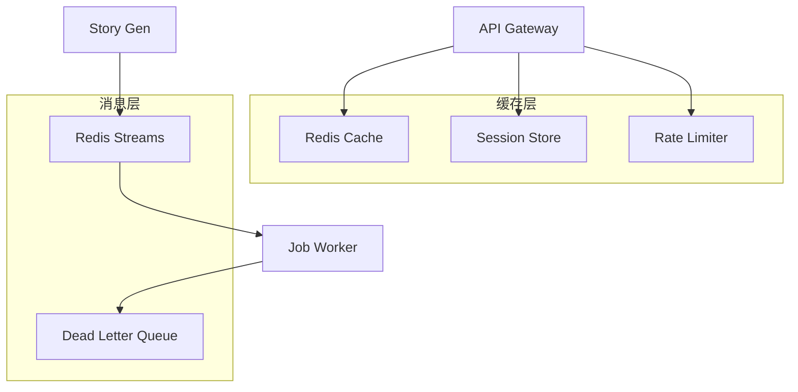
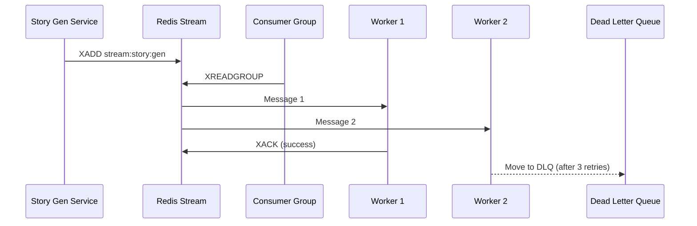

# 05 - Redis 缓存与消息队列规范

> AI 小说生成后端 Redis 缓存策略与 Redis Streams 消息队列设计规范

## 1. 概述

本文档定义了项目中 Redis 的两大核心用途：**高性能缓存**和**异步消息队列**。包括键命名规范、缓存策略、Redis Streams 消息模型以及死信队列处理。

---

## 2. Redis 架构



---

## 3. 键命名规范

### 3.1 命名格式

```
{namespace}:{tenant_id}:{resource}:{identifier}:{suffix}
```

### 3.2 命名示例

| 用途       | 键格式                                    | 示例                          |
| ---------- | ----------------------------------------- | ----------------------------- |
| 实体缓存   | `entity:{tenant}:{project}:{entity_id}`   | `entity:t001:p123:e456`       |
| 章节摘要   | `summary:{tenant}:{project}:{chapter_id}` | `summary:t001:p123:c789`      |
| 检索上下文 | `ctx:{tenant}:{project}:{chapter_id}`     | `ctx:t001:p123:c789`          |
| 会话状态   | `session:{user_id}`                       | `session:u123`                |
| 限流计数   | `ratelimit:{tenant}:{endpoint}`           | `ratelimit:t001:/v1/chapters` |
| 幂等键     | `idempotent:{key}`                        | `idempotent:abc123`           |
| 分布式锁   | `lock:{resource}:{id}`                    | `lock:chapter:c789`           |

### 3.3 消息流命名

| 流类型     | 键格式                  | 示例            |
| ---------- | ----------------------- | --------------- |
| 生成任务流 | `stream:story:gen`      | -               |
| 记忆更新流 | `stream:memory:update`  | -               |
| 审计日志流 | `stream:audit:log`      | -               |
| 死信队列   | `dlq:{original_stream}` | `dlq:story:gen` |

---

## 4. 缓存策略

### 4.1 缓存分层

| 层级      | 数据类型               | TTL   | 策略     |
| --------- | ---------------------- | ----- | -------- |
| L1 热数据 | 活跃实体、当前章节摘要 | 30min | LRU 淘汰 |
| L2 温数据 | 历史章节摘要、关系图谱 | 2h    | 按需加载 |
| L3 冷数据 | 项目设定、世界观       | 24h   | 启动预热 |

### 4.2 缓存模式

#### Read-Through 模式

```go
// pkg/cache/cache.go
package cache

import (
    "context"
    "encoding/json"
    "time"
    "github.com/redis/go-redis/v9"
)

type Cache struct {
    client *redis.Client
}

func (c *Cache) GetOrLoad(ctx context.Context, key string, ttl time.Duration, loader func() (any, error)) ([]byte, error) {
    // 尝试从缓存获取
    val, err := c.client.Get(ctx, key).Bytes()
    if err == nil {
        return val, nil
    }

    if err != redis.Nil {
        return nil, err
    }

    // 缓存未命中，加载数据
    data, err := loader()
    if err != nil {
        return nil, err
    }

    // 序列化并缓存
    bytes, err := json.Marshal(data)
    if err != nil {
        return nil, err
    }

    c.client.Set(ctx, key, bytes, ttl)
    return bytes, nil
}
```

#### Write-Through 模式

```go
func (c *Cache) SetWithDB(ctx context.Context, key string, value any, ttl time.Duration, dbWriter func() error) error {
    // 先写数据库
    if err := dbWriter(); err != nil {
        return err
    }

    // 再更新缓存
    bytes, err := json.Marshal(value)
    if err != nil {
        return err
    }

    return c.client.Set(ctx, key, bytes, ttl).Err()
}
```

#### Cache-Aside 失效

```go
func (c *Cache) InvalidatePattern(ctx context.Context, pattern string) error {
    iter := c.client.Scan(ctx, 0, pattern, 0).Iterator()
    var keys []string
    for iter.Next(ctx) {
        keys = append(keys, iter.Val())
    }

    if len(keys) > 0 {
        return c.client.Del(ctx, keys...).Err()
    }
    return nil
}

// 示例：使实体相关缓存失效
func (c *Cache) InvalidateEntity(ctx context.Context, tenantID, projectID, entityID string) error {
    pattern := fmt.Sprintf("entity:%s:%s:%s*", tenantID, projectID, entityID)
    return c.InvalidatePattern(ctx, pattern)
}
```

### 4.3 防缓存击穿

```go
// 使用 singleflight 防止缓存击穿
import "golang.org/x/sync/singleflight"

var group singleflight.Group

func (c *Cache) GetOrLoadSafe(ctx context.Context, key string, ttl time.Duration, loader func() (any, error)) ([]byte, error) {
    val, err := c.client.Get(ctx, key).Bytes()
    if err == nil {
        return val, nil
    }

    // 使用 singleflight 合并并发请求
    result, err, _ := group.Do(key, func() (interface{}, error) {
        // 再次检查缓存（可能已被其他请求填充）
        val, err := c.client.Get(ctx, key).Bytes()
        if err == nil {
            return val, nil
        }

        data, err := loader()
        if err != nil {
            return nil, err
        }

        bytes, _ := json.Marshal(data)
        c.client.Set(ctx, key, bytes, ttl)
        return bytes, nil
    })

    if err != nil {
        return nil, err
    }
    return result.([]byte), nil
}
```

---

## 5. Redis Streams 消息队列

### 5.1 Stream 设计



### 5.2 生产者实现

```go
// internal/infrastructure/messaging/producer.go
package messaging

import (
    "context"
    "encoding/json"
    "github.com/redis/go-redis/v9"
)

type Producer struct {
    client *redis.Client
}

type Message struct {
    ID        string          `json:"id"`
    Type      string          `json:"type"`
    TenantID  string          `json:"tenant_id"`
    ProjectID string          `json:"project_id"`
    Payload   json.RawMessage `json:"payload"`
    Metadata  map[string]string `json:"metadata"`
}

func (p *Producer) Publish(ctx context.Context, stream string, msg *Message) (string, error) {
    data, err := json.Marshal(msg)
    if err != nil {
        return "", err
    }

    return p.client.XAdd(ctx, &redis.XAddArgs{
        Stream: stream,
        MaxLen: 100000,      // 限制 Stream 长度
        Approx: true,        // 近似裁剪
        Values: map[string]interface{}{
            "data": data,
        },
    }).Result()
}

// 发布生成任务
func (p *Producer) PublishGenJob(ctx context.Context, job *GenerationJob) (string, error) {
    payload, _ := json.Marshal(job)
    msg := &Message{
        ID:        job.ID,
        Type:      "chapter_gen",
        TenantID:  job.TenantID,
        ProjectID: job.ProjectID,
        Payload:   payload,
        Metadata: map[string]string{
            "priority":       fmt.Sprintf("%d", job.Priority),
            "idempotency_key": job.IdempotencyKey,
        },
    }
    return p.Publish(ctx, "stream:story:gen", msg)
}
```

### 5.3 消费者实现

```go
// internal/infrastructure/messaging/consumer.go
package messaging

import (
    "context"
    "time"
    "github.com/redis/go-redis/v9"
)

type Consumer struct {
    client        *redis.Client
    stream        string
    group         string
    consumerName  string
    blockTimeout  time.Duration
    retryLimit    int
    retryBackoff  BackoffConfig
}

type BackoffConfig struct {
    Initial    time.Duration
    Max        time.Duration
    Multiplier float64
}

func (c *Consumer) Start(ctx context.Context, handler func(context.Context, *Message) error) error {
    // 确保消费者组存在
    c.client.XGroupCreateMkStream(ctx, c.stream, c.group, "0")

    for {
        select {
        case <-ctx.Done():
            return ctx.Err()
        default:
        }

        // 读取消息
        streams, err := c.client.XReadGroup(ctx, &redis.XReadGroupArgs{
            Group:    c.group,
            Consumer: c.consumerName,
            Streams:  []string{c.stream, ">"},
            Count:    10,
            Block:    c.blockTimeout,
        }).Result()

        if err != nil {
            if err == redis.Nil {
                continue
            }
            return err
        }

        for _, stream := range streams {
            for _, xmsg := range stream.Messages {
                c.processMessage(ctx, xmsg, handler)
            }
        }
    }
}

func (c *Consumer) processMessage(ctx context.Context, xmsg redis.XMessage, handler func(context.Context, *Message) error) {
    var msg Message
    if err := json.Unmarshal([]byte(xmsg.Values["data"].(string)), &msg); err != nil {
        c.ack(ctx, xmsg.ID) // 无法解析，直接确认
        return
    }

    if err := handler(ctx, &msg); err != nil {
        c.handleFailure(ctx, xmsg, &msg, err)
        return
    }

    c.ack(ctx, xmsg.ID)
}

func (c *Consumer) ack(ctx context.Context, id string) {
    c.client.XAck(ctx, c.stream, c.group, id)
}

func (c *Consumer) handleFailure(ctx context.Context, xmsg redis.XMessage, msg *Message, err error) {
    // 获取重试次数
    retryCount := c.getRetryCount(ctx, xmsg.ID)

    if retryCount >= c.retryLimit {
        // 移入死信队列
        c.moveToDLQ(ctx, msg, err)
        c.ack(ctx, xmsg.ID)
        return
    }

    // 计算退避时间
    backoff := c.calculateBackoff(retryCount)

    // 延迟重试（使用 XCLAIM 重新分配）
    time.AfterFunc(backoff, func() {
        c.client.XClaim(ctx, &redis.XClaimArgs{
            Stream:   c.stream,
            Group:    c.group,
            Consumer: c.consumerName,
            MinIdle:  0,
            Messages: []string{xmsg.ID},
        })
    })
}

func (c *Consumer) moveToDLQ(ctx context.Context, msg *Message, err error) {
    dlqStream := "dlq:" + c.stream
    dlqMsg := map[string]interface{}{
        "original_stream": c.stream,
        "data":            msg,
        "error":           err.Error(),
        "failed_at":       time.Now().Unix(),
    }

    data, _ := json.Marshal(dlqMsg)
    c.client.XAdd(ctx, &redis.XAddArgs{
        Stream: dlqStream,
        Values: map[string]interface{}{"data": data},
    })
}

func (c *Consumer) calculateBackoff(retryCount int) time.Duration {
    backoff := c.retryBackoff.Initial
    for i := 0; i < retryCount; i++ {
        backoff = time.Duration(float64(backoff) * c.retryBackoff.Multiplier)
        if backoff > c.retryBackoff.Max {
            backoff = c.retryBackoff.Max
            break
        }
    }
    return backoff
}
```

---

## 6. Stream 配置

### 6.1 流定义

| Stream                 | Consumer Group  | 用途         | 保留策略 |
| ---------------------- | --------------- | ------------ | -------- |
| `stream:story:gen`     | `cg-gen-worker` | 章节生成任务 | 100K 条  |
| `stream:memory:update` | `cg-mem-writer` | 记忆回写任务 | 100K 条  |
| `stream:audit:log`     | `cg-archiver`   | 审计日志归档 | 10K 条   |

### 6.2 死信队列处理

```go
// 死信队列监控与告警
func (c *Consumer) MonitorDLQ(ctx context.Context) {
    ticker := time.NewTicker(1 * time.Minute)
    defer ticker.Stop()

    for {
        select {
        case <-ctx.Done():
            return
        case <-ticker.C:
            dlqStream := "dlq:" + c.stream
            info, _ := c.client.XInfoStream(ctx, dlqStream).Result()

            if info.Length > 100 {
                // 触发告警
                log.Warn(ctx, "DLQ has pending messages",
                    "stream", dlqStream,
                    "count", info.Length,
                )
            }
        }
    }
}
```

---

## 7. 限流器实现

```go
// pkg/ratelimit/limiter.go
package ratelimit

import (
    "context"
    "time"
    "github.com/redis/go-redis/v9"
)

type SlidingWindowLimiter struct {
    client *redis.Client
}

func (l *SlidingWindowLimiter) Allow(ctx context.Context, key string, limit int, window time.Duration) (bool, error) {
    now := time.Now().UnixMilli()
    windowStart := now - window.Milliseconds()

    pipe := l.client.Pipeline()

    // 移除窗口外的请求
    pipe.ZRemRangeByScore(ctx, key, "0", fmt.Sprintf("%d", windowStart))

    // 获取当前窗口内的请求数
    countCmd := pipe.ZCard(ctx, key)

    _, err := pipe.Exec(ctx)
    if err != nil {
        return false, err
    }

    count := countCmd.Val()
    if count >= int64(limit) {
        return false, nil
    }

    // 添加当前请求
    l.client.ZAdd(ctx, key, redis.Z{
        Score:  float64(now),
        Member: fmt.Sprintf("%d", now),
    })
    l.client.Expire(ctx, key, window)

    return true, nil
}
```

---

## 8. 相关文档

- [04-PostgreSQL 数据库设计详细文档](./04-PostgreSQL数据库设计详细文档.md)
- [06-向量数据库规范](./06-向量数据库规范.md)
- [15-异步任务服务设计](./15-异步任务服务设计.md)
