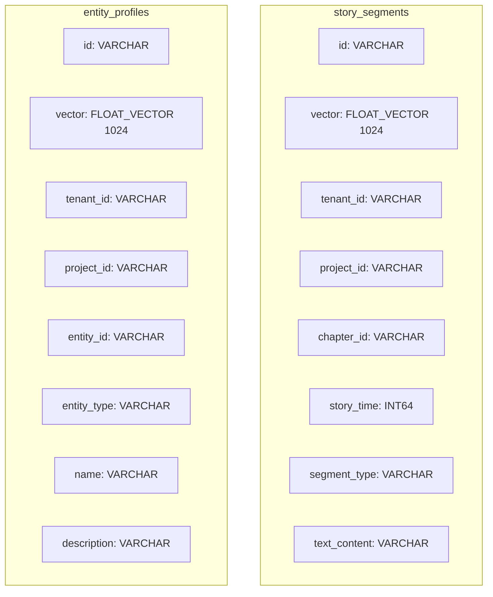

# 06 - 向量数据库规范

> AI 小说生成后端向量检索与索引设计规范（Milvus/PGVector）

## 1. 概述

本文档定义了项目的向量数据库设计，包括 Milvus 与 PGVector 选型、Collection 设计、Embedding 模型配置、索引参数调优以及检索流程。

---

## 2. 技术选型

| 特性           | Milvus 2.3+            | PGVector              |
| -------------- | ---------------------- | --------------------- |
| **适用场景**   | 生产环境、大规模数据   | 开发环境、小规模数据  |
| **向量维度**   | 最高 32768 维          | 最高 2000 维          |
| **索引类型**   | HNSW、IVF、DiskANN     | HNSW、IVF             |
| **分区支持**   | ✅ 原生支持            | ❌ 需手动分表         |
| **水平扩展**   | ✅ 分布式架构          | ❌ 单机               |
| **元数据过滤** | ✅ 高效标量过滤        | ✅ SQL 原生支持       |
| **部署复杂度** | 高（依赖 etcd、MinIO） | 低（PostgreSQL 扩展） |

**推荐**：

- 生产环境使用 **Milvus 2.3+**
- 开发/测试环境可使用 **PGVector**

---

## 3. Embedding 模型配置

### 3.1 模型选择

| 模型                   | 维度 | 最大 Token | 语言支持 | 用途               |
| ---------------------- | ---- | ---------- | -------- | ------------------ |
| BAAI/bge-m3            | 1024 | 8192       | 多语言   | 章节内容、实体描述 |
| text-embedding-3-large | 3072 | 8191       | 多语言   | 高精度检索（备选） |

### 3.2 Embedding 服务配置

```yaml
# configs/config.yaml
embedding:
  provider: "local" # local / openai / custom
  model: "BAAI/bge-m3"
  dimension: 1024
  batch_size: 32
  max_tokens: 8192
  endpoint: "http://embedding-svc:8000"
  timeout: 30s
  retry:
    max_attempts: 3
    backoff: 1s
```

### 3.3 Embedding 客户端实现

```go
// internal/infrastructure/embedding/client.go
package embedding

import (
    "context"
    "net/http"
)

type Client struct {
    endpoint   string
    httpClient *http.Client
    dimension  int
}

type EmbedRequest struct {
    Texts []string `json:"texts"`
    Model string   `json:"model"`
}

type EmbedResponse struct {
    Embeddings [][]float32 `json:"embeddings"`
    TokensUsed int         `json:"tokens_used"`
}

func (c *Client) Embed(ctx context.Context, texts []string) ([][]float32, error) {
    req := &EmbedRequest{
        Texts: texts,
        Model: "BAAI/bge-m3",
    }

    // 批量处理
    var allEmbeddings [][]float32
    for i := 0; i < len(texts); i += 32 {
        end := i + 32
        if end > len(texts) {
            end = len(texts)
        }

        batch := texts[i:end]
        resp, err := c.doBatchEmbed(ctx, batch)
        if err != nil {
            return nil, err
        }
        allEmbeddings = append(allEmbeddings, resp.Embeddings...)
    }

    return allEmbeddings, nil
}
```

---

## 4. Milvus Collection 设计

### 4.1 Collection 结构



### 4.2 Collection 定义

```go
// internal/infrastructure/persistence/milvus/schema.go
package milvus

import (
    "github.com/milvus-io/milvus-sdk-go/v2/entity"
)

// 故事片段 Collection
func StorySegmentsSchema() *entity.Schema {
    return &entity.Schema{
        CollectionName: "story_segments",
        Description:    "Story content segments for semantic search",
        Fields: []*entity.Field{
            {
                Name:       "id",
                DataType:   entity.FieldTypeVarChar,
                PrimaryKey: true,
                MaxLength:  64,
            },
            {
                Name:     "vector",
                DataType: entity.FieldTypeFloatVector,
                TypeParams: map[string]string{
                    "dim": "1024",
                },
            },
            {
                Name:      "tenant_id",
                DataType:  entity.FieldTypeVarChar,
                MaxLength: 64,
            },
            {
                Name:      "project_id",
                DataType:  entity.FieldTypeVarChar,
                MaxLength: 64,
            },
            {
                Name:      "chapter_id",
                DataType:  entity.FieldTypeVarChar,
                MaxLength: 64,
            },
            {
                Name:     "story_time",
                DataType: entity.FieldTypeInt64,
            },
            {
                Name:      "segment_type",
                DataType:  entity.FieldTypeVarChar,
                MaxLength: 32,
            },
            {
                Name:      "text_content",
                DataType:  entity.FieldTypeVarChar,
                MaxLength: 65535,
            },
        },
    }
}

// 实体档案 Collection
func EntityProfilesSchema() *entity.Schema {
    return &entity.Schema{
        CollectionName: "entity_profiles",
        Description:    "Entity profiles for character/item/location search",
        Fields: []*entity.Field{
            {
                Name:       "id",
                DataType:   entity.FieldTypeVarChar,
                PrimaryKey: true,
                MaxLength:  64,
            },
            {
                Name:     "vector",
                DataType: entity.FieldTypeFloatVector,
                TypeParams: map[string]string{
                    "dim": "1024",
                },
            },
            {
                Name:      "tenant_id",
                DataType:  entity.FieldTypeVarChar,
                MaxLength: 64,
            },
            {
                Name:      "project_id",
                DataType:  entity.FieldTypeVarChar,
                MaxLength: 64,
            },
            {
                Name:      "entity_id",
                DataType:  entity.FieldTypeVarChar,
                MaxLength: 64,
            },
            {
                Name:      "entity_type",
                DataType:  entity.FieldTypeVarChar,
                MaxLength: 32,
            },
            {
                Name:      "name",
                DataType:  entity.FieldTypeVarChar,
                MaxLength: 256,
            },
            {
                Name:      "description",
                DataType:  entity.FieldTypeVarChar,
                MaxLength: 65535,
            },
        },
    }
}
```

### 4.3 分区策略

```go
// 分区命名：tenant_{tenant_id}_proj_{project_id}
func PartitionName(tenantID, projectID string) string {
    return fmt.Sprintf("tenant_%s_proj_%s", tenantID, projectID)
}

// 创建分区
func (r *MilvusRepository) CreatePartition(ctx context.Context, collection, tenantID, projectID string) error {
    partitionName := PartitionName(tenantID, projectID)
    return r.client.CreatePartition(ctx, collection, partitionName)
}
```

---

## 5. 索引配置

### 5.1 HNSW 索引参数

```go
// 索引创建
func (r *MilvusRepository) CreateIndex(ctx context.Context, collection string) error {
    idx, err := entity.NewIndexHNSW(
        entity.COSINE,  // 距离度量
        16,             // M: 每层邻居数
        200,            // efConstruction: 构建时搜索范围
    )
    if err != nil {
        return err
    }

    return r.client.CreateIndex(ctx, collection, "vector", idx, false)
}
```

### 5.2 搜索参数

```go
// 搜索时的 ef 参数
func SearchParams() entity.SearchParam {
    sp, _ := entity.NewIndexHNSWSearchParam(
        128, // ef: 搜索时的候选集大小
    )
    return sp
}
```

### 5.3 参数调优指南

| 参数             | 默认值 | 调优建议                       |
| ---------------- | ------ | ------------------------------ |
| `M`              | 16     | 增大提高召回率，消耗更多内存   |
| `efConstruction` | 200    | 增大提高索引质量，增加构建时间 |
| `ef` (search)    | 128    | 增大提高召回率，增加搜索延迟   |
| `metric_type`    | COSINE | 语义相似度推荐 COSINE          |

---

## 6. 检索实现

### 6.1 向量检索

```go
// internal/infrastructure/persistence/milvus/repository.go
package milvus

import (
    "context"
    "github.com/milvus-io/milvus-sdk-go/v2/client"
    "github.com/milvus-io/milvus-sdk-go/v2/entity"
)

type Repository struct {
    client client.Client
}

type SearchResult struct {
    ID          string
    Score       float32
    TextContent string
    ChapterID   string
    StoryTime   int64
}

func (r *Repository) SearchSegments(ctx context.Context, params *SearchParams) ([]*SearchResult, error) {
    // 构建过滤表达式
    filter := fmt.Sprintf(
        `tenant_id == "%s" && project_id == "%s"`,
        params.TenantID, params.ProjectID,
    )

    // 时间过滤（排除未来事件）
    if params.CurrentStoryTime > 0 {
        filter += fmt.Sprintf(` && story_time <= %d`, params.CurrentStoryTime)
    }

    // 执行搜索
    results, err := r.client.Search(ctx,
        "story_segments",
        []string{PartitionName(params.TenantID, params.ProjectID)},
        filter,
        []string{"id", "text_content", "chapter_id", "story_time"},
        []entity.Vector{entity.FloatVector(params.QueryVector)},
        "vector",
        entity.COSINE,
        params.TopK,
        SearchParams(),
    )
    if err != nil {
        return nil, err
    }

    // 解析结果
    var searchResults []*SearchResult
    for _, result := range results {
        for i := 0; i < result.ResultCount; i++ {
            searchResults = append(searchResults, &SearchResult{
                ID:          result.IDs.(*entity.ColumnVarChar).Data()[i],
                Score:       result.Scores[i],
                TextContent: result.Fields.GetColumn("text_content").(*entity.ColumnVarChar).Data()[i],
                ChapterID:   result.Fields.GetColumn("chapter_id").(*entity.ColumnVarChar).Data()[i],
                StoryTime:   result.Fields.GetColumn("story_time").(*entity.ColumnInt64).Data()[i],
            })
        }
    }

    return searchResults, nil
}
```

### 6.2 混合检索（语义 + 关键词）

```go
// 混合检索：向量相似度 + BM25 加权
func (r *Repository) HybridSearch(ctx context.Context, params *HybridSearchParams) ([]*SearchResult, error) {
    // 1. 向量检索
    vectorResults, err := r.SearchSegments(ctx, &SearchParams{
        TenantID:         params.TenantID,
        ProjectID:        params.ProjectID,
        QueryVector:      params.QueryVector,
        CurrentStoryTime: params.CurrentStoryTime,
        TopK:             params.TopK * 2, // 多召回用于重排
    })
    if err != nil {
        return nil, err
    }

    // 2. 关键词检索（从 ES 或全文索引）
    keywordResults, err := r.keywordSearch(ctx, params.QueryText, params.TopK*2)
    if err != nil {
        return nil, err
    }

    // 3. 融合重排
    merged := r.fusionRank(vectorResults, keywordResults, params.VectorWeight, params.KeywordWeight)

    // 4. 返回 TopK
    if len(merged) > params.TopK {
        merged = merged[:params.TopK]
    }

    return merged, nil
}

// 融合重排（RRF - Reciprocal Rank Fusion）
func (r *Repository) fusionRank(vecResults, kwResults []*SearchResult, vecWeight, kwWeight float32) []*SearchResult {
    scores := make(map[string]float32)
    results := make(map[string]*SearchResult)

    k := float32(60) // RRF 常数

    // 向量结果评分
    for i, r := range vecResults {
        score := vecWeight / (k + float32(i+1))
        scores[r.ID] += score
        results[r.ID] = r
    }

    // 关键词结果评分
    for i, r := range kwResults {
        score := kwWeight / (k + float32(i+1))
        scores[r.ID] += score
        if _, ok := results[r.ID]; !ok {
            results[r.ID] = r
        }
    }

    // 排序
    var merged []*SearchResult
    for id, r := range results {
        r.Score = scores[id]
        merged = append(merged, r)
    }

    sort.Slice(merged, func(i, j int) bool {
        return merged[i].Score > merged[j].Score
    })

    return merged
}
```

---

## 7. 数据写入与索引维护

### 7.1 分块写入

```go
// 文本分块
func ChunkText(text string, chunkSize, overlap int) []string {
    if len(text) <= chunkSize {
        return []string{text}
    }

    var chunks []string
    start := 0
    for start < len(text) {
        end := start + chunkSize
        if end > len(text) {
            end = len(text)
        }

        chunks = append(chunks, text[start:end])
        start = end - overlap
    }

    return chunks
}

// 批量写入
func (r *Repository) UpsertSegments(ctx context.Context, segments []*Segment) error {
    // 分批处理
    batchSize := 100
    for i := 0; i < len(segments); i += batchSize {
        end := i + batchSize
        if end > len(segments) {
            end = len(segments)
        }

        batch := segments[i:end]
        if err := r.insertBatch(ctx, batch); err != nil {
            return err
        }
    }

    return nil
}
```

### 7.2 索引重建

```go
// 索引重建流程
func (r *Repository) RebuildIndex(ctx context.Context, collection string) error {
    // 1. 删除旧索引
    if err := r.client.DropIndex(ctx, collection, "vector"); err != nil {
        return err
    }

    // 2. 创建新索引
    if err := r.CreateIndex(ctx, collection); err != nil {
        return err
    }

    // 3. 加载 Collection
    return r.client.LoadCollection(ctx, collection, false)
}
```

---

## 8. PGVector 备选方案

### 8.1 表结构

```sql
-- 启用扩展
CREATE EXTENSION IF NOT EXISTS vector;

-- 故事片段表
CREATE TABLE story_segments_vec (
    id UUID PRIMARY KEY DEFAULT gen_random_uuid(),
    tenant_id VARCHAR(64) NOT NULL,
    project_id UUID NOT NULL,
    chapter_id UUID,
    story_time BIGINT,
    segment_type VARCHAR(32),
    text_content TEXT,
    embedding vector(1024),
    created_at TIMESTAMPTZ DEFAULT NOW()
);

-- HNSW 索引
CREATE INDEX idx_segments_vec_hnsw ON story_segments_vec
    USING hnsw (embedding vector_cosine_ops)
    WITH (m = 16, ef_construction = 200);

-- 复合过滤索引
CREATE INDEX idx_segments_tenant_project ON story_segments_vec(tenant_id, project_id);
```

### 8.2 查询示例

```sql
-- 向量相似度搜索
SELECT id, text_content, 1 - (embedding <=> $1::vector) AS similarity
FROM story_segments_vec
WHERE tenant_id = $2
  AND project_id = $3
  AND story_time <= $4
ORDER BY embedding <=> $1::vector
LIMIT 10;
```

---

## 9. 相关文档

- [04-PostgreSQL 数据库设计详细文档](./04-PostgreSQL数据库设计详细文档.md)
- [05-Redis 缓存与消息队列规范](./05-Redis缓存与消息队列规范.md)
- [12-RAG 检索服务设计](./12-RAG检索服务设计.md)
