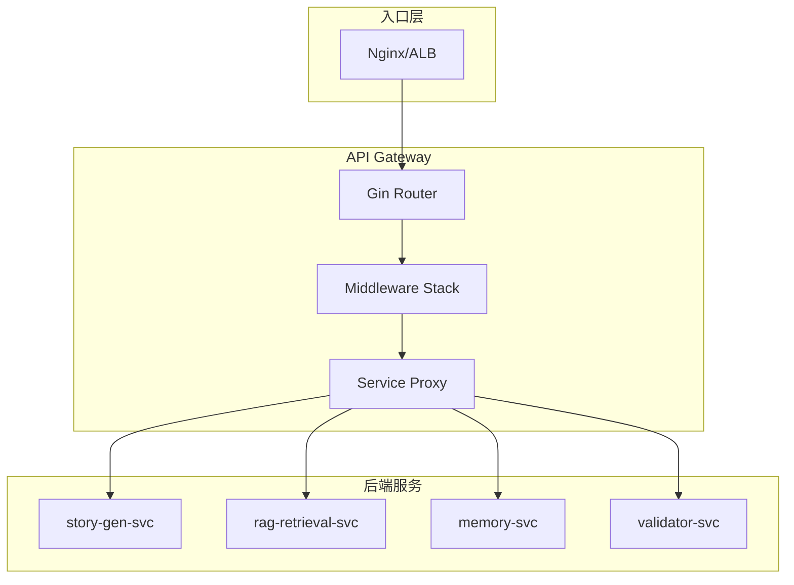
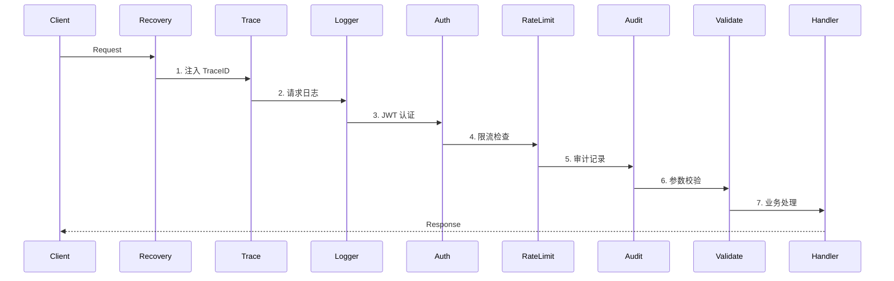

# 07 - Gin API 网关与中间件设计

> AI 小说生成后端 Gin 网关架构、中间件栈与安全策略规范

## 1. 概述

本文档定义了 API 网关的设计规范，包括 Gin 路由架构、中间件执行顺序、JWT 认证、限流熔断以及请求签名与幂等性处理。

---

## 2. 网关架构



---

## 3. 中间件执行顺序



### 3.1 中间件栈配置

```go
// internal/interfaces/http/router/router.go
package router

import (
    "github.com/gin-gonic/gin"
    "z-novel-ai-api/internal/interfaces/http/middleware"
)

func Setup(cfg *config.Config) *gin.Engine {
    r := gin.New()

    // 中间件栈（按执行顺序）
    r.Use(
        middleware.Recovery(),        // 1. Panic 恢复
        middleware.Trace(),           // 2. 分布式追踪
        middleware.Logger(),          // 3. 请求日志
        middleware.CORS(cfg.Security.CORS), // 4. CORS
        middleware.Auth(cfg.Security.JWT),  // 5. JWT 认证
        middleware.RateLimit(cfg.Security.RateLimit), // 6. 限流
        middleware.Audit(),           // 7. 审计日志
        middleware.RequestID(),       // 8. 请求 ID
    )

    // 注册路由
    registerRoutes(r, cfg)

    return r
}
```

---

## 4. 核心中间件实现

### 4.1 Recovery 中间件

```go
// internal/interfaces/http/middleware/recovery.go
package middleware

import (
    "net/http"
    "github.com/gin-gonic/gin"
    "z-novel-ai-api/pkg/logger"
)

func Recovery() gin.HandlerFunc {
    return func(c *gin.Context) {
        defer func() {
            if err := recover(); err != nil {
                logger.Error(c.Request.Context(), "panic recovered",
                    nil,
                    "panic", err,
                    "path", c.Request.URL.Path,
                )

                c.AbortWithStatusJSON(http.StatusInternalServerError, gin.H{
                    "code":    500,
                    "message": "internal server error",
                    "trace_id": c.GetString("trace_id"),
                })
            }
        }()
        c.Next()
    }
}
```

### 4.2 Trace 中间件

```go
// internal/interfaces/http/middleware/trace.go
package middleware

import (
    "github.com/gin-gonic/gin"
    "go.opentelemetry.io/contrib/instrumentation/github.com/gin-gonic/gin/otelgin"
    "go.opentelemetry.io/otel/trace"
)

func Trace() gin.HandlerFunc {
    return func(c *gin.Context) {
        // 使用 OpenTelemetry Gin 中间件
        otelgin.Middleware("api-gateway")(c)

        // 提取 trace_id 到 Context
        span := trace.SpanFromContext(c.Request.Context())
        if span.SpanContext().IsValid() {
            traceID := span.SpanContext().TraceID().String()
            spanID := span.SpanContext().SpanID().String()

            c.Set("trace_id", traceID)
            c.Set("span_id", spanID)
            c.Header("X-Trace-ID", traceID)
        }

        c.Next()
    }
}
```

### 4.3 Auth 中间件（JWT）

```go
// internal/interfaces/http/middleware/auth.go
package middleware

import (
    "net/http"
    "strings"
    "github.com/gin-gonic/gin"
    "github.com/golang-jwt/jwt/v5"
)

type JWTConfig struct {
    Secret     string
    Issuer     string
    SkipPaths  []string
}

type Claims struct {
    jwt.RegisteredClaims
    TenantID string `json:"tenant_id"`
    UserID   string `json:"user_id"`
    Role     string `json:"role"`
}

func Auth(cfg JWTConfig) gin.HandlerFunc {
    skipMap := make(map[string]bool)
    for _, path := range cfg.SkipPaths {
        skipMap[path] = true
    }

    return func(c *gin.Context) {
        // 跳过公开路径
        if skipMap[c.Request.URL.Path] {
            c.Next()
            return
        }

        // 获取 Token
        authHeader := c.GetHeader("Authorization")
        if authHeader == "" {
            abortUnauthorized(c, "missing authorization header")
            return
        }

        parts := strings.SplitN(authHeader, " ", 2)
        if len(parts) != 2 || parts[0] != "Bearer" {
            abortUnauthorized(c, "invalid authorization format")
            return
        }

        tokenString := parts[1]

        // 解析 Token
        claims := &Claims{}
        token, err := jwt.ParseWithClaims(tokenString, claims, func(token *jwt.Token) (interface{}, error) {
            return []byte(cfg.Secret), nil
        })

        if err != nil || !token.Valid {
            abortUnauthorized(c, "invalid token")
            return
        }

        // 验证 Issuer
        if claims.Issuer != cfg.Issuer {
            abortUnauthorized(c, "invalid issuer")
            return
        }

        // 注入用户信息到 Context
        c.Set("tenant_id", claims.TenantID)
        c.Set("user_id", claims.UserID)
        c.Set("role", claims.Role)

        c.Next()
    }
}

func abortUnauthorized(c *gin.Context, msg string) {
    c.AbortWithStatusJSON(http.StatusUnauthorized, gin.H{
        "code":     401,
        "message":  msg,
        "trace_id": c.GetString("trace_id"),
    })
}
```

### 4.4 RateLimit 中间件

```go
// internal/interfaces/http/middleware/ratelimit.go
package middleware

import (
    "net/http"
    "github.com/gin-gonic/gin"
    "z-novel-ai-api/pkg/ratelimit"
)

type RateLimitConfig struct {
    Enabled           bool
    RequestsPerSecond int
    Burst             int
}

func RateLimit(cfg RateLimitConfig, limiter *ratelimit.SlidingWindowLimiter) gin.HandlerFunc {
    if !cfg.Enabled {
        return func(c *gin.Context) { c.Next() }
    }

    return func(c *gin.Context) {
        tenantID := c.GetString("tenant_id")
        if tenantID == "" {
            tenantID = "anonymous"
        }

        key := "ratelimit:" + tenantID + ":" + c.Request.URL.Path

        allowed, err := limiter.Allow(c.Request.Context(), key, cfg.RequestsPerSecond, time.Second)
        if err != nil {
            // 限流器故障时放行
            c.Next()
            return
        }

        if !allowed {
            c.AbortWithStatusJSON(http.StatusTooManyRequests, gin.H{
                "code":     429,
                "message":  "rate limit exceeded",
                "trace_id": c.GetString("trace_id"),
            })
            return
        }

        c.Next()
    }
}
```

### 4.5 Audit 中间件

```go
// internal/interfaces/http/middleware/audit.go
package middleware

import (
    "time"
    "github.com/gin-gonic/gin"
    "z-novel-ai-api/pkg/logger"
)

func Audit() gin.HandlerFunc {
    return func(c *gin.Context) {
        start := time.Now()

        c.Next()

        duration := time.Since(start)

        // 记录审计日志
        logger.Info(c.Request.Context(), "api request",
            "method", c.Request.Method,
            "path", c.Request.URL.Path,
            "status", c.Writer.Status(),
            "duration_ms", duration.Milliseconds(),
            "ip", c.ClientIP(),
            "user_agent", c.Request.UserAgent(),
            "tenant_id", c.GetString("tenant_id"),
            "user_id", c.GetString("user_id"),
            "request_id", c.GetString("request_id"),
        )
    }
}
```

### 4.6 InputValidate 中间件

```go
// internal/interfaces/http/middleware/validate.go
package middleware

import (
    "net/http"
    "github.com/gin-gonic/gin"
    "github.com/go-playground/validator/v10"
)

var validate = validator.New()

func ValidateBody[T any]() gin.HandlerFunc {
    return func(c *gin.Context) {
        var body T
        if err := c.ShouldBindJSON(&body); err != nil {
            c.AbortWithStatusJSON(http.StatusBadRequest, gin.H{
                "code":     400,
                "message":  "invalid request body",
                "details":  err.Error(),
                "trace_id": c.GetString("trace_id"),
            })
            return
        }

        if err := validate.Struct(body); err != nil {
            c.AbortWithStatusJSON(http.StatusBadRequest, gin.H{
                "code":     400,
                "message":  "validation failed",
                "details":  formatValidationErrors(err),
                "trace_id": c.GetString("trace_id"),
            })
            return
        }

        c.Set("body", body)
        c.Next()
    }
}

func formatValidationErrors(err error) []map[string]string {
    var errors []map[string]string
    for _, e := range err.(validator.ValidationErrors) {
        errors = append(errors, map[string]string{
            "field":   e.Field(),
            "tag":     e.Tag(),
            "message": e.Error(),
        })
    }
    return errors
}
```

---

## 5. 幂等性处理

### 5.1 幂等键中间件

```go
// internal/interfaces/http/middleware/idempotency.go
package middleware

import (
    "context"
    "net/http"
    "time"
    "github.com/gin-gonic/gin"
    "github.com/redis/go-redis/v9"
)

func Idempotency(client *redis.Client, ttl time.Duration) gin.HandlerFunc {
    return func(c *gin.Context) {
        // 仅对写操作检查幂等性
        if c.Request.Method != http.MethodPost && c.Request.Method != http.MethodPut {
            c.Next()
            return
        }

        key := c.GetHeader("Idempotency-Key")
        if key == "" {
            c.Next()
            return
        }

        ctx := c.Request.Context()
        cacheKey := "idempotent:" + key

        // 检查是否已处理
        result, err := client.Get(ctx, cacheKey).Result()
        if err == nil {
            // 返回缓存的响应
            c.Data(http.StatusOK, "application/json", []byte(result))
            c.Abort()
            return
        }

        // 设置锁防止重复处理
        locked, err := client.SetNX(ctx, cacheKey+":lock", "1", 30*time.Second).Result()
        if err != nil || !locked {
            c.AbortWithStatusJSON(http.StatusConflict, gin.H{
                "code":    409,
                "message": "request is being processed",
            })
            return
        }

        // 处理请求
        c.Next()

        // 缓存响应
        if c.Writer.Status() >= 200 && c.Writer.Status() < 300 {
            // 注意：需要自定义 ResponseWriter 来捕获响应体
            // 这里简化处理
            client.Set(ctx, cacheKey, "{\"cached\":true}", ttl)
        }

        client.Del(ctx, cacheKey+":lock")
    }
}
```

---

## 6. 请求签名验证

```go
// internal/interfaces/http/middleware/signature.go
package middleware

import (
    "crypto/hmac"
    "crypto/sha256"
    "encoding/hex"
    "io"
    "net/http"
    "time"
    "github.com/gin-gonic/gin"
)

func Signature(secret string, maxAge time.Duration) gin.HandlerFunc {
    return func(c *gin.Context) {
        sig := c.GetHeader("X-Signature")
        timestamp := c.GetHeader("X-Timestamp")

        if sig == "" || timestamp == "" {
            c.AbortWithStatusJSON(http.StatusUnauthorized, gin.H{
                "code":    401,
                "message": "missing signature headers",
            })
            return
        }

        // 验证时间戳
        ts, err := time.Parse(time.RFC3339, timestamp)
        if err != nil || time.Since(ts) > maxAge {
            c.AbortWithStatusJSON(http.StatusUnauthorized, gin.H{
                "code":    401,
                "message": "signature expired",
            })
            return
        }

        // 读取请求体
        body, err := io.ReadAll(c.Request.Body)
        if err != nil {
            c.AbortWithStatusJSON(http.StatusBadRequest, gin.H{
                "code":    400,
                "message": "failed to read body",
            })
            return
        }

        // 计算签名
        message := timestamp + string(body)
        mac := hmac.New(sha256.New, []byte(secret))
        mac.Write([]byte(message))
        expectedSig := hex.EncodeToString(mac.Sum(nil))

        if !hmac.Equal([]byte(sig), []byte(expectedSig)) {
            c.AbortWithStatusJSON(http.StatusUnauthorized, gin.H{
                "code":    401,
                "message": "invalid signature",
            })
            return
        }

        // 重置 Body
        c.Request.Body = io.NopCloser(bytes.NewBuffer(body))
        c.Next()
    }
}
```

---

## 7. 熔断降级

```go
// internal/interfaces/http/middleware/circuitbreaker.go
package middleware

import (
    "net/http"
    "github.com/gin-gonic/gin"
    "github.com/sony/gobreaker"
)

func CircuitBreaker(name string, settings gobreaker.Settings) gin.HandlerFunc {
    cb := gobreaker.NewCircuitBreaker(gobreaker.Settings{
        Name:        name,
        MaxRequests: 100,
        Interval:    10 * time.Second,
        Timeout:     60 * time.Second,
        ReadyToTrip: func(counts gobreaker.Counts) bool {
            failureRatio := float64(counts.TotalFailures) / float64(counts.Requests)
            return counts.Requests >= 10 && failureRatio >= 0.5
        },
    })

    return func(c *gin.Context) {
        _, err := cb.Execute(func() (interface{}, error) {
            c.Next()
            if c.Writer.Status() >= 500 {
                return nil, fmt.Errorf("server error")
            }
            return nil, nil
        })

        if err != nil {
            if err == gobreaker.ErrOpenState {
                c.AbortWithStatusJSON(http.StatusServiceUnavailable, gin.H{
                    "code":    503,
                    "message": "service temporarily unavailable",
                })
            }
        }
    }
}
```

---

## 8. 相关文档

- [08-RESTful API 接口规范](./08-RESTful API 接口规范.md)
- [09-gRPC 内部服务通信规范](./09-gRPC内部服务通信规范.md)
- [03-日志与可观测性规范](./03-日志与可观测性规范.md)
