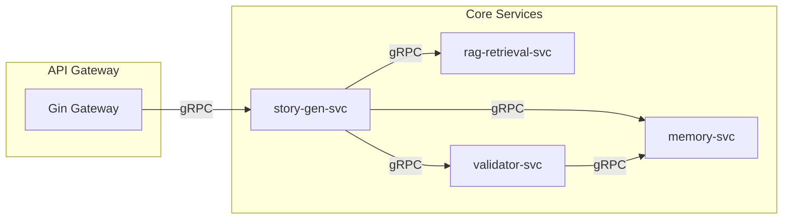

# 09 - gRPC 内部服务通信规范

> AI 小说生成后端 gRPC 服务定义、Proto 规范与内部通信设计

## 1. 概述

本文档定义了项目内部服务间的 gRPC 通信规范，包括 Proto3 定义规范、服务接口设计、错误码体系以及 mTLS 配置。

---

## 2. gRPC 服务架构



---

## 3. Proto 目录结构

```
api/proto/
├── common/
│   ├── common.proto          # 通用消息定义
│   └── errors.proto          # 错误码定义
├── story/
│   └── story_service.proto   # 小说生成服务
├── retrieval/
│   └── retrieval_service.proto  # 检索服务
├── validator/
│   └── validator_service.proto  # 校验服务
├── memory/
│   └── memory_service.proto  # 记忆服务
└── buf.yaml                  # Buf 配置
```

---

## 4. Proto 定义规范

### 4.1 通用消息定义

```protobuf
// api/proto/common/common.proto
syntax = "proto3";

package common;

option go_package = "z-novel-ai-api/api/proto/common";

import "google/protobuf/timestamp.proto";

// 分页请求
message PageRequest {
    int32 page = 1;
    int32 page_size = 2;
}

// 分页响应
message PageResponse {
    int32 page = 1;
    int32 page_size = 2;
    int32 total = 3;
    int32 total_pages = 4;
}

// 租户上下文
message TenantContext {
    string tenant_id = 1;
    string user_id = 2;
    string trace_id = 3;
    string project_id = 4;
}

// 实体引用
message EntityRef {
    string id = 1;
    string name = 2;
    string type = 3;
}

// 时间范围
message TimeRange {
    int64 start = 1;
    int64 end = 2;
}
```

### 4.2 错误码定义

```protobuf
// api/proto/common/errors.proto
syntax = "proto3";

package common;

option go_package = "z-novel-ai-api/api/proto/common";

// 业务错误详情
message ErrorDetail {
    string error_code = 1;
    string message = 2;
    string details = 3;
    repeated string suggestions = 4;
}

// 标准错误码
enum ErrorCode {
    ERROR_CODE_UNSPECIFIED = 0;

    // 通用错误 1xxx
    ERROR_CODE_INVALID_ARGUMENT = 1001;
    ERROR_CODE_NOT_FOUND = 1002;
    ERROR_CODE_ALREADY_EXISTS = 1003;
    ERROR_CODE_PERMISSION_DENIED = 1004;

    // 生成错误 2xxx
    ERROR_CODE_GENERATION_FAILED = 2001;
    ERROR_CODE_VALIDATION_FAILED = 2002;
    ERROR_CODE_CONTEXT_EMPTY = 2003;
    ERROR_CODE_MODEL_UNAVAILABLE = 2004;

    // 检索错误 3xxx
    ERROR_CODE_RETRIEVAL_TIMEOUT = 3001;
    ERROR_CODE_VECTOR_NOT_FOUND = 3002;

    // 记忆错误 4xxx
    ERROR_CODE_ENTITY_CONFLICT = 4001;
    ERROR_CODE_STATE_MISMATCH = 4002;
}
```

---

## 5. 服务接口定义

### 5.1 小说生成服务

```protobuf
// api/proto/story/story_service.proto
syntax = "proto3";

package story;

option go_package = "z-novel-ai-api/api/proto/story";

import "common/common.proto";
import "google/protobuf/timestamp.proto";

service StoryGenService {
    // 生成章节（流式）
    rpc GenerateChapter(GenerateChapterRequest) returns (stream GenerateChapterResponse);

    // 重新生成章节
    rpc RegenerateChapter(RegenerateChapterRequest) returns (stream GenerateChapterResponse);

    // 获取生成状态
    rpc GetGenerationStatus(GetGenerationStatusRequest) returns (GenerationStatus);

    // 取消生成
    rpc CancelGeneration(CancelGenerationRequest) returns (CancelGenerationResponse);
}

message GenerateChapterRequest {
    common.TenantContext context = 1;
    string chapter_id = 2;
    string outline = 3;
    int32 target_word_count = 4;
    int64 story_time_start = 5;
    GenerationOptions options = 6;
}

message GenerationOptions {
    string model = 1;
    float temperature = 2;
    bool skip_validation = 3;
    int32 max_retries = 4;
}

message GenerateChapterResponse {
    oneof payload {
        ContentChunk content = 1;
        GenerationMetadata metadata = 2;
        GenerationComplete complete = 3;
        GenerationError error = 4;
    }
}

message ContentChunk {
    string text = 1;
    int32 index = 2;
}

message GenerationMetadata {
    int32 word_count = 1;
    int32 tokens_used = 2;
    string model = 3;
}

message GenerationComplete {
    string chapter_id = 1;
    string content = 2;
    string summary = 3;
    int32 word_count = 4;
    bool validation_passed = 5;
    google.protobuf.Timestamp completed_at = 6;
}

message GenerationError {
    common.ErrorCode code = 1;
    string message = 2;
    common.ErrorDetail detail = 3;
}
```

### 5.2 检索服务

```protobuf
// api/proto/retrieval/retrieval_service.proto
syntax = "proto3";

package retrieval;

option go_package = "z-novel-ai-api/api/proto/retrieval";

import "common/common.proto";

service RetrievalService {
    // 检索上下文
    rpc RetrieveContext(RetrieveContextRequest) returns (RetrieveContextResponse);

    // 搜索实体
    rpc SearchEntities(SearchEntitiesRequest) returns (SearchEntitiesResponse);

    // 搜索事件
    rpc SearchEvents(SearchEventsRequest) returns (SearchEventsResponse);

    // Debug 检索
    rpc DebugRetrieval(DebugRetrievalRequest) returns (DebugRetrievalResponse);
}

message RetrieveContextRequest {
    common.TenantContext context = 1;
    string query = 2;
    int64 current_story_time = 3;
    int32 top_k = 4;
    RetrievalOptions options = 5;
}

message RetrievalOptions {
    float vector_weight = 1;      // 默认 0.7
    float keyword_weight = 2;     // 默认 0.3
    bool include_entities = 3;
    bool include_events = 4;
    repeated string entity_types = 5;
}

message RetrieveContextResponse {
    repeated ContextSegment segments = 1;
    repeated common.EntityRef entities = 2;
    ContextMetadata metadata = 3;
}

message ContextSegment {
    string id = 1;
    string text = 2;
    string chapter_id = 3;
    int64 story_time = 4;
    float score = 5;
    string source = 6;  // vector, keyword, time
}

message ContextMetadata {
    int32 total_segments = 1;
    int32 total_entities = 2;
    int64 retrieval_duration_ms = 3;
}
```

### 5.3 校验服务

```protobuf
// api/proto/validator/validator_service.proto
syntax = "proto3";

package validator;

option go_package = "z-novel-ai-api/api/proto/validator";

import "common/common.proto";

service ValidatorService {
    // 一致性校验
    rpc ValidateConsistency(ValidateConsistencyRequest) returns (ValidateConsistencyResponse);

    // 敏感内容校验
    rpc ValidateContent(ValidateContentRequest) returns (ValidateContentResponse);
}

message ValidateConsistencyRequest {
    common.TenantContext context = 1;
    string chapter_id = 2;
    string content = 3;
    repeated EntityState entity_states = 4;
    int64 current_story_time = 5;
}

message EntityState {
    string entity_id = 1;
    string name = 2;
    string current_state = 3;
    int64 last_update_time = 4;
}

message ValidateConsistencyResponse {
    bool passed = 1;
    repeated ValidationIssue issues = 2;
    ValidatorMetadata metadata = 3;
}

message ValidationIssue {
    string issue_id = 1;
    IssueType type = 2;
    IssueSeverity severity = 3;
    string description = 4;
    string location = 5;
    repeated string suggestions = 6;
}

enum IssueType {
    ISSUE_TYPE_UNSPECIFIED = 0;
    ISSUE_TYPE_SETTING_CONFLICT = 1;
    ISSUE_TYPE_CHARACTER_STATE = 2;
    ISSUE_TYPE_TIMELINE_ERROR = 3;
    ISSUE_TYPE_EMOTION_INCONSISTENT = 4;
}

enum IssueSeverity {
    ISSUE_SEVERITY_UNSPECIFIED = 0;
    ISSUE_SEVERITY_ERROR = 1;
    ISSUE_SEVERITY_WARNING = 2;
    ISSUE_SEVERITY_INFO = 3;
}

message ValidatorMetadata {
    string model = 1;
    int32 tokens_used = 2;
    int64 duration_ms = 3;
}
```

### 5.4 记忆服务

```protobuf
// api/proto/memory/memory_service.proto
syntax = "proto3";

package memory;

option go_package = "z-novel-ai-api/api/proto/memory";

import "common/common.proto";
import "google/protobuf/timestamp.proto";

service MemoryService {
    // 实体管理
    rpc GetEntity(GetEntityRequest) returns (Entity);
    rpc UpdateEntity(UpdateEntityRequest) returns (Entity);
    rpc ListEntities(ListEntitiesRequest) returns (ListEntitiesResponse);

    // 关系管理
    rpc GetRelations(GetRelationsRequest) returns (GetRelationsResponse);
    rpc UpdateRelation(UpdateRelationRequest) returns (Relation);

    // 事件管理
    rpc CreateEvent(CreateEventRequest) returns (Event);
    rpc ListEvents(ListEventsRequest) returns (ListEventsResponse);

    // 摘要回写
    rpc WriteBackSummary(WriteBackSummaryRequest) returns (WriteBackSummaryResponse);

    // 状态快照
    rpc GetStateSnapshot(GetStateSnapshotRequest) returns (StateSnapshot);
}

message Entity {
    string id = 1;
    string project_id = 2;
    string name = 3;
    repeated string aliases = 4;
    string type = 5;
    string description = 6;
    map<string, string> attributes = 7;
    string current_state = 8;
    string importance = 9;
    google.protobuf.Timestamp created_at = 10;
    google.protobuf.Timestamp updated_at = 11;
}

message Relation {
    string id = 1;
    string source_entity_id = 2;
    string target_entity_id = 3;
    string relation_type = 4;
    float strength = 5;
    string description = 6;
}

message Event {
    string id = 1;
    string project_id = 2;
    string chapter_id = 3;
    int64 story_time_start = 4;
    int64 story_time_end = 5;
    string event_type = 6;
    string summary = 7;
    repeated string involved_entity_ids = 8;
    string importance = 9;
}

message WriteBackSummaryRequest {
    common.TenantContext context = 1;
    string chapter_id = 2;
    string content = 3;
    string summary = 4;
    repeated EntityStateUpdate entity_updates = 5;
    repeated Event new_events = 6;
}

message EntityStateUpdate {
    string entity_id = 1;
    string new_state = 2;
    map<string, string> attribute_changes = 3;
}
```

---

## 6. 代码生成

### 6.1 Buf 配置

```yaml
# api/proto/buf.yaml
version: v1
name: buf.build/z-novel-ai/api
deps: []
lint:
  use:
    - DEFAULT
breaking:
  use:
    - FILE
```

```yaml
# api/proto/buf.gen.yaml
version: v1
plugins:
  - plugin: go
    out: ../gen/go
    opt:
      - paths=source_relative
  - plugin: go-grpc
    out: ../gen/go
    opt:
      - paths=source_relative
```

### 6.2 Makefile

```makefile
# 生成 Proto 代码
proto:
	cd api/proto && buf generate

# 检查 Proto 规范
proto-lint:
	cd api/proto && buf lint

# 检查破坏性变更
proto-breaking:
	cd api/proto && buf breaking --against .git#branch=main
```

---

## 7. 客户端实现

### 7.1 gRPC 客户端配置

```go
// internal/infrastructure/grpc/client.go
package grpc

import (
    "context"
    "time"
    "google.golang.org/grpc"
    "google.golang.org/grpc/credentials/insecure"
    "google.golang.org/grpc/keepalive"
)

type ClientConfig struct {
    Address     string
    Timeout     time.Duration
    MaxRetries  int
    EnableTLS   bool
    CertFile    string
}

func NewClient(cfg *ClientConfig) (*grpc.ClientConn, error) {
    opts := []grpc.DialOption{
        grpc.WithKeepaliveParams(keepalive.ClientParameters{
            Time:                10 * time.Second,
            Timeout:             3 * time.Second,
            PermitWithoutStream: true,
        }),
        grpc.WithDefaultCallOptions(
            grpc.MaxCallRecvMsgSize(16 * 1024 * 1024),
            grpc.MaxCallSendMsgSize(16 * 1024 * 1024),
        ),
        grpc.WithUnaryInterceptor(unaryClientInterceptor()),
        grpc.WithStreamInterceptor(streamClientInterceptor()),
    }

    if cfg.EnableTLS {
        creds, err := credentials.NewClientTLSFromFile(cfg.CertFile, "")
        if err != nil {
            return nil, err
        }
        opts = append(opts, grpc.WithTransportCredentials(creds))
    } else {
        opts = append(opts, grpc.WithTransportCredentials(insecure.NewCredentials()))
    }

    return grpc.Dial(cfg.Address, opts...)
}

// 客户端拦截器
func unaryClientInterceptor() grpc.UnaryClientInterceptor {
    return func(ctx context.Context, method string, req, reply interface{}, cc *grpc.ClientConn, invoker grpc.UnaryInvoker, opts ...grpc.CallOption) error {
        start := time.Now()
        err := invoker(ctx, method, req, reply, cc, opts...)
        duration := time.Since(start)

        // 记录调用日志和指标
        logger.Info(ctx, "grpc client call",
            "method", method,
            "duration_ms", duration.Milliseconds(),
            "error", err,
        )

        return err
    }
}
```

### 7.2 服务调用示例

```go
// 调用检索服务
func (s *StoryGenService) retrieveContext(ctx context.Context, req *GenerateRequest) (*retrieval.RetrieveContextResponse, error) {
    resp, err := s.retrievalClient.RetrieveContext(ctx, &retrieval.RetrieveContextRequest{
        Context: &common.TenantContext{
            TenantId:  req.TenantID,
            ProjectId: req.ProjectID,
            TraceId:   getTraceID(ctx),
        },
        Query:            req.Outline,
        CurrentStoryTime: req.StoryTimeStart,
        TopK:             20,
        Options: &retrieval.RetrievalOptions{
            VectorWeight:    0.7,
            KeywordWeight:   0.3,
            IncludeEntities: true,
            IncludeEvents:   true,
        },
    })

    if err != nil {
        return nil, err
    }

    return resp, nil
}
```

---

## 8. 错误处理

```go
// 转换 gRPC 错误
func handleGRPCError(err error) error {
    st, ok := status.FromError(err)
    if !ok {
        return err
    }

    switch st.Code() {
    case codes.NotFound:
        return errors.NewNotFoundError("resource")
    case codes.InvalidArgument:
        return errors.NewValidationError("E1001", st.Message())
    case codes.DeadlineExceeded:
        return errors.NewTimeoutError()
    case codes.Unavailable:
        return errors.NewServiceUnavailableError()
    default:
        return err
    }
}
```

---

## 9. 相关文档

- [07-Gin API 网关与中间件设计](./07-Gin API 网关与中间件设计.md)
- [08-RESTful API 接口规范](./08-RESTful API 接口规范.md)
- [11-小说生成服务设计](./11-小说生成服务设计.md)
