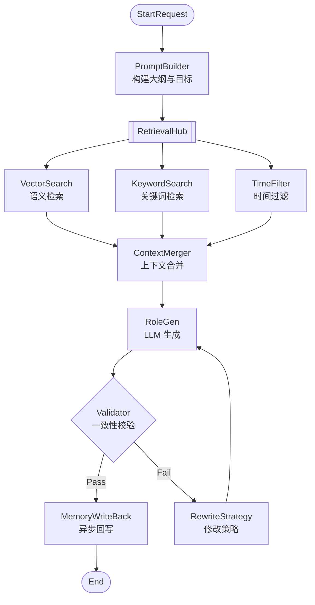

# 10 - Eino 编排与工作流设计

> AI 小说生成后端 Eino 框架集成与工作流编排规范

## 1. 概述

本文档定义了使用字节跳动 Eino 框架进行 LLM 编排的规范，包括 Pipeline 设计、节点定义、错误处理与降级策略。

---

## 2. Eino 框架简介

Eino 是字节跳动开源的 LLM 应用编排框架，提供：

- **Chain**：顺序执行的节点链
- **Graph**：有向无环图编排
- **Tool**：工具调用能力
- **Memory**：对话记忆管理
- **Callback**：执行过程钩子

---

## 3. 章节生成工作流



---

## 4. 节点规范

### 4.1 节点定义表

| 节点          | 输入                 | 输出               | 超时  | 重试 | 错误处理         |
| ------------- | -------------------- | ------------------ | ----- | ---- | ---------------- |
| PromptBuilder | ChapterGoal, Outline | HeadPrompt         | 500ms | 0    | Fail Fast        |
| RetrievalHub  | Query, StoryTime     | ContextList        | 2s    | 1    | 降级为空 Context |
| RoleGen       | FullPrompt           | StreamChunk        | 60s   | 1    | 切换备用模型     |
| Verifier      | Draft                | Pass/Fail + Reason | 10s   | 2    | 默认 Pass        |
| WriteBack     | FinalContent         | EventMsg           | 5s    | 3    | 写入 DLQ         |

### 4.2 节点实现

```go
// internal/workflow/node/prompt_builder.go
package node

import (
    "context"
    "github.com/cloudwego/eino/flow"
)

type PromptBuilderNode struct {
    promptTemplate string
}

type PromptBuilderInput struct {
    Outline         string
    TargetWordCount int
    PreviousSummary string
    WorldSettings   map[string]string
}

type PromptBuilderOutput struct {
    SystemPrompt string
    UserPrompt   string
}

func (n *PromptBuilderNode) Run(ctx context.Context, input *PromptBuilderInput) (*PromptBuilderOutput, error) {
    systemPrompt := fmt.Sprintf(`你是一位专业的小说作家。
世界观设定：%s
请根据大纲生成小说章节内容。`, formatWorldSettings(input.WorldSettings))

    userPrompt := fmt.Sprintf(`章节大纲：%s
上一章摘要：%s
目标字数：%d

请生成本章节的详细内容，注意保持与前文的连贯性。`,
        input.Outline,
        input.PreviousSummary,
        input.TargetWordCount,
    )

    return &PromptBuilderOutput{
        SystemPrompt: systemPrompt,
        UserPrompt:   userPrompt,
    }, nil
}
```

```go
// internal/workflow/node/retrieval_hub.go
package node

import (
    "context"
    "sync"
    "z-novel-ai-api/api/proto/retrieval"
)

type RetrievalHubNode struct {
    retrievalClient retrieval.RetrievalServiceClient
    vectorWeight    float32
    keywordWeight   float32
}

type RetrievalInput struct {
    Query            string
    CurrentStoryTime int64
    TopK             int
    TenantID         string
    ProjectID        string
}

type RetrievalOutput struct {
    Segments       []ContextSegment
    Entities       []EntityRef
    RetrievalStats RetrievalStats
}

func (n *RetrievalHubNode) Run(ctx context.Context, input *RetrievalInput) (*RetrievalOutput, error) {
    resp, err := n.retrievalClient.RetrieveContext(ctx, &retrieval.RetrieveContextRequest{
        Context: &common.TenantContext{
            TenantId:  input.TenantID,
            ProjectId: input.ProjectID,
        },
        Query:            input.Query,
        CurrentStoryTime: input.CurrentStoryTime,
        TopK:             int32(input.TopK),
        Options: &retrieval.RetrievalOptions{
            VectorWeight:    n.vectorWeight,
            KeywordWeight:   n.keywordWeight,
            IncludeEntities: true,
            IncludeEvents:   true,
        },
    })

    if err != nil {
        // 降级：返回空上下文
        logger.Warn(ctx, "retrieval failed, degrading to empty context",
            "error", err,
        )
        return &RetrievalOutput{
            Segments: []ContextSegment{},
            Entities: []EntityRef{},
        }, nil
    }

    return convertRetrievalResponse(resp), nil
}
```

```go
// internal/workflow/node/role_gen.go
package node

import (
    "context"
    "github.com/cloudwego/eino/llm"
)

type RoleGenNode struct {
    llmClient     llm.Client
    fallbackChain []string  // ["openai", "deepseek"]
    maxTokens     int
    temperature   float32
}

type RoleGenInput struct {
    SystemPrompt string
    UserPrompt   string
    Context      string
}

type RoleGenOutput struct {
    Content    string
    TokensUsed int
    Model      string
}

func (n *RoleGenNode) Run(ctx context.Context, input *RoleGenInput) (*RoleGenOutput, error) {
    fullPrompt := fmt.Sprintf("%s\n\n参考上下文：\n%s", input.UserPrompt, input.Context)

    var lastErr error
    for _, model := range n.fallbackChain {
        resp, err := n.llmClient.Complete(ctx, &llm.CompletionRequest{
            Model:       model,
            System:      input.SystemPrompt,
            Messages:    []llm.Message{{Role: "user", Content: fullPrompt}},
            MaxTokens:   n.maxTokens,
            Temperature: n.temperature,
            Stream:      true,
        })

        if err != nil {
            lastErr = err
            logger.Warn(ctx, "llm call failed, trying next model",
                "model", model,
                "error", err,
            )
            continue
        }

        return &RoleGenOutput{
            Content:    resp.Content,
            TokensUsed: resp.Usage.TotalTokens,
            Model:      model,
        }, nil
    }

    return nil, fmt.Errorf("all models failed: %w", lastErr)
}

// 流式生成
func (n *RoleGenNode) RunStream(ctx context.Context, input *RoleGenInput) (<-chan *StreamChunk, error) {
    chunks := make(chan *StreamChunk, 100)

    go func() {
        defer close(chunks)

        stream, err := n.llmClient.CompleteStream(ctx, &llm.CompletionRequest{
            Model:       n.fallbackChain[0],
            System:      input.SystemPrompt,
            Messages:    []llm.Message{{Role: "user", Content: input.UserPrompt}},
            MaxTokens:   n.maxTokens,
            Temperature: n.temperature,
        })

        if err != nil {
            chunks <- &StreamChunk{Error: err}
            return
        }

        index := 0
        for chunk := range stream {
            chunks <- &StreamChunk{
                Text:  chunk.Delta,
                Index: index,
            }
            index++
        }
    }()

    return chunks, nil
}
```

---

## 5. Pipeline 编排

```go
// internal/workflow/pipeline/chapter_gen.go
package pipeline

import (
    "context"
    "github.com/cloudwego/eino/flow"
    "z-novel-ai-api/internal/workflow/node"
)

type ChapterGenPipeline struct {
    promptBuilder *node.PromptBuilderNode
    retrievalHub  *node.RetrievalHubNode
    roleGen       *node.RoleGenNode
    verifier      *node.VerifierNode
    writeBack     *node.WriteBackNode

    maxRetries int
}

type GenerateInput struct {
    TenantID        string
    ProjectID       string
    ChapterID       string
    Outline         string
    TargetWordCount int
    StoryTimeStart  int64
    WorldSettings   map[string]string
    PreviousSummary string
}

type GenerateOutput struct {
    Content          string
    Summary          string
    WordCount        int
    ValidationPassed bool
    Model            string
    TokensUsed       int
}

func (p *ChapterGenPipeline) Execute(ctx context.Context, input *GenerateInput) (*GenerateOutput, error) {
    // 1. 构建 Prompt
    promptOut, err := p.promptBuilder.Run(ctx, &node.PromptBuilderInput{
        Outline:         input.Outline,
        TargetWordCount: input.TargetWordCount,
        PreviousSummary: input.PreviousSummary,
        WorldSettings:   input.WorldSettings,
    })
    if err != nil {
        return nil, fmt.Errorf("prompt builder failed: %w", err)
    }

    // 2. 检索上下文
    retrievalOut, err := p.retrievalHub.Run(ctx, &node.RetrievalInput{
        Query:            input.Outline,
        CurrentStoryTime: input.StoryTimeStart,
        TopK:             20,
        TenantID:         input.TenantID,
        ProjectID:        input.ProjectID,
    })
    if err != nil {
        return nil, fmt.Errorf("retrieval failed: %w", err)
    }

    contextStr := formatContext(retrievalOut.Segments, retrievalOut.Entities)

    // 3. 生成（带重试验证循环）
    var genOut *node.RoleGenOutput
    var validationPassed bool

    for attempt := 0; attempt <= p.maxRetries; attempt++ {
        genOut, err = p.roleGen.Run(ctx, &node.RoleGenInput{
            SystemPrompt: promptOut.SystemPrompt,
            UserPrompt:   promptOut.UserPrompt,
            Context:      contextStr,
        })
        if err != nil {
            return nil, fmt.Errorf("generation failed: %w", err)
        }

        // 4. 校验
        verifyOut, err := p.verifier.Run(ctx, &node.VerifierInput{
            ChapterID:        input.ChapterID,
            Content:          genOut.Content,
            CurrentStoryTime: input.StoryTimeStart,
            TenantID:         input.TenantID,
            ProjectID:        input.ProjectID,
        })
        if err != nil {
            // 校验服务失败，默认通过
            logger.Warn(ctx, "validation failed, defaulting to pass", "error", err)
            validationPassed = true
            break
        }

        if verifyOut.Passed {
            validationPassed = true
            break
        }

        // 根据校验反馈修改 Prompt
        promptOut.UserPrompt = appendValidationFeedback(
            promptOut.UserPrompt,
            verifyOut.Issues,
        )
    }

    // 5. 异步回写
    go func() {
        _ = p.writeBack.Run(context.Background(), &node.WriteBackInput{
            ChapterID: input.ChapterID,
            Content:   genOut.Content,
            TenantID:  input.TenantID,
            ProjectID: input.ProjectID,
        })
    }()

    return &GenerateOutput{
        Content:          genOut.Content,
        Summary:          extractSummary(genOut.Content),
        WordCount:        countWords(genOut.Content),
        ValidationPassed: validationPassed,
        Model:            genOut.Model,
        TokensUsed:       genOut.TokensUsed,
    }, nil
}
```

---

## 6. 流式 Pipeline

```go
// 流式执行
func (p *ChapterGenPipeline) ExecuteStream(ctx context.Context, input *GenerateInput) (<-chan *StreamEvent, error) {
    events := make(chan *StreamEvent, 100)

    go func() {
        defer close(events)

        // 1. Prompt + Retrieval (非流式)
        promptOut, _ := p.promptBuilder.Run(ctx, &node.PromptBuilderInput{...})
        retrievalOut, _ := p.retrievalHub.Run(ctx, &node.RetrievalInput{...})

        events <- &StreamEvent{
            Type: "metadata",
            Data: gin.H{"context_segments": len(retrievalOut.Segments)},
        }

        // 2. 流式生成
        chunks, err := p.roleGen.RunStream(ctx, &node.RoleGenInput{
            SystemPrompt: promptOut.SystemPrompt,
            UserPrompt:   promptOut.UserPrompt,
            Context:      formatContext(retrievalOut.Segments, retrievalOut.Entities),
        })
        if err != nil {
            events <- &StreamEvent{Type: "error", Error: err}
            return
        }

        var fullContent strings.Builder
        for chunk := range chunks {
            if chunk.Error != nil {
                events <- &StreamEvent{Type: "error", Error: chunk.Error}
                return
            }

            fullContent.WriteString(chunk.Text)
            events <- &StreamEvent{
                Type: "content",
                Data: gin.H{"chunk": chunk.Text, "index": chunk.Index},
            }
        }

        // 3. 后处理
        events <- &StreamEvent{
            Type: "complete",
            Data: gin.H{
                "word_count": countWords(fullContent.String()),
            },
        }
    }()

    return events, nil
}
```

---

## 7. 错误处理与降级

### 7.1 降级策略

```go
// internal/workflow/strategy/fallback.go
package strategy

type FallbackStrategy struct {
    EnableModelSwitch   bool
    EnableSkipValidation bool
    DefaultOnRetrievalFail bool
}

func (s *FallbackStrategy) HandleRetrievalError(err error) *RetrievalOutput {
    if s.DefaultOnRetrievalFail {
        logger.Warn(ctx, "retrieval failed, using empty context")
        return &RetrievalOutput{Segments: []ContextSegment{}}
    }
    return nil
}

func (s *FallbackStrategy) HandleValidationError(err error) bool {
    if s.EnableSkipValidation {
        logger.Warn(ctx, "validation failed, defaulting to pass")
        return true // 视为通过
    }
    return false
}
```

---

## 8. 相关文档

- [11-小说生成服务设计](./11-小说生成服务设计.md)
- [12-RAG 检索服务设计](./12-RAG检索服务设计.md)
- [13-校验服务设计](./13-校验服务设计.md)
