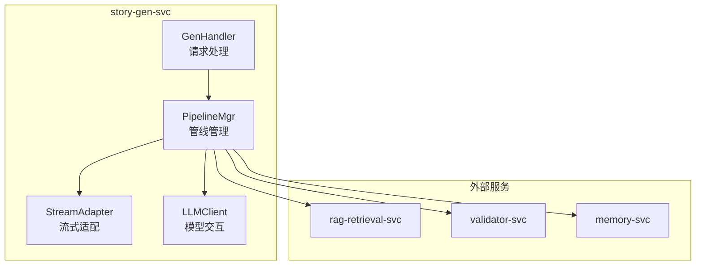
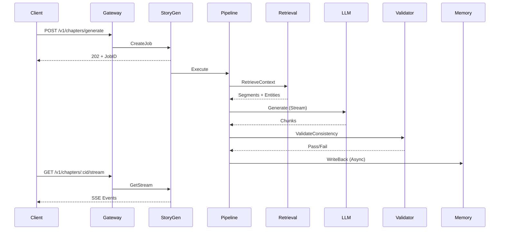

# 11 - 小说生成服务设计

> AI 小说生成后端 story-gen-svc 服务架构与实现规范

## 1. 概述

小说生成服务（story-gen-svc）是系统的核心服务，负责编排章节生成管线、管理 LLM 交互、流式输出以及与其他服务的协调。

---

## 2. 服务架构



---

## 3. 模块划分

### 3.1 GenHandler（请求处理）

```go
// internal/application/story/handler.go
package story

type GenHandler struct {
    pipelineMgr *PipelineMgr
    jobRepo     repository.JobRepository
}

func (h *GenHandler) GenerateChapter(ctx context.Context, req *dto.CreateChapterRequest) (*dto.JobResponse, error) {
    // 1. 创建任务记录
    job := &domain.GenerationJob{
        ID:         uuid.New().String(),
        TenantID:   ctx.Value("tenant_id").(string),
        ProjectID:  req.ProjectID,
        ChapterID:  req.ChapterID,
        Status:     domain.JobStatusPending,
        InputParams: req,
    }

    if err := h.jobRepo.Create(ctx, job); err != nil {
        return nil, err
    }

    // 2. 异步执行
    go h.executeAsync(job)

    return &dto.JobResponse{
        JobID:  job.ID,
        Status: "pending",
    }, nil
}

func (h *GenHandler) executeAsync(job *domain.GenerationJob) {
    ctx := context.Background()

    job.Status = domain.JobStatusRunning
    job.StartedAt = time.Now()
    h.jobRepo.Update(ctx, job)

    output, err := h.pipelineMgr.Execute(ctx, job.InputParams)

    if err != nil {
        job.Status = domain.JobStatusFailed
        job.ErrorMessage = err.Error()
    } else {
        job.Status = domain.JobStatusCompleted
        job.OutputResult = output
    }

    job.CompletedAt = time.Now()
    h.jobRepo.Update(ctx, job)
}
```

### 3.2 PipelineMgr（管线管理）

```go
// internal/application/story/pipeline_mgr.go
package story

type PipelineMgr struct {
    pipeline     *pipeline.ChapterGenPipeline
    config       *config.GenerationConfig
    metricsCollector *metrics.Collector
}

func (m *PipelineMgr) Execute(ctx context.Context, req *dto.CreateChapterRequest) (*dto.GenerateOutput, error) {
    start := time.Now()
    defer func() {
        metrics.StoryGenerationDuration.WithLabelValues(
            req.TenantID,
        ).Observe(time.Since(start).Seconds())
    }()

    // 获取项目设置
    project, err := m.projectRepo.Get(ctx, req.ProjectID)
    if err != nil {
        return nil, err
    }

    // 获取上一章摘要
    previousSummary := m.getPreviousSummary(ctx, req.ProjectID, req.ChapterSeqNum)

    // 执行管线
    output, err := m.pipeline.Execute(ctx, &pipeline.GenerateInput{
        TenantID:        req.TenantID,
        ProjectID:       req.ProjectID,
        ChapterID:       req.ChapterID,
        Outline:         req.Outline,
        TargetWordCount: req.TargetWordCount,
        StoryTimeStart:  req.StoryTimeStart,
        WorldSettings:   project.WorldSettings,
        PreviousSummary: previousSummary,
    })

    if err != nil {
        metrics.StoryGenerationTotal.WithLabelValues(req.TenantID, "failed").Inc()
        return nil, err
    }

    metrics.StoryGenerationTotal.WithLabelValues(req.TenantID, "success").Inc()
    metrics.LLMTokensUsed.WithLabelValues(output.Model, "completion").Add(float64(output.TokensUsed))

    return output, nil
}
```

### 3.3 StreamAdapter（流式适配）

```go
// internal/application/story/stream_adapter.go
package story

type StreamAdapter struct {
    pipeline *pipeline.ChapterGenPipeline
}

type StreamChunk struct {
    Type  string      `json:"type"`
    Data  interface{} `json:"data"`
    Error error       `json:"-"`
}

func (a *StreamAdapter) Stream(ctx context.Context, req *dto.CreateChapterRequest) (<-chan *StreamChunk, error) {
    events, err := a.pipeline.ExecuteStream(ctx, &pipeline.GenerateInput{
        TenantID:        req.TenantID,
        ProjectID:       req.ProjectID,
        ChapterID:       req.ChapterID,
        Outline:         req.Outline,
        TargetWordCount: req.TargetWordCount,
    })
    if err != nil {
        return nil, err
    }

    chunks := make(chan *StreamChunk, 100)

    go func() {
        defer close(chunks)

        for event := range events {
            chunks <- &StreamChunk{
                Type: event.Type,
                Data: event.Data,
            }
        }
    }()

    return chunks, nil
}
```

---

## 4. LLM 交互

### 4.1 多模型支持

```go
// internal/infrastructure/llm/client.go
package llm

type Client struct {
    providers    map[string]Provider
    fallbackChain []string
    metrics       *metrics.Collector
}

type Provider interface {
    Complete(ctx context.Context, req *CompletionRequest) (*CompletionResponse, error)
    CompleteStream(ctx context.Context, req *CompletionRequest) (<-chan *StreamChunk, error)
}

func (c *Client) Complete(ctx context.Context, req *CompletionRequest) (*CompletionResponse, error) {
    var lastErr error

    for _, providerName := range c.fallbackChain {
        provider, ok := c.providers[providerName]
        if !ok {
            continue
        }

        start := time.Now()
        resp, err := provider.Complete(ctx, req)
        duration := time.Since(start)

        metrics.LLMCallDuration.WithLabelValues(providerName, req.Model).Observe(duration.Seconds())

        if err != nil {
            lastErr = err
            logger.Warn(ctx, "llm provider failed",
                "provider", providerName,
                "error", err,
            )
            continue
        }

        return resp, nil
    }

    return nil, fmt.Errorf("all providers failed: %w", lastErr)
}
```

### 4.2 OpenAI Provider

```go
// internal/infrastructure/llm/openai.go
package llm

import (
    "github.com/sashabaranov/go-openai"
)

type OpenAIProvider struct {
    client *openai.Client
    config *config.OpenAIConfig
}

func (p *OpenAIProvider) Complete(ctx context.Context, req *CompletionRequest) (*CompletionResponse, error) {
    resp, err := p.client.CreateChatCompletion(ctx, openai.ChatCompletionRequest{
        Model: req.Model,
        Messages: []openai.ChatCompletionMessage{
            {Role: "system", Content: req.System},
            {Role: "user", Content: req.Messages[0].Content},
        },
        MaxTokens:   req.MaxTokens,
        Temperature: req.Temperature,
    })

    if err != nil {
        return nil, err
    }

    return &CompletionResponse{
        Content: resp.Choices[0].Message.Content,
        Usage: Usage{
            PromptTokens:     resp.Usage.PromptTokens,
            CompletionTokens: resp.Usage.CompletionTokens,
            TotalTokens:      resp.Usage.TotalTokens,
        },
    }, nil
}

func (p *OpenAIProvider) CompleteStream(ctx context.Context, req *CompletionRequest) (<-chan *StreamChunk, error) {
    stream, err := p.client.CreateChatCompletionStream(ctx, openai.ChatCompletionRequest{
        Model:       req.Model,
        Messages:    convertMessages(req),
        MaxTokens:   req.MaxTokens,
        Temperature: req.Temperature,
        Stream:      true,
    })

    if err != nil {
        return nil, err
    }

    chunks := make(chan *StreamChunk, 100)

    go func() {
        defer close(chunks)
        defer stream.Close()

        for {
            resp, err := stream.Recv()
            if err == io.EOF {
                return
            }
            if err != nil {
                chunks <- &StreamChunk{Error: err}
                return
            }

            if len(resp.Choices) > 0 {
                chunks <- &StreamChunk{
                    Delta: resp.Choices[0].Delta.Content,
                }
            }
        }
    }()

    return chunks, nil
}
```

---

## 5. 并发与超时控制

```go
// 服务配置
type ServiceConfig struct {
    GenerationTimeout   time.Duration  // 120s
    RetrievalTimeout    time.Duration  // 5s
    ValidationTimeout   time.Duration  // 10s
    MaxConcurrentJobs   int            // 100
    MaxRetries          int            // 1
}

// 带超时的执行
func (m *PipelineMgr) ExecuteWithTimeout(ctx context.Context, req *dto.CreateChapterRequest) (*dto.GenerateOutput, error) {
    ctx, cancel := context.WithTimeout(ctx, m.config.GenerationTimeout)
    defer cancel()

    resultCh := make(chan *executeResult, 1)

    go func() {
        output, err := m.Execute(ctx, req)
        resultCh <- &executeResult{output: output, err: err}
    }()

    select {
    case result := <-resultCh:
        return result.output, result.err
    case <-ctx.Done():
        return nil, fmt.Errorf("generation timeout: %w", ctx.Err())
    }
}
```

---

## 6. 数据流（DF-1）



---

## 7. 相关文档

- [10-Eino 编排与工作流设计](./10-Eino编排与工作流设计.md)
- [12-RAG 检索服务设计](./12-RAG检索服务设计.md)
- [08-RESTful API 接口规范](./08-RESTful API 接口规范.md)
