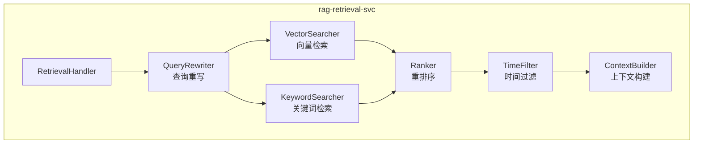
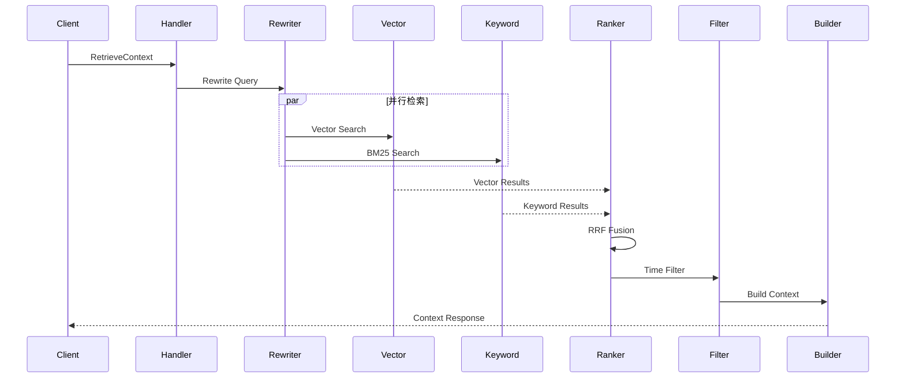

# 12 - RAG 检索服务设计

> AI 小说生成后端 rag-retrieval-svc 三信号检索与上下文构建规范

## 1. 概述

RAG 检索服务负责为章节生成提供相关上下文，采用三信号混合检索策略：语义向量检索、关键词检索和时间过滤。

---

## 2. 服务架构



---

## 3. 三信号检索机制

### 3.1 检索流程



### 3.2 查询重写

```go
// internal/application/retrieval/query_rewriter.go
package retrieval

type QueryRewriter struct {
    llmClient llm.Client
    cache     cache.Cache
}

type RewriteResult struct {
    ExpandedQuery  string   // 扩展后的查询
    Keywords       []string // 提取的关键词
    EntityMentions []string // 提及的实体名
}

func (r *QueryRewriter) Rewrite(ctx context.Context, query string) (*RewriteResult, error) {
    // 1. 尝试从缓存获取
    cacheKey := "query_rewrite:" + hash(query)
    if cached, err := r.cache.Get(ctx, cacheKey); err == nil {
        return cached.(*RewriteResult), nil
    }

    // 2. 使用 LLM 重写查询
    prompt := fmt.Sprintf(`请分析以下小说章节大纲，提取关键信息：

大纲：%s

请返回 JSON 格式：
{
  "expanded_query": "扩展后的搜索查询",
  "keywords": ["关键词1", "关键词2"],
  "entity_mentions": ["角色名1", "地点名1"]
}`, query)

    resp, err := r.llmClient.Complete(ctx, &llm.CompletionRequest{
        Model:   "gpt-4o-mini",
        System:  "你是一个查询分析助手。",
        Messages: []llm.Message{{Role: "user", Content: prompt}},
    })

    if err != nil {
        // 降级：直接使用原始查询
        return &RewriteResult{
            ExpandedQuery: query,
            Keywords:      extractKeywords(query),
        }, nil
    }

    result := parseRewriteResult(resp.Content)
    r.cache.Set(ctx, cacheKey, result, 1*time.Hour)

    return result, nil
}
```

### 3.3 向量检索

```go
// internal/application/retrieval/vector_searcher.go
package retrieval

type VectorSearcher struct {
    milvusRepo  *milvus.Repository
    embedClient *embedding.Client
}

type VectorSearchResult struct {
    Segments []ContextSegment
    Duration time.Duration
}

func (s *VectorSearcher) Search(ctx context.Context, params *SearchParams) (*VectorSearchResult, error) {
    start := time.Now()

    // 1. 生成查询向量
    embeddings, err := s.embedClient.Embed(ctx, []string{params.Query})
    if err != nil {
        return nil, err
    }

    // 2. 向量检索
    results, err := s.milvusRepo.SearchSegments(ctx, &milvus.SearchParams{
        TenantID:         params.TenantID,
        ProjectID:        params.ProjectID,
        QueryVector:      embeddings[0],
        CurrentStoryTime: params.CurrentStoryTime,
        TopK:             params.TopK * 2, // 多召回用于后续融合
    })

    if err != nil {
        return nil, err
    }

    segments := make([]ContextSegment, len(results))
    for i, r := range results {
        segments[i] = ContextSegment{
            ID:          r.ID,
            Text:        r.TextContent,
            ChapterID:   r.ChapterID,
            StoryTime:   r.StoryTime,
            Score:       r.Score,
            Source:      "vector",
        }
    }

    return &VectorSearchResult{
        Segments: segments,
        Duration: time.Since(start),
    }, nil
}
```

### 3.4 关键词检索（BM25）

```go
// internal/application/retrieval/keyword_searcher.go
package retrieval

type KeywordSearcher struct {
    esClient *elasticsearch.Client
}

func (s *KeywordSearcher) Search(ctx context.Context, params *SearchParams) (*KeywordSearchResult, error) {
    // BM25 搜索
    query := map[string]interface{}{
        "query": map[string]interface{}{
            "bool": map[string]interface{}{
                "must": []map[string]interface{}{
                    {
                        "multi_match": map[string]interface{}{
                            "query":  params.Query,
                            "fields": []string{"content^2", "summary", "entity_names"},
                            "type":   "best_fields",
                        },
                    },
                },
                "filter": []map[string]interface{}{
                    {"term": {"tenant_id": params.TenantID}},
                    {"term": {"project_id": params.ProjectID}},
                },
            },
        },
        "size": params.TopK * 2,
    }

    resp, err := s.esClient.Search(
        s.esClient.Search.WithContext(ctx),
        s.esClient.Search.WithIndex("story_segments"),
        s.esClient.Search.WithBody(esutil.NewJSONReader(query)),
    )

    if err != nil {
        return nil, err
    }

    return parseESResponse(resp), nil
}
```

---

## 4. 融合重排

### 4.1 RRF（Reciprocal Rank Fusion）

```go
// internal/application/retrieval/ranker.go
package retrieval

type Ranker struct {
    vectorWeight  float32
    keywordWeight float32
    rrfK          float32 // 默认 60
}

func (r *Ranker) FusionRank(vectorResults, keywordResults []ContextSegment) []ContextSegment {
    scores := make(map[string]float32)
    segments := make(map[string]ContextSegment)

    // 向量结果评分
    for i, seg := range vectorResults {
        rank := float32(i + 1)
        score := r.vectorWeight / (r.rrfK + rank)
        scores[seg.ID] += score
        segments[seg.ID] = seg
    }

    // 关键词结果评分
    for i, seg := range keywordResults {
        rank := float32(i + 1)
        score := r.keywordWeight / (r.rrfK + rank)
        scores[seg.ID] += score
        if _, exists := segments[seg.ID]; !exists {
            segments[seg.ID] = seg
        }
    }

    // 合并并排序
    var merged []ContextSegment
    for id, seg := range segments {
        seg.Score = scores[id]
        seg.Source = determineSource(vectorResults, keywordResults, id)
        merged = append(merged, seg)
    }

    sort.Slice(merged, func(i, j int) bool {
        return merged[i].Score > merged[j].Score
    })

    return merged
}
```

---

## 5. 时间过滤

```go
// internal/application/retrieval/time_filter.go
package retrieval

type TimeFilter struct{}

func (f *TimeFilter) Filter(segments []ContextSegment, currentStoryTime int64) []ContextSegment {
    var filtered []ContextSegment

    for _, seg := range segments {
        // 排除未来事件
        if seg.StoryTime > currentStoryTime {
            continue
        }

        // 时间衰减（可选）
        timeDiff := currentStoryTime - seg.StoryTime
        if timeDiff > 0 {
            decayFactor := 1.0 / (1.0 + float32(timeDiff)/1000000)
            seg.Score *= decayFactor
        }

        filtered = append(filtered, seg)
    }

    // 重新排序
    sort.Slice(filtered, func(i, j int) bool {
        return filtered[i].Score > filtered[j].Score
    })

    return filtered
}
```

---

## 6. 上下文构建

```go
// internal/application/retrieval/context_builder.go
package retrieval

type ContextBuilder struct {
    maxTokens    int
    entityRepo   repository.EntityRepository
}

type BuiltContext struct {
    Text        string
    Entities    []EntityRef
    TokenCount  int
}

func (b *ContextBuilder) Build(ctx context.Context, segments []ContextSegment, params *BuildParams) (*BuiltContext, error) {
    var contextParts []string
    var entities []EntityRef
    tokenCount := 0

    // 1. 添加相关片段
    for _, seg := range segments {
        segTokens := countTokens(seg.Text)
        if tokenCount + segTokens > b.maxTokens {
            break
        }

        contextParts = append(contextParts, fmt.Sprintf(
            "[来源：第%s章，故事时间：%d]\n%s",
            seg.ChapterID, seg.StoryTime, seg.Text,
        ))
        tokenCount += segTokens
    }

    // 2. 获取相关实体状态
    entityIDs := extractEntityIDs(segments)
    entityStates, err := b.entityRepo.GetByIDs(ctx, entityIDs)
    if err == nil {
        for _, e := range entityStates {
            entities = append(entities, EntityRef{
                ID:    e.ID,
                Name:  e.Name,
                Type:  e.Type,
                State: e.CurrentState,
            })
        }
    }

    return &BuiltContext{
        Text:       strings.Join(contextParts, "\n\n---\n\n"),
        Entities:   entities,
        TokenCount: tokenCount,
    }, nil
}
```

---

## 7. 检索调试接口

```go
// 提供检索效果调试
func (h *RetrievalHandler) DebugRetrieval(ctx context.Context, req *DebugRequest) (*DebugResponse, error) {
    // 详细记录每个检索步骤
    debug := &DebugInfo{}

    // 1. 查询重写
    rewriteResult, _ := h.rewriter.Rewrite(ctx, req.Query)
    debug.RewriteResult = rewriteResult

    // 2. 向量检索
    vectorResult, _ := h.vectorSearcher.Search(ctx, &SearchParams{Query: rewriteResult.ExpandedQuery, ...})
    debug.VectorResults = vectorResult.Segments
    debug.VectorDuration = vectorResult.Duration

    // 3. 关键词检索
    keywordResult, _ := h.keywordSearcher.Search(ctx, &SearchParams{Query: req.Query, Keywords: rewriteResult.Keywords, ...})
    debug.KeywordResults = keywordResult.Segments
    debug.KeywordDuration = keywordResult.Duration

    // 4. 融合结果
    merged := h.ranker.FusionRank(vectorResult.Segments, keywordResult.Segments)
    debug.MergedResults = merged

    // 5. 时间过滤
    filtered := h.timeFilter.Filter(merged, req.CurrentStoryTime)
    debug.FilteredResults = filtered

    return &DebugResponse{
        FinalContext: h.builder.Build(ctx, filtered, &BuildParams{}),
        DebugInfo:    debug,
    }, nil
}
```

---

## 8. 相关文档

- [06-向量数据库规范](./06-向量数据库规范.md)
- [11-小说生成服务设计](./11-小说生成服务设计.md)
- [14-记忆服务设计](./14-记忆服务设计.md)
