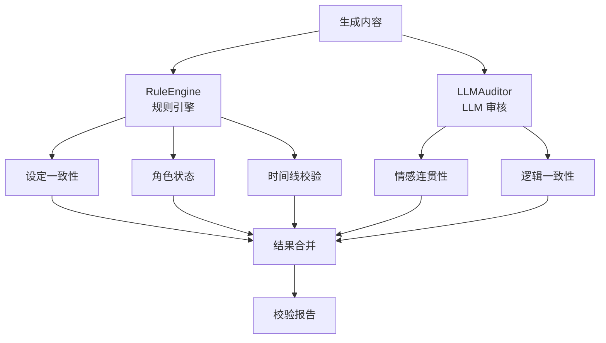

# 13 - 校验服务设计

> AI 小说生成后端 validator-svc 四维一致性校验规范

## 1. 概述

校验服务负责对生成的章节内容进行四维一致性校验：设定一致性、角色状态、时间线、情感连贯性。

---

## 2. 四维校验模型



---

## 3. 校验维度

| 维度       | 校验内容               | 方法     | 严重级别 |
| ---------- | ---------------------- | -------- | -------- |
| 设定一致性 | 世界观、魔法体系、规则 | 规则匹配 | ERROR    |
| 角色状态   | 生死、位置、属性变化   | 状态比对 | ERROR    |
| 时间线     | 事件顺序、因果关系     | 规则引擎 | WARNING  |
| 情感连贯   | 角色情绪、关系变化     | LLM 分析 | INFO     |

---

## 4. 规则引擎

```go
// internal/application/validator/rule_engine.go
package validator

type RuleEngine struct {
    rules []Rule
}

type Rule interface {
    Name() string
    Check(ctx context.Context, input *ValidationInput) (*ValidationResult, error)
}

// 角色状态规则
type CharacterStateRule struct {
    memoryClient memory.MemoryServiceClient
}

func (r *CharacterStateRule) Name() string {
    return "character_state"
}

func (r *CharacterStateRule) Check(ctx context.Context, input *ValidationInput) (*ValidationResult, error) {
    // 1. 提取内容中提及的角色
    mentionedCharacters := extractCharacterMentions(input.Content)

    // 2. 获取角色当前状态
    states, err := r.memoryClient.ListEntities(ctx, &memory.ListEntitiesRequest{
        Context:   input.TenantContext,
        EntityIds: mentionedCharacters,
    })
    if err != nil {
        return nil, err
    }

    // 3. 检查状态冲突
    var issues []ValidationIssue

    for _, entity := range states.Entities {
        // 检查已死亡角色是否出现
        if strings.Contains(entity.CurrentState, "死亡") {
            if isCharacterActive(input.Content, entity.Name) {
                issues = append(issues, ValidationIssue{
                    Type:        ISSUE_TYPE_CHARACTER_STATE,
                    Severity:    ISSUE_SEVERITY_ERROR,
                    Description: fmt.Sprintf("角色 %s 已在之前章节死亡，但在本章中活跃出现", entity.Name),
                    Location:    findLocation(input.Content, entity.Name),
                    Suggestions: []string{
                        "移除该角色的出场",
                        "修改为回忆或闪回场景",
                        "确认之前章节中的死亡描述是否需要修改",
                    },
                })
            }
        }

        // 检查位置一致性
        if entityLocation := extractLocation(entity.CurrentState); entityLocation != "" {
            contentLocation := extractCharacterLocation(input.Content, entity.Name)
            if contentLocation != "" && contentLocation != entityLocation {
                issues = append(issues, ValidationIssue{
                    Type:        ISSUE_TYPE_CHARACTER_STATE,
                    Severity:    ISSUE_SEVERITY_WARNING,
                    Description: fmt.Sprintf("角色 %s 上次出现在 %s，但本章直接出现在 %s，缺少位置转换描述",
                        entity.Name, entityLocation, contentLocation),
                    Suggestions: []string{
                        "添加角色移动的描述",
                        "解释位置变化的原因",
                    },
                })
            }
        }
    }

    return &ValidationResult{
        Passed: len(issues) == 0,
        Issues: issues,
    }, nil
}

// 时间线规则
type TimelineRule struct {
    memoryClient memory.MemoryServiceClient
}

func (r *TimelineRule) Check(ctx context.Context, input *ValidationInput) (*ValidationResult, error) {
    // 获取相关事件
    events, err := r.memoryClient.ListEvents(ctx, &memory.ListEventsRequest{
        Context:   input.TenantContext,
        TimeRange: &common.TimeRange{End: input.CurrentStoryTime},
    })
    if err != nil {
        return nil, err
    }

    var issues []ValidationIssue

    // 检查时间悖论
    for _, event := range events.Events {
        if isEventContradicted(input.Content, event) {
            issues = append(issues, ValidationIssue{
                Type:        ISSUE_TYPE_TIMELINE_ERROR,
                Severity:    ISSUE_SEVERITY_WARNING,
                Description: fmt.Sprintf("内容与已发生的事件矛盾：%s", event.Summary),
                Suggestions: []string{"调整描述以符合已建立的时间线"},
            })
        }
    }

    return &ValidationResult{Issues: issues}, nil
}
```

---

## 5. LLM 审核器

```go
// internal/application/validator/llm_auditor.go
package validator

type LLMAuditor struct {
    llmClient llm.Client
    timeout   time.Duration
}

func (a *LLMAuditor) Audit(ctx context.Context, input *ValidationInput) (*AuditResult, error) {
    ctx, cancel := context.WithTimeout(ctx, a.timeout)
    defer cancel()

    prompt := fmt.Sprintf(`你是一位专业的小说编辑，请审核以下章节内容的一致性和连贯性。

章节内容：
%s

已知角色状态：
%s

已知事件时间线：
%s

请检查：
1. 情感连贯性：角色情绪变化是否自然合理
2. 逻辑一致性：剧情发展是否符合逻辑
3. 设定符合度：是否违反已建立的世界观设定

请以 JSON 格式返回：
{
  "passed": true/false,
  "issues": [
    {
      "type": "emotion/logic/setting",
      "severity": "error/warning/info",
      "description": "问题描述",
      "location": "具体位置",
      "suggestions": ["修改建议"]
    }
  ],
  "summary": "整体评价"
}`,
        input.Content,
        formatEntityStates(input.EntityStates),
        formatEventTimeline(input.Events),
    )

    resp, err := a.llmClient.Complete(ctx, &llm.CompletionRequest{
        Model:       "gpt-4o",
        System:      "你是专业的小说一致性审核专家。",
        Messages:    []llm.Message{{Role: "user", Content: prompt}},
        MaxTokens:   2048,
        Temperature: 0.3,
    })

    if err != nil {
        // 校验服务失败，默认通过
        logger.Warn(ctx, "llm audit failed", "error", err)
        return &AuditResult{Passed: true}, nil
    }

    return parseAuditResult(resp.Content), nil
}
```

---

## 6. 敏感内容过滤

```go
// internal/application/validator/content_filter.go
package validator

type ContentFilter struct {
    sensitiveWords []string
    nsfwClient     NSFWClient
}

func (f *ContentFilter) Filter(ctx context.Context, content string) (*FilterResult, error) {
    var issues []ValidationIssue

    // 1. 敏感词检测
    for _, word := range f.sensitiveWords {
        if strings.Contains(content, word) {
            issues = append(issues, ValidationIssue{
                Type:        ISSUE_TYPE_SENSITIVE,
                Severity:    ISSUE_SEVERITY_ERROR,
                Description: fmt.Sprintf("检测到敏感词：%s", word),
                Location:    findWordLocation(content, word),
                Suggestions: []string{"请替换或删除敏感内容"},
            })
        }
    }

    // 2. NSFW 检测（调用外部服务）
    nsfwResult, err := f.nsfwClient.Check(ctx, content)
    if err == nil && nsfwResult.IsNSFW {
        issues = append(issues, ValidationIssue{
            Type:        ISSUE_TYPE_NSFW,
            Severity:    ISSUE_SEVERITY_ERROR,
            Description: "内容包含不适当元素",
            Suggestions: []string{"请修改不适当的内容描述"},
        })
    }

    return &FilterResult{
        Passed: len(issues) == 0,
        Issues: issues,
    }, nil
}
```

---

## 7. 校验服务整合

```go
// internal/application/validator/service.go
package validator

type ValidatorService struct {
    ruleEngine    *RuleEngine
    llmAuditor    *LLMAuditor
    contentFilter *ContentFilter
    config        *config.ValidatorConfig
}

func (s *ValidatorService) Validate(ctx context.Context, req *ValidateRequest) (*ValidateResponse, error) {
    start := time.Now()
    var allIssues []ValidationIssue

    // 1. 规则引擎校验
    ruleResult, err := s.ruleEngine.Check(ctx, req.ToInput())
    if err != nil {
        logger.Error(ctx, "rule engine failed", err)
    } else {
        allIssues = append(allIssues, ruleResult.Issues...)
    }

    // 2. LLM 审核
    if s.config.EnableLLMAudit {
        auditResult, err := s.llmAuditor.Audit(ctx, req.ToInput())
        if err != nil {
            logger.Error(ctx, "llm audit failed", err)
        } else {
            allIssues = append(allIssues, auditResult.Issues...)
        }
    }

    // 3. 内容过滤
    filterResult, err := s.contentFilter.Filter(ctx, req.Content)
    if err != nil {
        logger.Error(ctx, "content filter failed", err)
    } else {
        allIssues = append(allIssues, filterResult.Issues...)
    }

    // 4. 判断是否通过
    passed := true
    for _, issue := range allIssues {
        if issue.Severity == ISSUE_SEVERITY_ERROR {
            passed = false
            break
        }
    }

    // 5. 降级策略
    if !passed && s.config.DefaultPassOnFailure {
        logger.Warn(ctx, "validation failed but defaulting to pass", "issues", len(allIssues))
        passed = true
    }

    return &ValidateResponse{
        Passed: passed,
        Issues: allIssues,
        Metadata: &ValidatorMetadata{
            Duration: time.Since(start),
        },
    }, nil
}
```

---

## 8. 相关文档

- [11-小说生成服务设计](./11-小说生成服务设计.md)
- [14-记忆服务设计](./14-记忆服务设计.md)
- [10-Eino 编排与工作流设计](./10-Eino编排与工作流设计.md)
