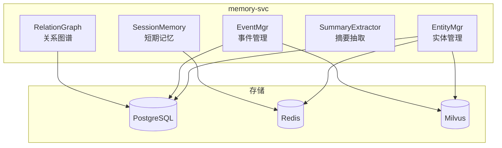

# 14 - 记忆服务设计

> AI 小说生成后端 memory-svc 实体/事件/关系管理与摘要回写规范

## 1. 概述

记忆服务负责管理小说的"记忆"系统，包括实体（角色/物品/地点）管理、事件时间轴、实体关系图谱以及章节摘要回写。

---

## 2. 服务架构



---

## 3. 实体管理（EntityMgr）

```go
// internal/application/memory/entity_mgr.go
package memory

type EntityMgr struct {
    entityRepo  repository.EntityRepository
    stateRepo   repository.EntityStateRepository
    cache       cache.Cache
    milvusRepo  *milvus.Repository
    embedClient *embedding.Client
}

// 创建实体
func (m *EntityMgr) Create(ctx context.Context, req *CreateEntityRequest) (*Entity, error) {
    entity := &domain.Entity{
        ID:          uuid.New().String(),
        ProjectID:   req.ProjectID,
        Name:        req.Name,
        Aliases:     req.Aliases,
        Type:        req.Type,
        Description: req.Description,
        Attributes:  req.Attributes,
        Importance:  req.Importance,
    }

    // 1. 保存到数据库
    if err := m.entityRepo.Create(ctx, entity); err != nil {
        return nil, err
    }

    // 2. 生成向量并存储
    go m.indexEntity(context.Background(), entity)

    return entity, nil
}

// 更新实体状态
func (m *EntityMgr) UpdateState(ctx context.Context, req *UpdateStateRequest) error {
    // 1. 获取当前实体
    entity, err := m.entityRepo.Get(ctx, req.EntityID)
    if err != nil {
        return err
    }

    // 2. 记录状态历史
    stateHist := &domain.EntityState{
        ID:               uuid.New().String(),
        EntityID:         req.EntityID,
        ChapterID:        req.ChapterID,
        StoryTime:        req.StoryTime,
        StateDescription: req.NewState,
        AttributeChanges: req.AttributeChanges,
        EventSummary:     req.EventSummary,
    }

    if err := m.stateRepo.Create(ctx, stateHist); err != nil {
        return err
    }

    // 3. 更新当前状态
    entity.CurrentState = req.NewState
    entity.LastAppearChapterID = req.ChapterID

    for k, v := range req.AttributeChanges {
        entity.Attributes[k] = v
    }

    if err := m.entityRepo.Update(ctx, entity); err != nil {
        return err
    }

    // 4. 失效缓存
    m.cache.InvalidateEntity(ctx, entity.ProjectID, entity.ID)

    // 5. 更新向量索引
    go m.indexEntity(context.Background(), entity)

    return nil
}

// 获取实体（带缓存）
func (m *EntityMgr) Get(ctx context.Context, id string) (*Entity, error) {
    cacheKey := fmt.Sprintf("entity:%s", id)

    // 尝试缓存
    if cached, err := m.cache.Get(ctx, cacheKey); err == nil {
        return cached.(*Entity), nil
    }

    // 从数据库获取
    entity, err := m.entityRepo.Get(ctx, id)
    if err != nil {
        return nil, err
    }

    // 写入缓存
    m.cache.Set(ctx, cacheKey, entity, 30*time.Minute)

    return entity, nil
}

// 实体向量索引
func (m *EntityMgr) indexEntity(ctx context.Context, entity *domain.Entity) {
    text := fmt.Sprintf("%s\n%s\n%s", entity.Name, entity.Description, entity.CurrentState)

    embeddings, err := m.embedClient.Embed(ctx, []string{text})
    if err != nil {
        logger.Error(ctx, "entity embedding failed", err)
        return
    }

    m.milvusRepo.UpsertEntityProfile(ctx, &milvus.EntityProfile{
        ID:          entity.ID,
        TenantID:    entity.TenantID,
        ProjectID:   entity.ProjectID,
        EntityID:    entity.ID,
        EntityType:  entity.Type,
        Name:        entity.Name,
        Description: entity.Description,
        Vector:      embeddings[0],
    })
}
```

---

## 4. 事件管理（EventMgr）

```go
// internal/application/memory/event_mgr.go
package memory

type EventMgr struct {
    eventRepo   repository.EventRepository
    milvusRepo  *milvus.Repository
    embedClient *embedding.Client
}

// 创建事件
func (m *EventMgr) Create(ctx context.Context, req *CreateEventRequest) (*Event, error) {
    event := &domain.Event{
        ID:               uuid.New().String(),
        ProjectID:        req.ProjectID,
        ChapterID:        req.ChapterID,
        StoryTimeStart:   req.StoryTimeStart,
        StoryTimeEnd:     req.StoryTimeEnd,
        EventType:        req.EventType,
        Summary:          req.Summary,
        Description:      req.Description,
        InvolvedEntities: req.InvolvedEntityIDs,
        LocationID:       req.LocationID,
        Importance:       req.Importance,
        Tags:             req.Tags,
    }

    if err := m.eventRepo.Create(ctx, event); err != nil {
        return nil, err
    }

    // 异步索引
    go m.indexEvent(context.Background(), event)

    return event, nil
}

// 按时间范围查询事件
func (m *EventMgr) ListByTimeRange(ctx context.Context, projectID string, start, end int64) ([]*Event, error) {
    return m.eventRepo.ListByTimeRange(ctx, projectID, start, end)
}

// 获取实体相关事件
func (m *EventMgr) ListByEntity(ctx context.Context, entityID string) ([]*Event, error) {
    return m.eventRepo.ListByInvolvedEntity(ctx, entityID)
}
```

---

## 5. 关系图谱（RelationGraph）

```go
// internal/application/memory/relation_graph.go
package memory

type RelationGraph struct {
    relationRepo repository.RelationRepository
}

// 创建或更新关系
func (g *RelationGraph) Upsert(ctx context.Context, req *UpsertRelationRequest) error {
    relation := &domain.Relation{
        ProjectID:      req.ProjectID,
        SourceEntityID: req.SourceEntityID,
        TargetEntityID: req.TargetEntityID,
        RelationType:   req.RelationType,
        Strength:       req.Strength,
        Description:    req.Description,
    }

    existing, err := g.relationRepo.GetByEntities(ctx, req.SourceEntityID, req.TargetEntityID, req.RelationType)
    if err == nil && existing != nil {
        // 更新
        existing.Strength = req.Strength
        existing.Description = req.Description
        existing.LastChapterID = req.ChapterID
        return g.relationRepo.Update(ctx, existing)
    }

    // 创建
    relation.ID = uuid.New().String()
    relation.FirstChapterID = req.ChapterID
    return g.relationRepo.Create(ctx, relation)
}

// 获取实体的所有关系
func (g *RelationGraph) GetEntityRelations(ctx context.Context, entityID string) ([]*Relation, error) {
    return g.relationRepo.ListByEntity(ctx, entityID)
}

// 获取两个实体之间的关系
func (g *RelationGraph) GetRelationBetween(ctx context.Context, entityA, entityB string) ([]*Relation, error) {
    return g.relationRepo.ListBetween(ctx, entityA, entityB)
}
```

---

## 6. 摘要抽取与回写

```go
// internal/application/memory/summary_extractor.go
package memory

type SummaryExtractor struct {
    llmClient    llm.Client
    entityMgr    *EntityMgr
    eventMgr     *EventMgr
    relationMgr  *RelationGraph
}

type WriteBackRequest struct {
    ChapterID   string
    Content     string
    TenantID    string
    ProjectID   string
}

func (e *SummaryExtractor) WriteBack(ctx context.Context, req *WriteBackRequest) error {
    // 1. 提取摘要和实体状态变化
    extracted, err := e.extract(ctx, req.Content)
    if err != nil {
        return err
    }

    // 2. 更新章节摘要
    if err := e.updateChapterSummary(ctx, req.ChapterID, extracted.Summary); err != nil {
        logger.Error(ctx, "update chapter summary failed", err)
    }

    // 3. 更新实体状态
    for _, update := range extracted.EntityUpdates {
        if err := e.entityMgr.UpdateState(ctx, &UpdateStateRequest{
            EntityID:         update.EntityID,
            ChapterID:        req.ChapterID,
            NewState:         update.NewState,
            AttributeChanges: update.AttributeChanges,
        }); err != nil {
            logger.Error(ctx, "update entity state failed", err, "entity_id", update.EntityID)
        }
    }

    // 4. 创建新事件
    for _, event := range extracted.NewEvents {
        if _, err := e.eventMgr.Create(ctx, &CreateEventRequest{
            ProjectID:         req.ProjectID,
            ChapterID:         req.ChapterID,
            StoryTimeStart:    event.StoryTime,
            EventType:         event.Type,
            Summary:           event.Summary,
            InvolvedEntityIDs: event.InvolvedEntities,
        }); err != nil {
            logger.Error(ctx, "create event failed", err)
        }
    }

    // 5. 更新关系
    for _, rel := range extracted.RelationChanges {
        if err := e.relationMgr.Upsert(ctx, &UpsertRelationRequest{
            ProjectID:      req.ProjectID,
            SourceEntityID: rel.SourceID,
            TargetEntityID: rel.TargetID,
            RelationType:   rel.Type,
            Strength:       rel.Strength,
            ChapterID:      req.ChapterID,
        }); err != nil {
            logger.Error(ctx, "update relation failed", err)
        }
    }

    return nil
}

func (e *SummaryExtractor) extract(ctx context.Context, content string) (*ExtractedInfo, error) {
    prompt := fmt.Sprintf(`请分析以下小说章节内容，提取关键信息。

章节内容：
%s

请以 JSON 格式返回：
{
  "summary": "章节摘要（100字以内）",
  "entity_updates": [
    {
      "entity_name": "角色名",
      "new_state": "新的状态描述",
      "attribute_changes": {"属性": "新值"}
    }
  ],
  "new_events": [
    {
      "type": "事件类型",
      "summary": "事件摘要",
      "involved_entities": ["相关角色"],
      "story_time": 时间戳
    }
  ],
  "relation_changes": [
    {
      "source": "角色A",
      "target": "角色B",
      "type": "关系类型",
      "strength": 0.8
    }
  ]
}`, content)

    resp, err := e.llmClient.Complete(ctx, &llm.CompletionRequest{
        Model:       "gpt-4o-mini",
        System:      "你是专业的小说内容分析专家。",
        Messages:    []llm.Message{{Role: "user", Content: prompt}},
        MaxTokens:   2048,
        Temperature: 0.3,
    })

    if err != nil {
        return nil, err
    }

    return parseExtractedInfo(resp.Content), nil
}
```

---

## 7. 短期会话记忆

```go
// internal/application/memory/session_memory.go
package memory

type SessionMemory struct {
    redis *redis.Client
    ttl   time.Duration
}

type SessionContext struct {
    RecentChunks    []string          // 最近生成的片段
    ActiveEntities  []string          // 活跃的实体 ID
    CurrentLocation string            // 当前场景位置
    EmotionalTone   string            // 情感基调
    LastUpdateTime  time.Time
}

func (m *SessionMemory) Get(ctx context.Context, sessionID string) (*SessionContext, error) {
    key := "session:" + sessionID
    data, err := m.redis.Get(ctx, key).Bytes()
    if err != nil {
        if err == redis.Nil {
            return &SessionContext{}, nil
        }
        return nil, err
    }

    var session SessionContext
    json.Unmarshal(data, &session)
    return &session, nil
}

func (m *SessionMemory) Update(ctx context.Context, sessionID string, update *SessionUpdate) error {
    session, _ := m.Get(ctx, sessionID)

    // 追加最近片段（保留最近 10 个）
    session.RecentChunks = append(session.RecentChunks, update.NewChunk)
    if len(session.RecentChunks) > 10 {
        session.RecentChunks = session.RecentChunks[len(session.RecentChunks)-10:]
    }

    session.ActiveEntities = update.ActiveEntities
    session.CurrentLocation = update.Location
    session.EmotionalTone = update.Tone
    session.LastUpdateTime = time.Now()

    data, _ := json.Marshal(session)
    return m.redis.Set(ctx, "session:"+sessionID, data, m.ttl).Err()
}
```

---

## 8. 相关文档

- [12-RAG 检索服务设计](./12-RAG检索服务设计.md)
- [13-校验服务设计](./13-校验服务设计.md)
- [04-PostgreSQL 数据库设计详细文档](./04-PostgreSQL数据库设计详细文档.md)
