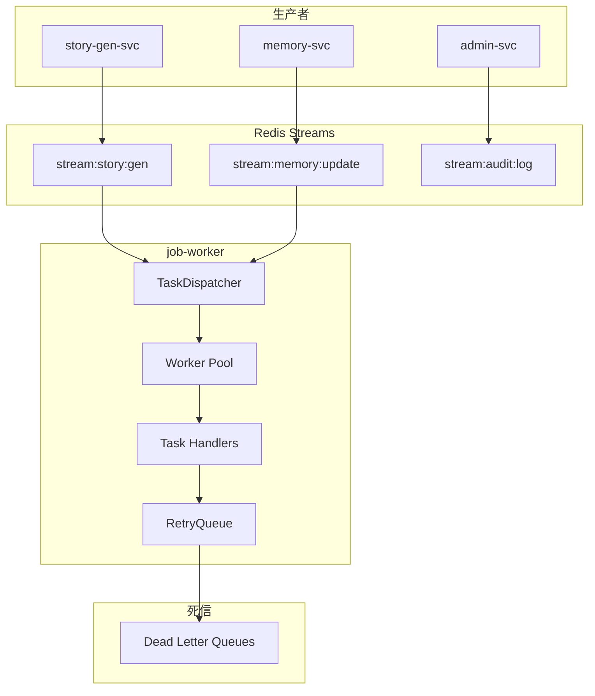

# 15 - 异步任务服务设计

> AI 小说生成后端 job-worker 任务调度与执行规范

## 1. 概述

异步任务服务（job-worker）负责处理异步任务，包括批量 Embedding 生成、索引重建、摘要回写等耗时操作。

---

## 2. 服务架构



---

## 3. Worker Pool 设计

```go
// internal/application/worker/pool.go
package worker

type Pool struct {
    workers    int
    taskChan   chan *Task
    resultChan chan *Result
    wg         sync.WaitGroup
    ctx        context.Context
    cancel     context.CancelFunc
}

func NewPool(workers int) *Pool {
    ctx, cancel := context.WithCancel(context.Background())
    return &Pool{
        workers:    workers,
        taskChan:   make(chan *Task, workers*10),
        resultChan: make(chan *Result, workers*10),
        ctx:        ctx,
        cancel:     cancel,
    }
}

func (p *Pool) Start(handler TaskHandler) {
    for i := 0; i < p.workers; i++ {
        p.wg.Add(1)
        go p.worker(i, handler)
    }
}

func (p *Pool) worker(id int, handler TaskHandler) {
    defer p.wg.Done()

    for {
        select {
        case <-p.ctx.Done():
            return
        case task := <-p.taskChan:
            result := p.executeTask(task, handler)
            p.resultChan <- result
        }
    }
}

func (p *Pool) executeTask(task *Task, handler TaskHandler) *Result {
    start := time.Now()

    ctx, cancel := context.WithTimeout(p.ctx, task.Timeout)
    defer cancel()

    err := handler.Handle(ctx, task)

    return &Result{
        TaskID:   task.ID,
        Success:  err == nil,
        Error:    err,
        Duration: time.Since(start),
    }
}
```

---

## 4. 任务分发器

```go
// internal/application/worker/dispatcher.go
package worker

type Dispatcher struct {
    redis     *redis.Client
    pool      *Pool
    handlers  map[string]TaskHandler
    consumers map[string]*Consumer
}

func (d *Dispatcher) Start(ctx context.Context) error {
    // 启动消费者
    for streamName, handler := range d.handlers {
        consumer := NewConsumer(d.redis, streamName, handler)
        d.consumers[streamName] = consumer

        go func(c *Consumer) {
            if err := c.Start(ctx); err != nil {
                logger.Error(ctx, "consumer stopped", err, "stream", c.stream)
            }
        }(consumer)
    }

    // 启动结果处理
    go d.processResults(ctx)

    return nil
}

func (d *Dispatcher) processResults(ctx context.Context) {
    for {
        select {
        case <-ctx.Done():
            return
        case result := <-d.pool.resultChan:
            d.handleResult(ctx, result)
        }
    }
}

func (d *Dispatcher) handleResult(ctx context.Context, result *Result) {
    if result.Success {
        metrics.JobsCompleted.WithLabelValues(result.TaskType).Inc()
        return
    }

    metrics.JobsFailed.WithLabelValues(result.TaskType).Inc()
    logger.Error(ctx, "task failed", result.Error,
        "task_id", result.TaskID,
        "task_type", result.TaskType,
    )
}
```

---

## 5. 任务处理器

```go
// internal/application/worker/handlers.go
package worker

// Embedding 批量生成
type EmbeddingHandler struct {
    embedClient *embedding.Client
    milvusRepo  *milvus.Repository
}

func (h *EmbeddingHandler) Handle(ctx context.Context, task *Task) error {
    var req EmbeddingBatchRequest
    json.Unmarshal(task.Payload, &req)

    // 批量生成 Embedding
    embeddings, err := h.embedClient.Embed(ctx, req.Texts)
    if err != nil {
        return err
    }

    // 批量写入 Milvus
    segments := make([]*milvus.Segment, len(req.Texts))
    for i := range req.Texts {
        segments[i] = &milvus.Segment{
            ID:          req.IDs[i],
            TenantID:    req.TenantID,
            ProjectID:   req.ProjectID,
            TextContent: req.Texts[i],
            Vector:      embeddings[i],
        }
    }

    return h.milvusRepo.UpsertSegments(ctx, segments)
}

// 索引重建
type IndexRebuildHandler struct {
    milvusRepo *milvus.Repository
}

func (h *IndexRebuildHandler) Handle(ctx context.Context, task *Task) error {
    var req IndexRebuildRequest
    json.Unmarshal(task.Payload, &req)

    return h.milvusRepo.RebuildIndex(ctx, req.Collection)
}

// 摘要回写
type SummaryWriteBackHandler struct {
    summaryExtractor *memory.SummaryExtractor
}

func (h *SummaryWriteBackHandler) Handle(ctx context.Context, task *Task) error {
    var req memory.WriteBackRequest
    json.Unmarshal(task.Payload, &req)

    return h.summaryExtractor.WriteBack(ctx, &req)
}
```

---

## 6. 重试与死信队列

```go
// internal/application/worker/retry.go
package worker

type RetryManager struct {
    redis   *redis.Client
    config  *RetryConfig
}

type RetryConfig struct {
    MaxRetries     int
    InitialBackoff time.Duration
    MaxBackoff     time.Duration
    Multiplier     float64
}

func (m *RetryManager) ShouldRetry(task *Task) bool {
    return task.RetryCount < m.config.MaxRetries
}

func (m *RetryManager) CalculateBackoff(retryCount int) time.Duration {
    backoff := m.config.InitialBackoff
    for i := 0; i < retryCount; i++ {
        backoff = time.Duration(float64(backoff) * m.config.Multiplier)
        if backoff > m.config.MaxBackoff {
            return m.config.MaxBackoff
        }
    }
    return backoff
}

func (m *RetryManager) ScheduleRetry(ctx context.Context, task *Task) error {
    task.RetryCount++
    backoff := m.CalculateBackoff(task.RetryCount)

    // 使用 Redis ZADD 实现延迟重试
    score := float64(time.Now().Add(backoff).Unix())
    data, _ := json.Marshal(task)

    return m.redis.ZAdd(ctx, "retry:"+task.Stream, redis.Z{
        Score:  score,
        Member: string(data),
    }).Err()
}

func (m *RetryManager) MoveToDLQ(ctx context.Context, task *Task, err error) error {
    dlqData := map[string]interface{}{
        "task":       task,
        "error":      err.Error(),
        "failed_at":  time.Now(),
    }

    data, _ := json.Marshal(dlqData)

    return m.redis.XAdd(ctx, &redis.XAddArgs{
        Stream: "dlq:" + task.Stream,
        Values: map[string]interface{}{"data": string(data)},
    }).Err()
}
```

---

## 7. 监控与告警

```go
// 指标收集
var (
    JobsQueued = promauto.NewGaugeVec(
        prometheus.GaugeOpts{
            Name: "z_novel_jobs_queued",
            Help: "Number of jobs in queue",
        },
        []string{"stream"},
    )

    JobsCompleted = promauto.NewCounterVec(
        prometheus.CounterOpts{
            Name: "z_novel_jobs_completed_total",
            Help: "Total completed jobs",
        },
        []string{"task_type"},
    )

    JobsFailed = promauto.NewCounterVec(
        prometheus.CounterOpts{
            Name: "z_novel_jobs_failed_total",
            Help: "Total failed jobs",
        },
        []string{"task_type"},
    )

    JobDuration = promauto.NewHistogramVec(
        prometheus.HistogramOpts{
            Name:    "z_novel_job_duration_seconds",
            Buckets: []float64{1, 5, 10, 30, 60, 120, 300},
        },
        []string{"task_type"},
    )
)
```

---

## 8. 相关文档

- [05-Redis 缓存与消息队列规范](./05-Redis缓存与消息队列规范.md)
- [14-记忆服务设计](./14-记忆服务设计.md)
