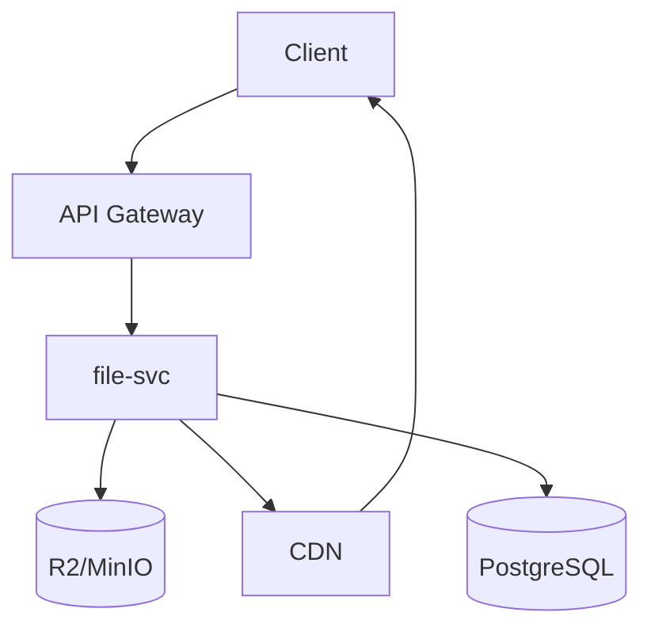

# 16 - 文件服务设计

> AI 小说生成后端 file-svc 文件存储与 CDN 管理规范

## 1. 概述

文件服务负责管理小说项目相关的文件资源，包括封面图片、插图、导出文件等，使用 R2/MinIO 作为对象存储。

---

## 2. 服务架构



---

## 3. 对象存储路径规范

```
{bucket}/
└── tenants/
    └── {tenant_id}/
        └── projects/
            └── {project_id}/
                ├── covers/
                │   └── {cover_id}.{ext}
                ├── chapters/
                │   └── {chapter_id}/
                │       └── illustrations/
                ├── exports/
                │   └── {export_id}.{format}
                └── assets/
```

---

## 4. 核心功能

```go
// internal/application/file/service.go
package file

type FileService struct {
    r2Client    *r2.Client
    bucket      string
    cdnBaseURL  string
    metaRepo    repository.FileMetaRepository
}

// 上传文件
func (s *FileService) Upload(ctx context.Context, req *UploadRequest) (*FileInfo, error) {
    // 1. 生成对象键
    objectKey := fmt.Sprintf("tenants/%s/projects/%s/%s/%s%s",
        req.TenantID, req.ProjectID, req.Category, uuid.New().String(), filepath.Ext(req.Filename))

    // 2. 上传到 R2
    _, err := s.r2Client.PutObject(ctx, &r2.PutObjectInput{
        Bucket:      aws.String(s.bucket),
        Key:         aws.String(objectKey),
        Body:        req.Content,
        ContentType: aws.String(req.ContentType),
        Metadata: map[string]string{
            "tenant_id":    req.TenantID,
            "project_id":   req.ProjectID,
            "original_name": req.Filename,
        },
    })
    if err != nil {
        return nil, err
    }

    // 3. 保存元数据
    meta := &domain.FileMeta{
        ID:          uuid.New().String(),
        TenantID:    req.TenantID,
        ProjectID:   req.ProjectID,
        ObjectKey:   objectKey,
        Filename:    req.Filename,
        ContentType: req.ContentType,
        Size:        req.Size,
        Category:    req.Category,
    }

    if err := s.metaRepo.Create(ctx, meta); err != nil {
        return nil, err
    }

    return &FileInfo{
        ID:  meta.ID,
        URL: s.getPublicURL(objectKey),
    }, nil
}

// 生成预签名下载 URL
func (s *FileService) GetSignedURL(ctx context.Context, fileID string, expiry time.Duration) (string, error) {
    meta, err := s.metaRepo.Get(ctx, fileID)
    if err != nil {
        return "", err
    }

    presignClient := r2.NewPresignClient(s.r2Client)
    req, err := presignClient.PresignGetObject(ctx, &r2.GetObjectInput{
        Bucket: aws.String(s.bucket),
        Key:    aws.String(meta.ObjectKey),
    }, r2.WithPresignExpires(expiry))

    if err != nil {
        return "", err
    }

    return req.URL, nil
}

// 删除文件
func (s *FileService) Delete(ctx context.Context, fileID string) error {
    meta, err := s.metaRepo.Get(ctx, fileID)
    if err != nil {
        return err
    }

    // 软删除元数据
    if err := s.metaRepo.SoftDelete(ctx, fileID); err != nil {
        return err
    }

    // 异步删除 R2 对象（可选）
    go func() {
        s.r2Client.DeleteObject(context.Background(), &r2.DeleteObjectInput{
            Bucket: aws.String(s.bucket),
            Key:    aws.String(meta.ObjectKey),
        })
    }()

    return nil
}
```

---

## 5. 导出功能

```go
// 导出小说为多种格式
func (s *FileService) ExportNovel(ctx context.Context, req *ExportRequest) (*ExportResult, error) {
    // 1. 获取所有章节内容
    chapters, err := s.chapterRepo.ListByProject(ctx, req.ProjectID)
    if err != nil {
        return nil, err
    }

    var content bytes.Buffer

    switch req.Format {
    case "txt":
        for _, ch := range chapters {
            content.WriteString(fmt.Sprintf("# %s\n\n%s\n\n", ch.Title, ch.Content))
        }
    case "epub":
        // 使用 epub 库生成
        return s.generateEPUB(ctx, chapters, req)
    case "pdf":
        // 使用 PDF 生成库
        return s.generatePDF(ctx, chapters, req)
    }

    // 2. 上传导出文件
    return s.Upload(ctx, &UploadRequest{
        TenantID:    req.TenantID,
        ProjectID:   req.ProjectID,
        Category:    "exports",
        Filename:    fmt.Sprintf("%s.%s", req.Title, req.Format),
        Content:     bytes.NewReader(content.Bytes()),
        ContentType: getMimeType(req.Format),
        Size:        int64(content.Len()),
    })
}
```

---

## 6. 相关文档

- [01-项目初始化与目录结构规范](./01-项目初始化与目录结构规范.md)
- [08-RESTful API 接口规范](./08-RESTful API 接口规范.md)
