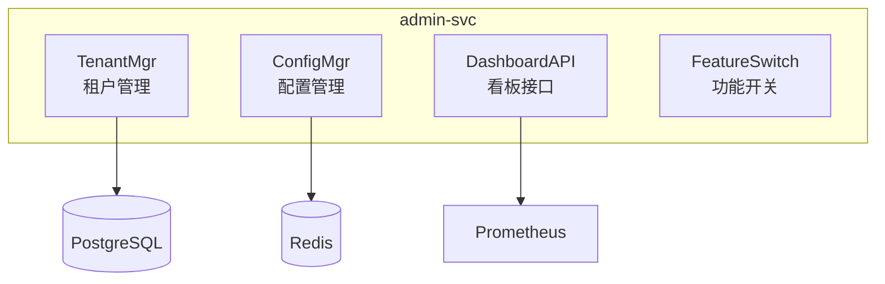

# 17 - 管理服务设计

> AI 小说生成后端 admin-svc 租户管理与系统配置规范

## 1. 概述

管理服务负责租户管理、配置热更、运行参数调整以及系统看板 API。

---

## 2. 服务功能



---

## 3. 租户管理

```go
// internal/application/admin/tenant_mgr.go
package admin

type TenantMgr struct {
    tenantRepo repository.TenantRepository
    cache      cache.Cache
}

// 创建租户
func (m *TenantMgr) Create(ctx context.Context, req *CreateTenantRequest) (*Tenant, error) {
    tenant := &domain.Tenant{
        ID:       uuid.New().String(),
        Name:     req.Name,
        Slug:     req.Slug,
        Settings: req.Settings,
        Quota:    defaultQuota(),
        Status:   "active",
    }

    if err := m.tenantRepo.Create(ctx, tenant); err != nil {
        return nil, err
    }

    // 初始化资源
    go m.initializeTenantResources(tenant.ID)

    return tenant, nil
}

// 更新配额
func (m *TenantMgr) UpdateQuota(ctx context.Context, tenantID string, quota *Quota) error {
    tenant, err := m.tenantRepo.Get(ctx, tenantID)
    if err != nil {
        return err
    }

    tenant.Quota = quota
    return m.tenantRepo.Update(ctx, tenant)
}
```

---

## 4. 配置热更新

```go
// internal/application/admin/config_mgr.go
package admin

type ConfigMgr struct {
    redis     *redis.Client
    pubsub    *redis.PubSub
    listeners []ConfigListener
}

type DynamicConfig struct {
    LogLevel       string  `json:"log_level"`
    RateLimitRPS   int     `json:"rate_limit_rps"`
    ValidationOn   bool    `json:"validation_on"`
    FallbackModels []string `json:"fallback_models"`
}

// 更新配置
func (m *ConfigMgr) Update(ctx context.Context, key string, value interface{}) error {
    // 1. 保存到 Redis
    data, _ := json.Marshal(value)
    if err := m.redis.Set(ctx, "config:"+key, data, 0).Err(); err != nil {
        return err
    }

    // 2. 发布配置变更事件
    return m.redis.Publish(ctx, "config:updates", key).Err()
}

// 监听配置变更
func (m *ConfigMgr) Watch(ctx context.Context) {
    m.pubsub = m.redis.Subscribe(ctx, "config:updates")

    go func() {
        for msg := range m.pubsub.Channel() {
            key := msg.Payload
            for _, listener := range m.listeners {
                listener.OnConfigChange(key)
            }
        }
    }()
}
```

---

## 5. 功能开关

```go
// internal/application/admin/feature_switch.go
package admin

type FeatureSwitch struct {
    redis *redis.Client
}

// 检查功能是否启用
func (s *FeatureSwitch) IsEnabled(ctx context.Context, feature string, tenantID string) bool {
    // 1. 检查租户级开关
    key := fmt.Sprintf("feature:%s:tenant:%s", feature, tenantID)
    if val, err := s.redis.Get(ctx, key).Result(); err == nil {
        return val == "1"
    }

    // 2. 检查全局开关
    globalKey := fmt.Sprintf("feature:%s:global", feature)
    if val, err := s.redis.Get(ctx, globalKey).Result(); err == nil {
        return val == "1"
    }

    return false
}

// 设置功能开关
func (s *FeatureSwitch) Set(ctx context.Context, feature string, tenantID string, enabled bool) error {
    var key string
    if tenantID != "" {
        key = fmt.Sprintf("feature:%s:tenant:%s", feature, tenantID)
    } else {
        key = fmt.Sprintf("feature:%s:global", feature)
    }

    val := "0"
    if enabled {
        val = "1"
    }

    return s.redis.Set(ctx, key, val, 0).Err()
}
```

---

## 6. 相关文档

- [02-配置管理与环境变量规范](./02-配置管理与环境变量规范.md)
- [19-安全与多租户隔离设计](./19-安全与多租户隔离设计.md)
