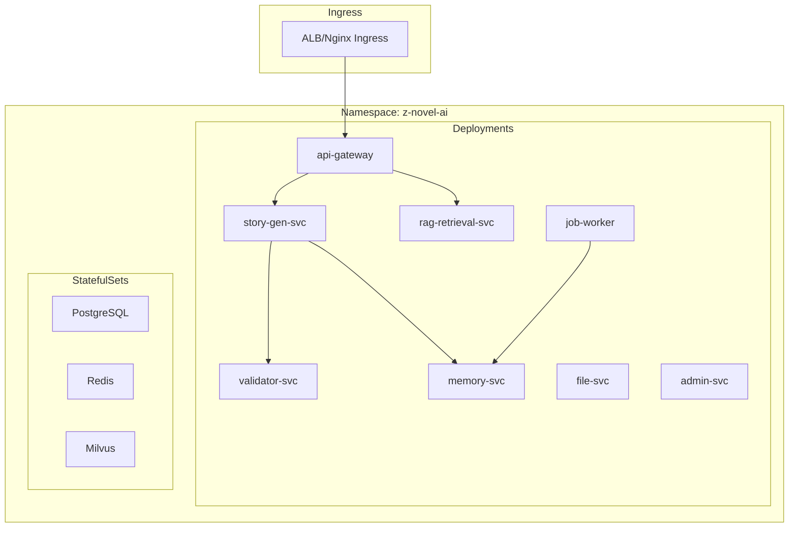

# 18 - Kubernetes 部署与运维规范

> AI 小说生成后端 Kubernetes 部署架构与运维流程规范

## 1. 概述

本文档定义了项目的 Kubernetes 部署架构，包括 Helm Chart 结构、资源配置、自动扩缩容策略以及日常运维流程。

---

## 2. 部署架构



---

## 3. Helm Chart 结构

```
deployments/helm/z-novel-ai/
├── Chart.yaml
├── values.yaml
├── values.prod.yaml
├── templates/
│   ├── _helpers.tpl
│   ├── configmap.yaml
│   ├── secret.yaml
│   ├── deployment-gateway.yaml
│   ├── deployment-story-gen.yaml
│   ├── deployment-rag.yaml
│   ├── deployment-validator.yaml
│   ├── deployment-memory.yaml
│   ├── deployment-worker.yaml
│   ├── service.yaml
│   ├── hpa.yaml
│   ├── ingress.yaml
│   └── pdb.yaml
└── charts/
    ├── postgresql/
    ├── redis/
    └── milvus/
```

---

## 4. 资源配置

### 4.1 Deployment 示例

```yaml
# templates/deployment-story-gen.yaml
apiVersion: apps/v1
kind: Deployment
metadata:
  name: {{ include "z-novel-ai.fullname" . }}-story-gen
spec:
  replicas: {{ .Values.storyGen.replicas }}
  selector:
    matchLabels:
      app: story-gen
  template:
    metadata:
      labels:
        app: story-gen
    spec:
      affinity:
        podAntiAffinity:
          preferredDuringSchedulingIgnoredDuringExecution:
            - weight: 100
              podAffinityTerm:
                labelSelector:
                  matchLabels:
                    app: story-gen
                topologyKey: topology.kubernetes.io/zone
      containers:
        - name: story-gen
          image: "{{ .Values.image.repository }}/story-gen-svc:{{ .Values.image.tag }}"
          ports:
            - containerPort: 8080
            - containerPort: 9090
          resources:
            requests:
              cpu: {{ .Values.storyGen.resources.requests.cpu }}
              memory: {{ .Values.storyGen.resources.requests.memory }}
            limits:
              cpu: {{ .Values.storyGen.resources.limits.cpu }}
              memory: {{ .Values.storyGen.resources.limits.memory }}
          env:
            - name: APP_ENV
              value: {{ .Values.env }}
          envFrom:
            - configMapRef:
                name: {{ include "z-novel-ai.fullname" . }}-config
            - secretRef:
                name: {{ include "z-novel-ai.fullname" . }}-secret
          livenessProbe:
            httpGet:
              path: /health
              port: 8080
            initialDelaySeconds: 10
            periodSeconds: 10
          readinessProbe:
            httpGet:
              path: /ready
              port: 8080
            initialDelaySeconds: 5
            periodSeconds: 5
```

### 4.2 HPA 配置

```yaml
# templates/hpa.yaml
apiVersion: autoscaling/v2
kind: HorizontalPodAutoscaler
metadata:
  name: {{ include "z-novel-ai.fullname" . }}-story-gen-hpa
spec:
  scaleTargetRef:
    apiVersion: apps/v1
    kind: Deployment
    name: {{ include "z-novel-ai.fullname" . }}-story-gen
  minReplicas: {{ .Values.storyGen.autoscaling.minReplicas }}
  maxReplicas: {{ .Values.storyGen.autoscaling.maxReplicas }}
  metrics:
    - type: Resource
      resource:
        name: cpu
        target:
          type: Utilization
          averageUtilization: 70
    - type: Resource
      resource:
        name: memory
        target:
          type: Utilization
          averageUtilization: 80
```

---

## 5. Values 配置

```yaml
# values.yaml
env: development
image:
  repository: z-novel-ai
  tag: latest

gateway:
  replicas: 2
  resources:
    requests:
      cpu: 100m
      memory: 256Mi
    limits:
      cpu: 500m
      memory: 512Mi

storyGen:
  replicas: 2
  resources:
    requests:
      cpu: 500m
      memory: 1Gi
    limits:
      cpu: 2
      memory: 4Gi
  autoscaling:
    enabled: true
    minReplicas: 2
    maxReplicas: 10

worker:
  replicas: 3
  resources:
    requests:
      cpu: 200m
      memory: 512Mi
    limits:
      cpu: 1
      memory: 2Gi
```

---

## 6. 灰度发布

```bash
# 金丝雀发布
helm upgrade z-novel-ai ./helm/z-novel-ai \
  --set storyGen.canary.enabled=true \
  --set storyGen.canary.weight=10 \
  --set storyGen.canary.image.tag=v1.2.0

# 全量发布
helm upgrade z-novel-ai ./helm/z-novel-ai \
  --set image.tag=v1.2.0

# 回滚
helm rollback z-novel-ai 1
```

---

## 7. 日常运维

### 7.1 巡检清单

| 检查项     | 命令                     | 告警阈值   |
| ---------- | ------------------------ | ---------- |
| Pod 状态   | `kubectl get pods`       | 非 Running |
| CPU/Memory | Grafana Dashboard        | >80%       |
| Redis Lag  | `redis-cli XINFO GROUPS` | >1000      |
| 错误率     | Prometheus Query         | >1%        |

### 7.2 故障处置

```bash
# LLM 超时 - 切换备用模型
kubectl set env deployment/story-gen LLM_FALLBACK_ENABLED=true

# 扩容
kubectl scale deployment/story-gen --replicas=10

# 查看日志
kubectl logs -f deployment/story-gen -c story-gen

# 进入 Pod 调试
kubectl exec -it <pod> -- /bin/sh
```

---

## 8. 相关文档

- [03-日志与可观测性规范](./03-日志与可观测性规范.md)
- [19-安全与多租户隔离设计](./19-安全与多租户隔离设计.md)
