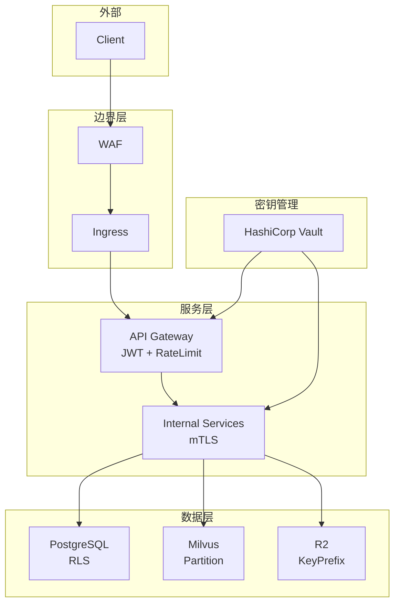

# 19 - 安全与多租户隔离设计

> AI 小说生成后端安全策略与多租户数据隔离规范

## 1. 概述

本文档定义了项目的安全设计，包括密钥管理、认证授权、内部通信安全以及多租户数据隔离方案。

---

## 2. 安全架构



---

## 3. 密钥管理

### 3.1 Vault 集成

```go
// internal/infrastructure/vault/client.go
package vault

type Client struct {
    vaultClient *api.Client
    namespace   string
}

func (c *Client) GetSecret(ctx context.Context, path string) (map[string]string, error) {
    secret, err := c.vaultClient.KVv2(c.namespace).Get(ctx, path)
    if err != nil {
        return nil, err
    }

    result := make(map[string]string)
    for k, v := range secret.Data {
        result[k] = v.(string)
    }
    return result, nil
}

// 启动时加载密钥
func LoadSecrets(ctx context.Context, cfg *config.Config) error {
    vault := NewClient(cfg.Vault)

    // 数据库密钥
    dbSecrets, _ := vault.GetSecret(ctx, "database")
    os.Setenv("DB_PASSWORD", dbSecrets["postgres_password"])
    os.Setenv("REDIS_PASSWORD", dbSecrets["redis_password"])

    // LLM 密钥
    llmSecrets, _ := vault.GetSecret(ctx, "llm")
    os.Setenv("OPENAI_API_KEY", llmSecrets["openai_api_key"])

    // JWT 密钥
    commonSecrets, _ := vault.GetSecret(ctx, "common")
    os.Setenv("JWT_SECRET", commonSecrets["jwt_secret"])

    return nil
}
```

---

## 4. 认证与授权

### 4.1 JWT Token 结构

```json
{
  "iss": "z-novel-ai",
  "sub": "user_123",
  "exp": 1735812000,
  "iat": 1735725600,
  "tenant_id": "tenant_001",
  "user_id": "user_123",
  "role": "admin",
  "permissions": ["project:write", "chapter:generate"]
}
```

### 4.2 RBAC 权限控制

```go
// internal/interfaces/http/middleware/rbac.go
package middleware

type Permission string

const (
    PermProjectRead    Permission = "project:read"
    PermProjectWrite   Permission = "project:write"
    PermChapterGenerate Permission = "chapter:generate"
    PermAdminAccess    Permission = "admin:access"
)

var rolePermissions = map[string][]Permission{
    "admin":  {PermProjectRead, PermProjectWrite, PermChapterGenerate, PermAdminAccess},
    "member": {PermProjectRead, PermProjectWrite, PermChapterGenerate},
    "viewer": {PermProjectRead},
}

func RequirePermission(perm Permission) gin.HandlerFunc {
    return func(c *gin.Context) {
        role := c.GetString("role")
        permissions := rolePermissions[role]

        for _, p := range permissions {
            if p == perm {
                c.Next()
                return
            }
        }

        c.AbortWithStatusJSON(403, gin.H{
            "code":    403,
            "message": "permission denied",
        })
    }
}
```

---

## 5. 多租户数据隔离

### 5.1 PostgreSQL RLS

```sql
-- 启用 RLS
ALTER TABLE projects ENABLE ROW LEVEL SECURITY;

-- 创建策略
CREATE POLICY tenant_isolation ON projects
    USING (tenant_id = current_setting('app.current_tenant_id')::UUID);

-- 应用层设置租户上下文
SELECT set_config('app.current_tenant_id', $1, TRUE);
```

### 5.2 Milvus Partition 隔离

```go
// 每个租户+项目使用独立分区
func PartitionName(tenantID, projectID string) string {
    return fmt.Sprintf("tenant_%s_proj_%s", tenantID, projectID)
}

// 检索时指定分区
client.Search(ctx,
    "story_segments",
    []string{PartitionName(tenantID, projectID)}, // 限定分区
    filter,
    ...
)
```

### 5.3 R2 KeyPrefix 隔离

```go
// 存储路径包含租户 ID
objectKey := fmt.Sprintf("tenants/%s/projects/%s/%s",
    tenantID, projectID, filename)

// 权限策略
{
    "Effect": "Allow",
    "Action": ["r2:GetObject", "r2:PutObject"],
    "Resource": "arn:aws:r2:::bucket/tenants/${aws:username}/*"
}
```

---

## 6. 内部通信安全

### 6.1 mTLS 配置

```go
// gRPC 服务端 mTLS
creds, _ := credentials.NewServerTLSFromFile("server.crt", "server.key")
server := grpc.NewServer(grpc.Creds(creds))

// gRPC 客户端 mTLS
creds, _ := credentials.NewClientTLSFromFile("ca.crt", "")
conn, _ := grpc.Dial(address, grpc.WithTransportCredentials(creds))
```

---

## 7. 内容安全

```go
// 敏感词过滤
type ContentFilter struct {
    sensitiveWords []string
}

func (f *ContentFilter) Check(content string) []string {
    var found []string
    for _, word := range f.sensitiveWords {
        if strings.Contains(content, word) {
            found = append(found, word)
        }
    }
    return found
}
```

---

## 8. 相关文档

- [07-Gin API 网关与中间件设计](./07-Gin API 网关与中间件设计.md)
- [04-PostgreSQL 数据库设计详细文档](./04-PostgreSQL数据库设计详细文档.md)
- [02-配置管理与环境变量规范](./02-配置管理与环境变量规范.md)
