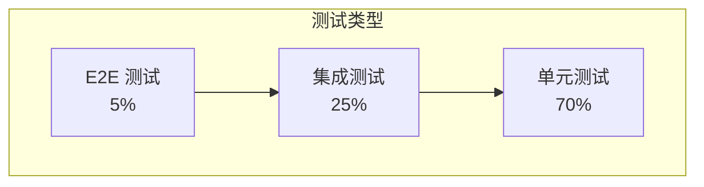

# 20 - 测试策略与质量保障

> AI 小说生成后端测试规范与 CI/CD 集成指南

## 1. 概述

本文档定义了项目的测试策略，包括单元测试、集成测试、回归测试、性能测试以及 CI/CD 流程集成。

---

## 2. 测试金字塔



---

## 3. 单元测试

### 3.1 规范

- **覆盖率要求**：≥ 80%
- **命名规范**：`TestXxx_场景_期望结果`
- **Mock 策略**：使用 `gomock` 或 `testify/mock`

### 3.2 示例

```go
// internal/application/story/handler_test.go
package story

import (
    "testing"
    "github.com/stretchr/testify/assert"
    "github.com/stretchr/testify/mock"
)

func TestGenHandler_GenerateChapter_Success(t *testing.T) {
    // Arrange
    mockPipeline := new(MockPipelineMgr)
    mockJobRepo := new(MockJobRepository)

    handler := &GenHandler{
        pipelineMgr: mockPipeline,
        jobRepo:     mockJobRepo,
    }

    req := &dto.CreateChapterRequest{
        ProjectID:       "proj_123",
        Outline:         "测试大纲",
        TargetWordCount: 2000,
    }

    mockJobRepo.On("Create", mock.Anything, mock.Anything).Return(nil)

    // Act
    resp, err := handler.GenerateChapter(context.Background(), req)

    // Assert
    assert.NoError(t, err)
    assert.NotEmpty(t, resp.JobID)
    mockJobRepo.AssertExpectations(t)
}

func TestGenHandler_GenerateChapter_JobCreateFailed(t *testing.T) {
    // ...
}
```

---

## 4. 集成测试

### 4.1 TestContainers

```go
// test/integration/db_test.go
package integration

import (
    "testing"
    "github.com/testcontainers/testcontainers-go"
    "github.com/testcontainers/testcontainers-go/modules/postgres"
)

func TestProjectRepository_CRUD(t *testing.T) {
    ctx := context.Background()

    // 启动 PostgreSQL 容器
    pgContainer, err := postgres.RunContainer(ctx,
        testcontainers.WithImage("postgres:15"),
        postgres.WithDatabase("testdb"),
        postgres.WithUsername("test"),
        postgres.WithPassword("test"),
    )
    if err != nil {
        t.Fatal(err)
    }
    defer pgContainer.Terminate(ctx)

    // 获取连接串
    connStr, _ := pgContainer.ConnectionString(ctx, "sslmode=disable")

    // 运行迁移
    db, _ := sql.Open("postgres", connStr)
    runMigrations(db)

    // 测试
    repo := NewProjectRepository(db)

    project := &domain.Project{
        TenantID: "tenant_001",
        Title:    "测试小说",
    }

    err = repo.Create(ctx, project)
    assert.NoError(t, err)

    found, err := repo.Get(ctx, project.ID)
    assert.NoError(t, err)
    assert.Equal(t, project.Title, found.Title)
}
```

---

## 5. 回归测试（黄金故事集）

```go
// test/regression/golden_test.go
package regression

// 黄金测试用例
var goldenStories = []struct {
    Name     string
    Outline  string
    Expected []string // 期望包含的关键元素
}{
    {
        Name:    "武侠开篇",
        Outline: "少年张三在破庙中偶遇高人，习得绝世武功",
        Expected: []string{"张三", "破庙", "武功"},
    },
}

func TestGoldenStories(t *testing.T) {
    for _, tc := range goldenStories {
        t.Run(tc.Name, func(t *testing.T) {
            resp, err := generateChapter(tc.Outline)
            assert.NoError(t, err)

            for _, keyword := range tc.Expected {
                assert.Contains(t, resp.Content, keyword)
            }
        })
    }
}
```

---

## 6. 性能测试

```go
// test/performance/benchmark_test.go
func BenchmarkChapterGeneration(b *testing.B) {
    setup()

    b.ResetTimer()
    for i := 0; i < b.N; i++ {
        generateChapter(&GenerateRequest{
            Outline:         "测试大纲",
            TargetWordCount: 1000,
        })
    }
}

// k6 负载测试
// k6 run --vus 50 --duration 5m test/performance/load.js
```

---

## 7. CI/CD 流程

```yaml
# .github/workflows/ci.yaml
name: CI

on: [push, pull_request]

jobs:
  test:
    runs-on: ubuntu-latest
    services:
      postgres:
        image: postgres:15
        env:
          POSTGRES_PASSWORD: test
      redis:
        image: redis:7

    steps:
      - uses: actions/checkout@v4

      - uses: actions/setup-go@v5
        with:
          go-version: "1.21"

      - name: Lint
        run: golangci-lint run

      - name: Test
        run: go test -race -coverprofile=coverage.out ./...

      - name: Coverage
        run: |
          go tool cover -func=coverage.out
          COVERAGE=$(go tool cover -func=coverage.out | grep total | awk '{print $3}')
          if [ "${COVERAGE%\%}" -lt 80 ]; then
            echo "Coverage ${COVERAGE} is below 80%"
            exit 1
          fi
```

---

## 8. 验收标准

| 里程碑        | 验收标准                   |
| ------------- | -------------------------- |
| M1 核心骨架   | API 可调用，SSE 流式返回   |
| M2 记忆与检索 | Context 准确率 ≥ 85%       |
| M3 校验与优化 | 逻辑矛盾率 ↓50%，TTFT < 2s |
| M4 生产就绪   | 100 QPS 稳定，无安全漏洞   |

---

## 9. 相关文档

- [03-日志与可观测性规范](./03-日志与可观测性规范.md)
- [18-Kubernetes 部署与运维规范](./18-Kubernetes部署与运维规范.md)
