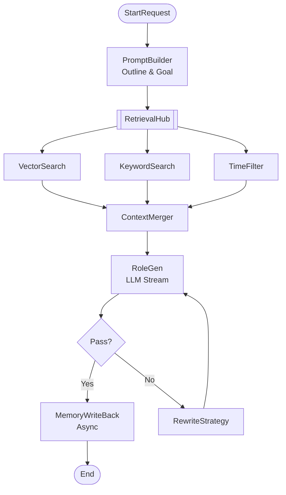

# AI 小说生成后端方案设计（Gin + Eino）

> 面向长篇小说上下文连贯性的生产级后端架构与实现规范

## 1. 执行摘要（Executive Summary）

- 业务目标：支持百万字级长篇小说的层级化生成（书 → 卷 → 章 → 节），确保设定、角色、时间、情感四维的长期连贯性。
- 核心能力：
  - 流式章节生成（Streaming Generation）
  - 三信号检索（语义向量 + 关键词 TF‑IDF + 时间对齐）
  - 四维一致性校验（设定/角色/状态/情感）
  - 记忆回写（摘要与状态抽取，时间知识图谱）
- 关键架构决策：分层微服务 + Gin API 网关 + Eino 编排工作流 + 混合 RAG 检索；数据层 PostgreSQL + Redis + VectorDB（Milvus/PGVector）+ S3。
- 非功能 SLO：SLA ≥ 99.9%；生成首字延迟 TTFT < 2s；检索接口 P99 < 300ms；支持 100+ 并发租户隔离。
- 上线范围：后端 API、工作流、存储与检索、异步任务与可观测性；不包含前端 UI、计费与版权模块。

---

## 2. 架构原则与风险缓解

### 2.1 架构原则

- 单一职责：服务按领域边界拆分（生成、检索、校验、记忆）。
- 事件驱动：高耗时流程（回写/分析）通过消息队列解耦，保障 API 响应速度。
- 幂等一致：所有写操作支持幂等重试，保证最终一致性。
- 多租户隔离：自接入层到数据层的全链路隔离（RLS/Partition/ObjectPrefix）。
- 可观测优先：日志、指标、追踪贯穿链路；易诊断、易审计。
- 安全优先：秘钥集中管理（Vault/KMS），内外部通信安全（JWT/mTLS）。
- 配置即代码：配置集中化、版本化与灰度控制。

### 2.2 关键风险与缓解策略

| 风险点              | 缓解策略                                                         |
| ------------------- | ---------------------------------------------------------------- |
| LLM 幻觉与不稳定    | Validator Agent 后置校验；检索提供事实依据；多模型路由与熔断降级 |
| 检索噪声与召回偏差  | BM25 + Cosine 融合重排；时间过滤；Query 重写；热数据分层缓存     |
| 长上下文成本过高    | 上下文滚动摘要；场景粒度生成；仅加载必要设定卡（只读）           |
| 向量库容量/性能瓶颈 | 分区命名空间（tenant+project）；索引再建流程；冷热分层；只读降级 |
| 限流与配额          | Token 桶限流（租户/接口维度）；配额超限自动降级                  |

---

## 3. 分层架构与数据流

### 3.1 分层结构

Ingress（Nginx/ALB） → Gin API Gateway（Auth/RateLimit/Audit/Trace） → 领域服务（StoryGen/Retrieval/Validator/Memory/JobWorker） → Eino 编排层（PromptFlow/Chain/Graph） → 数据层（PostgreSQL/Redis/VectorDB/S3） → 侧翼：可观测与安全（Prometheus/Grafana/Jaeger/Vault）。

### 3.2 关键数据流（DF‑1 ~ DF‑8）

- DF‑1 章节生成请求流：Client → Gateway → StoryGenSvc → Eino Pipeline（Prompt→Retrieval→Gen→Verify）→ Client（SSE Stream）。
- DF‑2 三信号检索召回流：RetrievalSvc → Milvus(Vector) & ES(Keyword) → Ranker → Context Builder。
- DF‑3 一致性校验反馈流：ValidatorSvc → LLM(Audit) → Pass/Fail → StoryGenSvc（Retry Loop）。
- DF‑4 摘要与状态回写流：StoryGenSvc → Redis Stream → JobWorker → MemorySvc → DB/Milvus（Update State）。
- DF‑5 向量索引写入/重建：MemorySvc → Text Splitter → Embedding → Milvus Insert。
- DF‑6 审计日志归档：Gateway Middleware → Kafka/Log Queue → ClickHouse/S3。
- DF‑7 指标采集与 Dashboard：Services(Prom SDK) → Scraper → Prometheus/Grafana。
- DF‑8 秘钥读取与轮转：Service Startup → Vault Agent → Env Injection → App Config。

---

## 4. 微服务详细设计

| 服务              | 职责                                   | 内部模块                                   | 关键依赖与策略                        |
| ----------------- | -------------------------------------- | ------------------------------------------ | ------------------------------------- |
| api-gateway       | 鉴权、路由、限流、审计、追踪           | Router、AuthMiddleware、RateLimiter、Proxy | Gin、Redis；熔断阈值错误率>50%        |
| story-gen-svc     | 生成编排核心；管理生成管线与 LLM 交互  | GenHandler、PipelineMgr、StreamAdapter     | Eino、LLM SDK；超时 120s，重试 1 次   |
| rag-retrieval-svc | 混合召回与重排行为；时间过滤           | QueryRewriter、VectorSearcher、Ranker      | Milvus、ElasticSearch；P99 目标 300ms |
| validator-svc     | 一致性与敏感性校验；给出修改建议       | RuleEngine、LLMAuditor、Filter             | LLM；失败默认 Pass（可配置）          |
| memory-svc        | 实体/事件/关系管理；摘要回写；短期会话 | EntityMgr、EventMgr、RelationGraph         | PostgreSQL、Redis Cache               |
| job-worker        | 异步任务执行；批量 Embedding、索引再建 | TaskDispatcher、Handlers、RetryQueue       | Redis Streams；指数退避，DLQ          |
| file-svc          | 封面/插图/导出管理；CDN 签名           | UploadHandler、CDNSigner                   | S3/MinIO                              |
| admin-svc         | 租户管理、配置热更、看板与运行参数     | TenantMgr、ConfigMgr、DashboardAPI         | PostgreSQL                            |

并发模型：所有服务实现 Context 超时取消；JobWorker 采用 Worker Pool + 消费者组；StoryGen 支持 SSE 流式发送。

重试与回退：

- LLM 失败 → 切换备用模型（OpenAI/DeepSeek）→ 最终降级为跳过校验直出（可配置）。
- 检索超时 → 降级为空 Context → 标注低置信度。
- 回写失败 → 写入 DLQ → 触发人工介入与补偿。

配置项：统一放置于 ConfigMap/Env，密钥由 Vault 注入。

---

## 5. 数据库模式（PostgreSQL）与索引设计

核心表（均含 `tenant_id` 用于隔离）：

### 5.1 DDL 示例

```sql
-- 小说项目
CREATE TABLE projects (
  id UUID PRIMARY KEY DEFAULT gen_random_uuid(),
  tenant_id VARCHAR(64) NOT NULL,
  title VARCHAR(255) NOT NULL,
  description TEXT,
  settings JSONB,
  created_at TIMESTAMPTZ DEFAULT NOW(),
  updated_at TIMESTAMPTZ DEFAULT NOW()
);
CREATE INDEX idx_projects_tenant ON projects(tenant_id);

-- 章节
CREATE TABLE chapters (
  id UUID PRIMARY KEY DEFAULT gen_random_uuid(),
  project_id UUID NOT NULL REFERENCES projects(id),
  volume_id UUID,
  seq_num INT NOT NULL,
  title VARCHAR(255),
  content_text TEXT,
  summary TEXT,
  status VARCHAR(32),
  word_count INT,
  version INT DEFAULT 1,
  created_at TIMESTAMPTZ DEFAULT NOW(),
  updated_at TIMESTAMPTZ DEFAULT NOW(),
  UNIQUE(project_id, volume_id, seq_num)
);
CREATE INDEX idx_chapters_project_seq ON chapters(project_id, seq_num);

-- 实体/角色
CREATE TABLE entities (
  id UUID PRIMARY KEY DEFAULT gen_random_uuid(),
  project_id UUID NOT NULL REFERENCES projects(id),
  name VARCHAR(128) NOT NULL,
  type VARCHAR(32) NOT NULL,
  description TEXT,
  attributes JSONB,
  current_state TEXT,
  last_appear_chapter_id UUID,
  created_at TIMESTAMPTZ DEFAULT NOW(),
  updated_at TIMESTAMPTZ DEFAULT NOW()
);
CREATE INDEX idx_entities_project_name ON entities(project_id, name);
CREATE INDEX idx_entities_attributes ON entities USING GIN (attributes);

-- 关系
CREATE TABLE relations (
  id UUID PRIMARY KEY,
  project_id UUID NOT NULL,
  source_entity_id UUID NOT NULL REFERENCES entities(id),
  target_entity_id UUID NOT NULL REFERENCES entities(id),
  relation_type VARCHAR(64),
  strength FLOAT,
  description TEXT
);
CREATE INDEX idx_relations_source ON relations(source_entity_id);

-- 事件（时间轴）
CREATE TABLE events (
  id UUID PRIMARY KEY,
  project_id UUID NOT NULL,
  chapter_id UUID REFERENCES chapters(id),
  story_time_start BIGINT,
  story_time_end BIGINT,
  summary VARCHAR(1024),
  involved_entities UUID[],
  vector_id VARCHAR(64)
);
CREATE INDEX idx_events_story_time ON events(project_id, story_time_start);
```

### 5.2 索引策略

- BTREE：`projects(tenant_id)`，`chapters(project_id, seq_num)`，`relations(source_entity_id)`。
- GIN/JSONB：`entities(attributes)` 用于属性快速检索。

---

## 6. 向量检索与索引参数规范

| 配置项      | 规范/参数                            | 说明                               |
| ----------- | ------------------------------------ | ---------------------------------- |
| 选型        | Milvus 2.3+ / PGVector               | 生产推荐 Milvus；开发可用 PGVector |
| Embedding   | BAAI/bge‑m3（1024 维）               | 多语言、长文本（8192 tokens）      |
| Collections | `story_segments` / `entity_profiles` | 按数据类型分集合                   |
| Partition   | `tenant_{id}_proj_{id}`              | 命名空间隔离、加速检索             |
| Index       | HNSW (M=16, efConstruction=200)      | Recall>98%，性能稳定               |
| Rerank      | BM25 + Cosine 加权（0.3/0.7）        | 关键词提升长尾实体召回             |

时间过滤：剔除 `timestamp > current_story_time` 的未来事件；优先采用最新状态快照。

---

## 7. API 设计规范（Gin + gRPC）

### 7.1 路由清单（REST）

| Method | Path                       | 功能                      | 特殊 Header               |
| ------ | -------------------------- | ------------------------- | ------------------------- |
| POST   | /v1/projects/:pid/chapters | 创建章节生成任务（Async） | Idempotency-Key           |
| GET    | /v1/chapters/:cid/stream   | SSE 流式获取生成内容      | Accept: text/event-stream |
| GET    | /v1/projects/:pid/entities | 查询角色列表（过滤）      | -                         |
| PUT    | /v1/entities/:eid/state    | 手动修正角色状态          | -                         |
| POST   | /v1/retrieval/debug        | 检索效果调试与解释        | -                         |

### 7.2 DTO/响应信封示例

```json
{
  "code": 200,
  "message": "success",
  "data": {
    "chapter_id": "uuid-xxx",
    "content": "...",
    "metadata": {
      "word_count": 2500,
      "generated_at": "2026-01-02T02:04:00Z"
    }
  },
  "trace_id": "0a1b2c3d4e5f..."
}
```

### 7.3 中间件栈与安全

- Recovery：捕获 Panic，防止服务崩溃
- Trace：OpenTelemetry `trace_id` 注入 Context
- Audit：记录 User/Path/IP/Latency 至审计日志
- Auth：JWT，解析 `tenant_id` 与 `user_id`
- RateLimit：租户配额滑动窗口限流
- InputValidate：基于 `go-playground/validator` 的 DTO 校验
- 签名与幂等：HMAC 请求签名；`Idempotency-Key` 防重放

### 7.4 gRPC（内部服务互调）

- Services：StoryGen/Retrieval/Validator/Memory
- 约定：Proto3；统一错误码；超时/重试由 ClientPolicy 控制

---

## 8. Eino 编排与管线节点规范

### 8.1 工作流节点（简表）

| 节点          | 输入/输出                          | 超时/重试 | 错误处理                  |
| ------------- | ---------------------------------- | --------- | ------------------------- |
| PromptBuilder | In: ChapterGoal → Out: HeadPrompt  | 500ms / 0 | Fail Fast（缺少大纲报错） |
| RetrievalHub  | In: Query, Time → Out: ContextList | 2s / 1    | 降级为空 Context；Warn    |
| RoleGen(LLM)  | In: FullPrompt → Out: StreamChunk  | 60s /1    | 切换备用模型；降级直出    |
| Verifier      | In: Draft → Out: Pass/Fail+Reason  | 10s /2    | 默认 Pass（可配置）       |
| WriteBack     | In: Final → Out: EventMsg          | 5s /3     | DLQ，标注待人工补偿       |

### 8.2 Mermaid 工作流（示意）



---

## 9. 异步任务与事件模型

| Topic(Stream)          | Consumer Group  | 幂等键               | 死信策略                        |
| ---------------------- | --------------- | -------------------- | ------------------------------- |
| `stream:story:gen`     | `cg-gen-worker` | `job_id`             | 重试 3 次后移入 `dlq:story:gen` |
| `stream:memory:update` | `cg-mem-writer` | `chapter_id+version` | 记录日志，人工介入              |
| `stream:audit:log`     | `cg-archiver`   | `req_id`             | 允许丢弃（低优先级）            |

重试：指数退避（如 1s→2s→4s）；并行度按队列 Lag 与 HPA 指标动态调整。

---

## 10. 可观测性与质量保障

### 10.1 指标（Prometheus）

- System：`go_goroutines`、`process_cpu_seconds`、`memory_usage`
- Business：`novel_gen_latency_p99`、`validation_pass_rate`、`active_writers_count`
- Component：`milvus_search_latency`、`redis_stream_lag`

### 10.2 日志与追踪

- 结构化 JSON 行日志（含 `trace_id`/`span_id`/`tenant_id`/`project_id`）
- OpenTelemetry 跨 Gin/gRPC/Eino/DB 全链路追踪
- Grafana 看板：系统健康、生成性能、检索质量、校验通过率等

---

## 11. 部署架构与运维流程

### 11.1 Kubernetes/Helm

| 资源        | 配置策略                                             | 灾备与备份            |
| ----------- | ---------------------------------------------------- | --------------------- |
| Deployment  | Stateless（Gateway/StoryGen）；PodAntiAffinity 多 AZ | 多副本冗余            |
| StatefulSet | VectorDB/Redis/PostgreSQL（自建时）                  | Volume 快照；WAL 归档 |
| HPA         | 基于 CPU/Memory/QueueLag 自动扩缩容                  | Min/Max Replicas 兜底 |
| Secret      | DB 密码、API Keys（Vault Agent 注入）                | 定期轮转              |

### 11.2 灰度与回滚

- 滚动发布、金丝雀流量；失败自动回滚；支持热修复与紧急开关（AdminSvc）。

### 11.3 备份与灾备

- PostgreSQL：每日全量 + 每小时增量；
- 对象存储：版本化与生命周期；
- 向量库：索引重建流程与只读降级策略。

---

## 12. 安全与合规设计

- 秘钥管理：Vault/KMS，禁止硬编码；Sidecar 注入 Pod。
- 认证与授权：OAuth2/JWT；内部 mTLS；RBAC 授权。
- 多租户隔离：PostgreSQL Row‑Level Security（RLS）；VectorDB 按 Partition/Collection；对象存储 KeyPrefix `tenants/{id}/...`。
- 内容安全：敏感词/NSFW 过滤（第三方服务接入）；审计日志确保不可抵赖。

---

## 13. 测试策略与质量保障

- 单元测试（Unit）：覆盖率 ≥ 80%，Mock DB/LLM。
- 集成测试（Integration）：TestContainers 启动真实依赖，验证 API→DB 链路。
- 回归测试（Regression）：“黄金故事集”周期运行；评估一致性与连贯性。
- 性能与容量：RPS、并发、索引容量；压测与画像。
- 容错与混沌：熔断/降级场景；队列阻塞、向量库延迟注入。

---

## 14. 实施计划与验收标准

| 里程碑                | 关键任务                                | 验收标准                 |
| --------------------- | --------------------------------------- | ------------------------ |
| M1 核心骨架（W1‑3）   | Gateway、StoryGen、Eino 最小闭环        | API 可调用，SSE 流式返回 |
| M2 记忆与检索（W4‑6） | VectorDB 集成，三信号检索，摘要回写     | Context 准确率 ≥ 85%     |
| M3 校验与优化（W7‑9） | Validator 接入，Prompt 调优，Redis 缓存 | 逻辑矛盾率 ↓50%，TTFT<2s |
| M4 生产就绪（W10‑12） | 多租户隔离、压测、审计与告警            | 100 QPS 稳定，无安全漏洞 |

文档交付：API 说明书、运行手册、架构图与 Helm values。

---

## 15. 运维与应急手册（Runbook）

- 日常巡检：Prom 告警、Redis Lag < 1000、向量库磁盘使用率。
- 故障处置：
  - LLM 超时：检查供应商状态 → 切换备用模型 → 开启降级（跳过校验）。
  - DB CPU 飙升：查看 `pg_stat_statements` → 扩容读副本 → 降级非核心查询。
  - 队列积压：提高并发消费者 → 临时限流入口 → 排查下游阻塞。
- SLA 违约流程：触发值班与应急会议；发布事后复盘与改进项。

---

## 16. 参考实现与后续工作

- 代码脚手架：Gin 模块化目录、SSE 示例、中间件栈；gRPC proto 与 Makefile；Helm values 与 K8s 清单；PG/PGVector 初始化 SQL 与迁移脚本。
- 扩展方向：Self‑Route 混合策略（RAG/LC 动态路由）；长期风格对齐（Style Cards）；跨卷一致性审阅（LC 为辅）。
