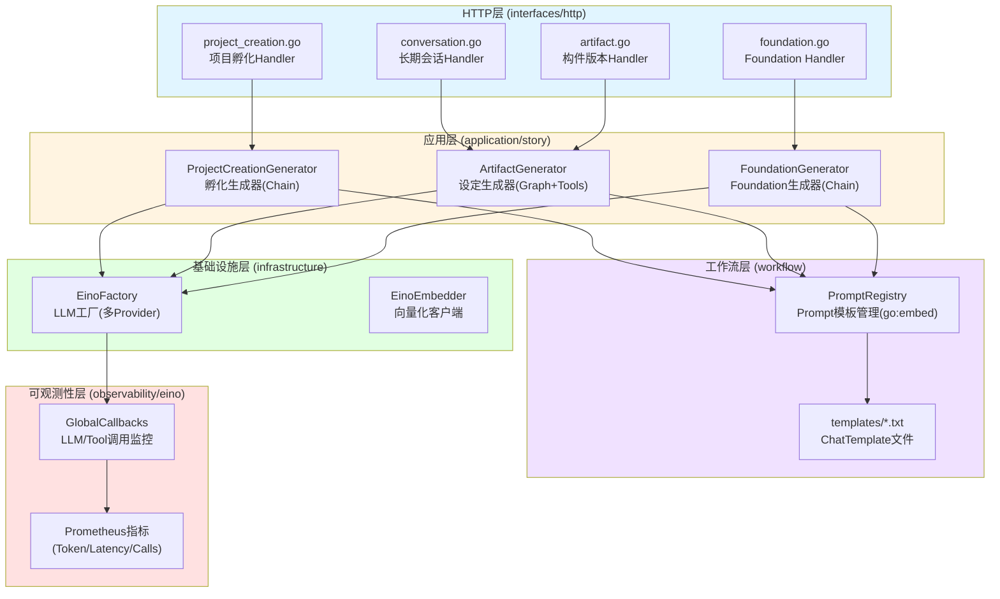
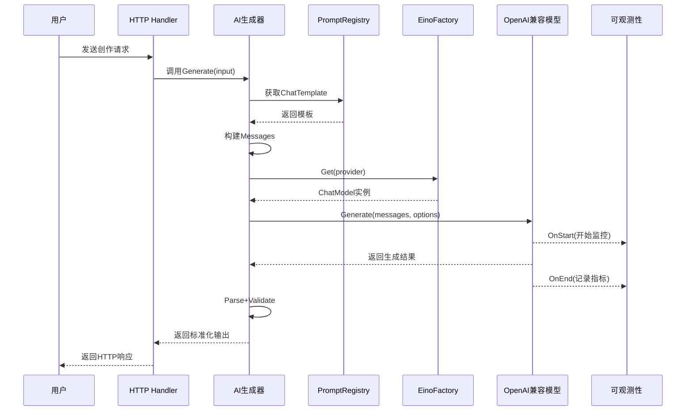
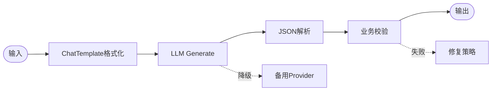
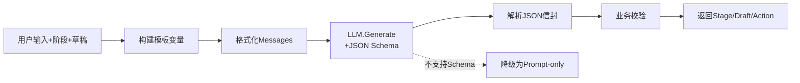
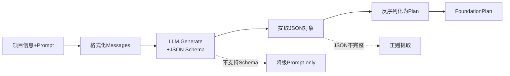
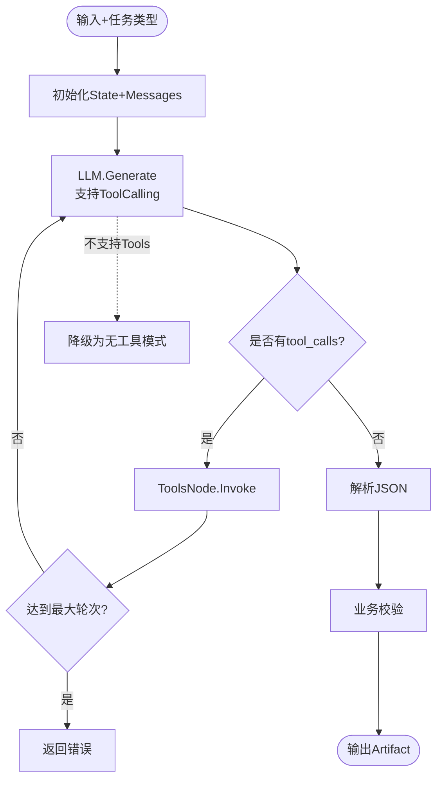
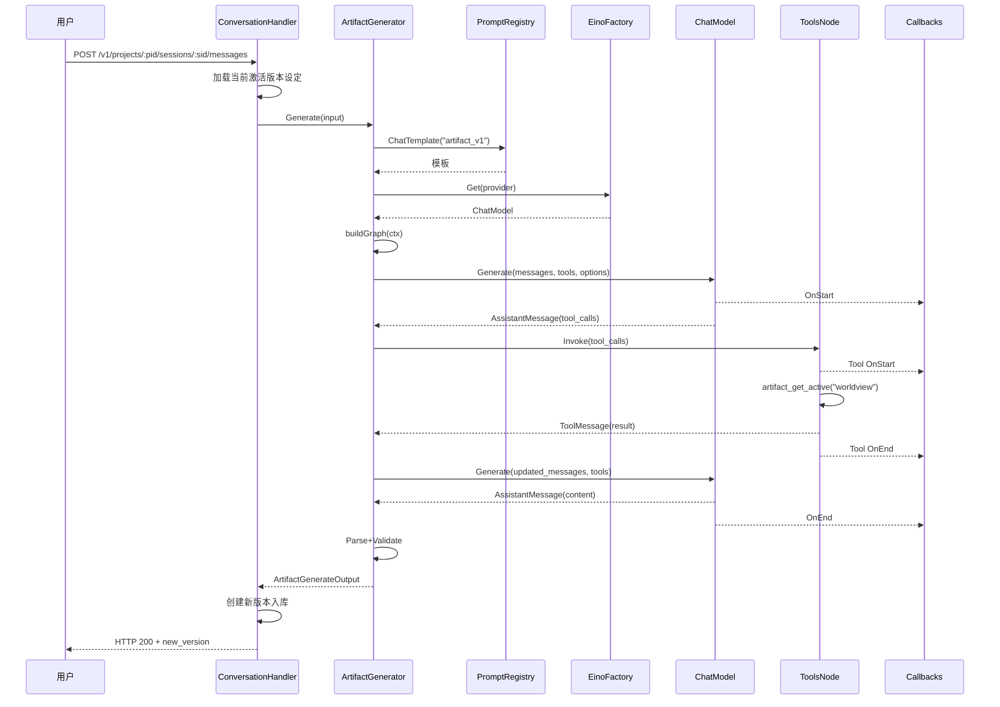

# z-novel-ai-api AI 模块全景梳理

**文档版本**: v1.0  
**更新时间**: 2026-01-07  
**适用范围**: 开发者、架构师、运维人员

---

## 📋 目录

- [1. 模块概述](#1-模块概述)
- [2. 整体架构](#2-整体架构)
- [3. 核心组件详解](#3-核心组件详解)
  - [3.1 基础设施层](#31-基础设施层)
  - [3.2 工作流编排层](#32-工作流编排层)
  - [3.3 应用层](#33-应用层)
  - [3.4 可观测性层](#34-可观测性层)
- [4. 三大 AI 生成器](#4-三大ai生成器)
- [5. 数据流向与调用链](#5-数据流向与调用链)
- [6. HTTP API 接口](#6-http-api接口)
- [7. 配置与部署](#7-配置与部署)
- [8. 未来规划](#8-未来规划)

---

## 1. 模块概述

`z-novel-ai-api`的 AI 模块是整个小说创作系统的核心引擎,负责将用户的创作意图转化为具体的小说设定内容。该模块基于字节跳动的**Eino 框架**构建,提供了从项目孵化到设定迭代的完整 AI 辅助创作能力。

### 1.1 核心能力

| 能力           | 描述                                                                   | 状态        |
| -------------- | ---------------------------------------------------------------------- | ----------- |
| **项目孵化**   | 通过 4 阶段对话(discover→narrow→draft→confirm)将模糊想法转化为正式项目 | ✅ 已完成   |
| **设定迭代**   | 在已有项目上通过多轮对话反复打磨设定(世界观/角色/大纲)                 | ✅ 已完成   |
| **一揽子生成** | 一次性生成完整设定包(Foundation),适合项目冷启动                        | ✅ 已完成   |
| **章节生成**   | 基于大纲与上下文生成章节正文                                           | ⏳ 占位实现 |
| **向量检索**   | RAG 检索与上下文召回                                                   | ⏳ 占位实现 |

### 1.2 技术栈

- **编排框架**: Cloudwego Eino (Chain / Graph / Tool Calling / Callbacks)
- **LLM 提供商**: 支持 OpenAI 格式的多 Provider 切换(OpenAI、DeepSeek 等)
- **向量数据库**: Milvus (规划中)
- **可观测性**: OpenTelemetry (Tracing) + Prometheus (Metrics)

---

## 2. 整体架构

### 2.1 分层架构图



### 2.2 数据流向



---

## 3. 核心组件详解

### 3.1 基础设施层

#### 3.1.1 LLM 工厂 (`internal/infrastructure/llm/eino_factory.go`)

**职责**:管理多个 LLM Provider 的客户端实例,提供统一访问接口。

**核心方法**:

```go
type EinoFactory struct {
    config *config.LLMConfig
    models map[string]model.BaseChatModel  // Provider名称 -> ChatModel实例
}

// 获取指定Provider的ChatModel,支持惰性加载
func (f *EinoFactory) Get(ctx context.Context, name string) (model.BaseChatModel, error)

// 获取默认Provider
func (f *EinoFactory) Default(ctx context.Context) (model.BaseChatModel, error)
```

**特性**:

- ✅ 支持多 Provider 配置(OpenAI、DeepSeek 等 OpenAI 兼容格式)
- ✅ 惰性加载+并发安全(sync.RWMutex)
- ✅ 基于 Eino 的`openai.NewChatModel`适配器

**配置示例**:

```yaml
llm:
  default_provider: "openai"
  providers:
    openai:
      api_key: "sk-xxx"
      base_url: "https://api.openai.com/v1"
      model: "gpt-4o"
      max_tokens: 8000
      temperature: 0.7
    deepseek:
      api_key: "sk-yyy"
      base_url: "https://api.deepseek.com/v1"
      model: "deepseek-chat"
```

#### 3.1.2 向量化客户端 (`internal/infrastructure/embedding/eino_client.go`)

**职责**:提供 Embedding 向量化能力(用于后续 RAG 检索)。

**当前状态**:基础实现已完成,但向量检索服务仍为占位实现。

---

### 3.2 工作流编排层

#### 3.2.1 Prompt 管理 (`internal/workflow/prompt/`)

**设计理念**:

- **统一管理**:所有 Prompt 模板集中存储在`templates/*.txt`
- **版本化**:通过`go:embed`内嵌到二进制,避免运行时文件依赖
- **可复用**:通过 PromptRegistry 按 ID 获取模板

**目录结构**:

```
internal/workflow/prompt/
├── registry.go              # Prompt注册与获取
└── templates/               # Prompt模板文件
    ├── foundation_v1.txt    # Foundation生成模板
    ├── artifact_v1.txt      # Artifact生成模板
    ├── project_creation_v1.txt  # 项目孵化模板
    └── ...
```

**核心代码**:

```go
//go:embed templates/*.txt
var templateFS embed.FS

type PromptRegistry struct {
    templates map[string]string  // PromptID -> 模板内容
}

// 根据PromptID获取ChatTemplate
func (r *PromptRegistry) ChatTemplate(id string) (*prompt.ChatTemplate, error)
```

---

### 3.3 应用层

应用层包含三大 AI 生成器,分别对应不同的创作场景。所有生成器均复用`EinoFactory`作为 LLM 客户端。

#### 3.3.1 通用架构模式



---

### 3.4 可观测性层

#### 3.4.1 Eino Callbacks (`internal/observability/eino/`)

**职责**:通过 Eino 的全局回调机制,在 LLM 和 Tool 调用时自动采集指标。

**核心监控点**:

| 类型          | 监控项     | Prometheus 指标                                           |
| ------------- | ---------- | --------------------------------------------------------- |
| **LLM 调用**  | 调用次数   | `llm_requests_total{workflow,provider,model,status}`      |
|               | 调用耗时   | `llm_latency_seconds{workflow,provider,model}`            |
|               | Token 消耗 | `llm_tokens_total{provider,model,type=prompt/completion}` |
| **Tool 调用** | 调用次数   | `tool_calls_total{workflow,tool,status}`                  |
|               | 调用耗时   | `tool_latency_seconds{workflow,tool}`                     |

**初始化方式**:

在服务启动时(api-gateway / job-worker)注册全局回调:

```go
import einoobs "z-novel-ai-api/internal/observability/eino"

func main() {
    einoobs.InitGlobalCallbacks()  // 注册Eino全局回调
    // ...
}
```

**链路追踪**:

- 集成 OpenTelemetry,每次 LLM 调用自动创建 Span
- 包含关键属性:`llm.provider`、`llm.model`、`llm.prompt_tokens`等

---

## 4. 三大 AI 生成器

### 4.1 ProjectCreationGenerator (项目孵化生成器)

**位置**: `internal/application/story/project_creation_generator.go`

**场景**: 通过 4 阶段对话将用户的模糊想法转化为正式项目。

**编排模式**: **Chain**(顺序流水线)

**核心流程**:



**输入结构**:

```go
type ProjectCreationGenerateInput struct {
    Stage       string           // 当前阶段: discover/narrow/draft/confirm
    Draft       json.RawMessage  // 当前草稿状态
    Prompt      string           // 用户输入
    Attachments []TextAttachment // 附件(参考材料)
    Provider    string           // 指定Provider(可选)
    Model       string           // 指定模型(可选)
}
```

**输出结构**:

```go
type ProjectCreationGenerateOutput struct {
    AssistantMessage     string                       // AI回复文本
    NextStage            string                       // 下一阶段
    Draft                json.RawMessage              // 更新后的草稿
    Action               string                       // 动作类型: continue/create_project
    RequiresConfirmation bool                         // 是否需要用户确认
    ProposedProject      *ProjectCreationProjectDraft // 拟创建的项目信息
    Meta                 LLMUsageMeta                 // 元信息(Token/Model等)
}
```

**安全门控**:

为避免模型幻觉导致误创建项目,服务端增加确定性门控:

1. 必须处于`confirm`阶段
2. 必须从用户输入中检测到明确确认意图(检测否定词优先拦截)
3. 即使模型输出`create_project`也不执行,改为继续要求确认

---

### 4.2 FoundationGenerator (一揽子生成器)

**位置**: `internal/application/story/foundation_generator.go`

**场景**: 项目冷启动时,一次性生成完整设定包(世界观+角色+大纲)。

**编排模式**: **Chain**(顺序流水线)

**核心流程**:



**输出结构 (FoundationPlan)**:

```go
type FoundationPlan struct {
    NovelFoundation NovelFoundation  // 小说基底(标题+简介)
    Worldview       Worldview        // 世界观
    Characters      []Character      // 角色列表
    Relations       []CharacterRelation  // 角色关系
    Volumes         []Volume         // 卷列表
    Chapters        []Chapter        // 章节列表(含大纲)
}
```

**流式支持**:

```go
// 支持SSE流式返回
func (g *FoundationGenerator) Stream(ctx, input) (*schema.StreamReader[*schema.Message], error)
```

**幂等应用**:

- `POST /v1/projects/:pid/foundation/apply`接收 Plan 并落库
- 按`ai_key`做 Upsert,支持重复调用

---

### 4.3 ArtifactGenerator (设定迭代生成器)

**位置**: `internal/application/story/artifact_generator.go`

**场景**: 在已有项目上通过长期会话反复打磨单个设定类型(世界观/角色/大纲)。

**编排模式**: **Graph + ToolCalling** (ReAct 回路)

**核心流程**:



**Tool 集(一期)**:

| Tool 名称             | 功能                       | 示例                                    |
| --------------------- | -------------------------- | --------------------------------------- |
| `artifact_get_active` | 获取指定类型的当前激活设定 | `artifact_get_active("worldview")`      |
| `artifact_search`     | 在设定中做关键词检索       | `artifact_search("主角", "characters")` |
| `project_get_brief`   | 获取项目摘要信息           | `project_get_brief()`                   |

**工具实现** (`internal/application/story/artifact_tools.go`):

```go
// 只读工具,不接收tenant/project参数(由上下文注入)
func makeArtifactToolGetActive(currentWorldview, currentCharacters, currentOutline json.RawMessage) einotool.InvokableTool
func makeArtifactToolSearch(currentWorldview, currentCharacters, currentOutline json.RawMessage) einotool.InvokableTool
func makeProjectGetBriefTool(projectTitle, projectDescription string) einotool.InvokableTool
```

**降级策略**:

- 不支持 ToolCalling 的 Provider 自动切换为"无工具模式"
- 最大工具轮次限制(默认 5 轮),避免成本失控

---

## 5. 数据流向与调用链

### 5.1 完整调用链示例 (Artifact 生成)



---

## 6. HTTP API 接口

### 6.1 项目孵化 (ProjectCreation)

| 接口                                          | 方法 | 描述             |
| --------------------------------------------- | ---- | ---------------- |
| `/v1/project-creation-sessions`               | POST | 创建孵化会话     |
| `/v1/project-creation-sessions/:sid/messages` | POST | 发送对话指令     |
| `/v1/project-creation-sessions/:sid`          | GET  | 获取会话状态     |
| `/v1/project-creation-sessions/:sid/turns`    | GET  | 获取对话轮次历史 |

**请求示例**:

```bash
# 创建会话
curl -X POST http://localhost:8080/v1/project-creation-sessions \
  -H "X-Tenant-ID: tenant-123" \
  -H "Authorization: Bearer xxx" \
  -H "Content-Type: application/json"

# 发送对话
curl -X POST http://localhost:8080/v1/project-creation-sessions/sess-abc/messages \
  -H "Content-Type: application/json" \
  -d '{
    "content": "我想写一个科幻小说"
  }'
```

---

### 6.2 设定迭代 (长期会话)

| 接口                                        | 方法 | 描述                         |
| ------------------------------------------- | ---- | ---------------------------- |
| `/v1/projects/:pid/sessions`                | POST | 创建长期会话                 |
| `/v1/projects/:pid/sessions/:sid/messages`  | POST | 发送任务指令(指定 task_type) |
| `/v1/projects/:pid/artifacts`               | GET  | 获取构件列表                 |
| `/v1/projects/:pid/artifacts/:aid/versions` | GET  | 获取版本列表                 |
| `/v1/projects/:pid/artifacts/:aid/rollback` | POST | 回滚到指定版本               |

**任务类型(task_type)**:

- `novel_foundation`: 小说基底(标题+简介)
- `worldview`: 世界观设定
- `characters`: 角色与关系网络
- `outline`: 卷章大纲

**请求示例**:

```bash
# 发送任务指令
curl -X POST http://localhost:8080/v1/projects/proj-123/sessions/sess-456/messages \
  -H "Content-Type: application/json" \
  -d '{
    "content": "生成一个赛博朋克风格的世界观",
    "task_type": "worldview"
  }'

# 回滚版本
curl -X POST http://localhost:8080/v1/projects/proj-123/artifacts/art-789/rollback \
  -H "Content-Type: application/json" \
  -d '{
    "target_version_id": "v-001"
  }'
```

---

### 6.3 一揽子生成 (Foundation)

| 接口                                    | 方法     | 描述                  |
| --------------------------------------- | -------- | --------------------- |
| `/v1/projects/:pid/foundation/preview`  | POST     | 同步预览生成 Plan     |
| `/v1/projects/:pid/foundation/stream`   | GET/POST | SSE 流式生成          |
| `/v1/projects/:pid/foundation/generate` | POST     | 异步生成(返回 Job ID) |
| `/v1/projects/:pid/foundation/apply`    | POST     | 将 Plan 落库          |

**请求示例**:

```bash
# 同步生成预览
curl -X POST http://localhost:8080/v1/projects/proj-123/foundation/preview \
  -H "Content-Type: application/json" \
  -d '{
    "prompt": "一个关于时间旅行的科幻故事",
    "target_word_count": 100000
  }'

# 应用Plan
curl -X POST http://localhost:8080/v1/projects/proj-123/foundation/apply \
  -H "Content-Type: application/json" \
  -H "Idempotency-Key: unique-key-123" \
  -d '{
    "plan": { ... }  # 从preview返回的Plan
  }'
```

---

## 7. 配置与部署

### 7.1 环境变量配置

```bash
# LLM Provider配置
LLM_DEFAULT_PROVIDER=openai
LLM_PROVIDERS_OPENAI_API_KEY=sk-xxx
LLM_PROVIDERS_OPENAI_BASE_URL=https://api.openai.com/v1
LLM_PROVIDERS_OPENAI_MODEL=gpt-4o
LLM_PROVIDERS_OPENAI_MAX_TOKENS=8000
LLM_PROVIDERS_OPENAI_TEMPERATURE=0.7

# 备用Provider
LLM_PROVIDERS_DEEPSEEK_API_KEY=sk-yyy
LLM_PROVIDERS_DEEPSEEK_BASE_URL=https://api.deepseek.com/v1
LLM_PROVIDERS_DEEPSEEK_MODEL=deepseek-chat
```

### 7.2 本地运行

```bash
# 启动依赖服务
docker compose up -d

# 数据库迁移
make migrate-up

# 启动API网关(默认FEATURES_CORE_ENABLED=false,不依赖gRPC服务)
JWT_SECRET="dev-secret" \
FEATURES_CORE_ENABLED=false \
go run ./cmd/api-gateway
```

### 7.3 Docker 部署

```yaml
# docker-compose.yaml (LLM相关部分)
services:
  api-gateway:
    environment:
      - LLM_DEFAULT_PROVIDER=openai
      - LLM_PROVIDERS_OPENAI_API_KEY=${OPENAI_API_KEY}
      - LLM_PROVIDERS_OPENAI_MODEL=gpt-4o
```

---

## 8. 未来规划

### 8.1 短期规划 (Milestone 3)

- [ ] **增量 Patch 模式**: 支持 AI 仅输出`JSON Patch`,减少 Token 消耗
- [ ] **上下文自动摘要**: 长会话超过阈值时自动压缩历史
- [ ] **校验失败修复回路**: Graph 内 Validate → Repair → Re-run

### 8.2 中期规划 (Milestone 4)

- [ ] **设定冲突扫描**: 检测新生成内容与已有设定的矛盾
- [ ] **多分支创作**: 支持同一节点的 A/B 版本并行与对比
- [ ] **完整 RAG 检索**: Milvus 向量检索与上下文召回

### 8.3 长期规划 (Milestone 5)

- [ ] **章节生成闭环**: 补齐章节正文的同步/SSE/异步路径
- [ ] **Tool 升级为 RAG**: `artifact_search`从字符串匹配升级为向量召回
- [ ] **多模态支持**: 支持图片参考材料输入

---

## 附录

### A. 相关文档索引

| 文档             | 路径                                      | 描述                             |
| ---------------- | ----------------------------------------- | -------------------------------- |
| Eino 编排设计    | `docs/10-Eino编排与工作流设计.md`         | Eino 框架集成规范                |
| 设定生成重构     | `docs/22-Eino设定生成工作流重构设计.md`   | Chain/Graph/ToolCalling 升级记录 |
| 对话驱动技术规范 | `docs/21-对话驱动小说生成一期实施记录.md` | 完整技术规范与实施记录           |
| 项目概览         | `CLAUDE.md`                               | 项目当前状态与目录结构           |

### B. 关键代码入口

| 模块                   | 文件路径                                                   |
| ---------------------- | ---------------------------------------------------------- |
| LLM 工厂               | `internal/infrastructure/llm/eino_factory.go`              |
| ProjectCreation 生成器 | `internal/application/story/project_creation_generator.go` |
| Foundation 生成器      | `internal/application/story/foundation_generator.go`       |
| Artifact 生成器        | `internal/application/story/artifact_generator.go`         |
| Artifact 工具集        | `internal/application/story/artifact_tools.go`             |
| Prompt 注册表          | `internal/workflow/prompt/registry.go`                     |
| Eino 可观测性          | `internal/observability/eino/handler.go`                   |

### C. 术语表

| 术语                | 解释                                        |
| ------------------- | ------------------------------------------- |
| **Artifact**        | 构件,指世界观/角色/大纲等可版本化的设定资产 |
| **Foundation**      | 小说基底,包含完整设定包(世界观+角色+大纲)   |
| **ProjectCreation** | 项目孵化,通过对话引导创建项目               |
| **Chain**           | Eino 顺序流水线,适合线性流程                |
| **Graph**           | Eino 有向图编排,支持分支与回路              |
| **ToolCalling**     | LLM 主动调用工具获取数据                    |
| **ReAct**           | Reasoning + Acting,工具调用回路模式         |
| **ai_key**          | AI 生成内容的稳定标识符,用于精准匹配更新    |

---

**文档维护**: 本文档随项目演进持续更新,如有疑问请参考源码或联系开发团队。
