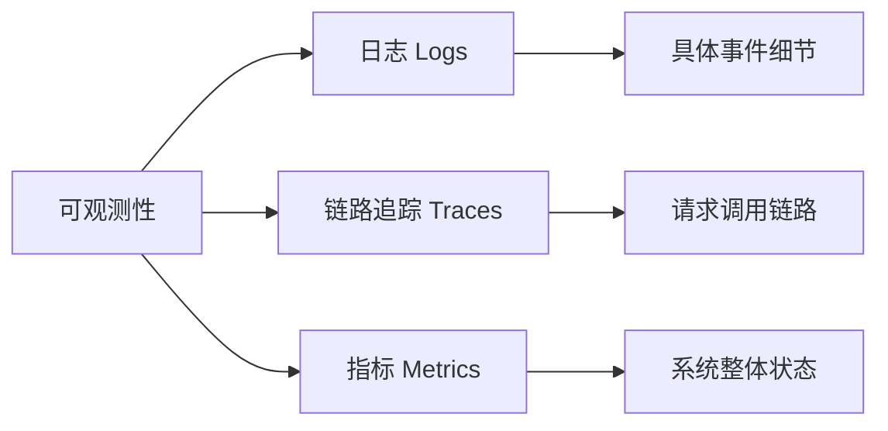
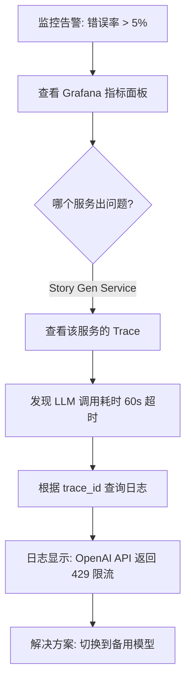

# 系统的可观测性初步认知

> 从零开始理解日志、链路追踪与指标监控

## 引言

我在 vibe coding 一个复杂系统时，AI 在我的系统中加入了链路追踪和指标监控两个组件并和日志组件一起构建出了系统的可观测性，由于我只对日志有过一些了解并不清楚链路追踪和指标监控这两个组件，所以写下这篇文章来记录我对系统可观测性的初步认知。

## 什么是可观测性？

可观测性是指通过系统的外部输出（日志、指标、追踪）来推断系统内部状态的能力。它由三个核心支柱组成：



### 餐厅类比

为了更好理解，我让 AI 用一个大型餐厅来类比：

| 概念         | 餐厅场景                                    | 后端系统                             |
| ------------ | ------------------------------------------- | ------------------------------------ |
| **日志**     | 后厨小本本记录："12:01，5 号桌点了战斧牛排" | `logger.Info("开始生成章节")`        |
| **链路追踪** | 订单追踪表：前台 → 配菜 → 烹饪 → 上菜       | 请求经过：网关 → 生成服务 →LLM→ 返回 |
| **指标**     | 经理仪表盘：当前客流、平均上菜时间          | QPS、P99 延迟、错误率                |

---

## 一、结构化日志 (Logs)

### 1.1 为什么需要结构化日志？

传统的文本日志：

```
2026-01-02 12:00:00 开始生成章节
2026-01-02 12:00:05 生成失败
```

问题：

- 无法快速过滤和查询
- 缺少上下文信息（是哪个用户？哪个项目？）
- 难以与其他系统关联

结构化日志（JSON 格式）：

```json
{
  "time": "2026-01-02T12:00:00Z",
  "level": "INFO",
  "msg": "开始生成章节",
  "trace_id": "abc123",
  "user_id": "user_001",
  "project_id": "proj_456",
  "chapter_id": "chap_789"
}
```

优势：

- ✅ 可以按任意字段查询
- ✅ 自动关联到链路追踪
- ✅ 便于日志聚合分析

### 1.2 项目实现

我在 vibe coding 时，AI 基于 Go 1.21 的官方 `slog` 库进行了如下封装：

```go
// pkg/logger/logger.go
package logger

import (
    "context"
    "log/slog"
)

// FromContext 从上下文中提取追踪信息
func FromContext(ctx context.Context) *slog.Logger {
    logger := Default()

    // 自动注入 trace_id、request_id 等
    if traceID := ctx.Value(TraceIDKey); traceID != nil {
        logger = logger.With("trace_id", traceID)
    }
    if userID := ctx.Value(UserIDKey); userID != nil {
        logger = logger.With("user_id", userID)
    }

    return logger
}
```

**使用示例**：

```go
func GenerateChapter(ctx context.Context, req *Request) error {
    log := logger.FromContext(ctx).With(
        "chapter_id", req.ChapterID,
        "operation", "generate_chapter",
    )

    log.Info("开始生成章节", "word_target", req.WordTarget)

    // 业务逻辑...

    log.Info("章节生成完成",
        "duration_ms", time.Since(start).Milliseconds(),
        "word_count", result.WordCount,
    )

    return nil
}
```

### 1.3 日志级别规范

| 级别  | 用途             | 生产环境    | 示例                                          |
| ----- | ---------------- | ----------- | --------------------------------------------- |
| DEBUG | 调试信息、变量值 | ❌ 关闭     | `log.Debug("检索到的上下文", "context", ctx)` |
| INFO  | 正常业务流程     | ✅ 关键路径 | `log.Info("章节生成完成")`                    |
| WARN  | 可恢复错误、降级 | ✅ 开启     | `log.Warn("LLM 调用超时，切换备用模型")`      |
| ERROR | 业务错误、异常   | ✅ 开启     | `log.Error("数据库连接失败", err)`            |

---

## 二、分布式链路追踪 (Tracing)

### 2.1 为什么需要链路追踪？

在微服务架构中，一个用户请求可能经过多个服务：

```
用户请求
  ↓
API Gateway (80ms)
  ↓
Story Gen Service (2000ms) ← 慢！
  ↓
RAG Retrieval Service (50ms)
  ↓
LLM Provider (1800ms) ← 元凶！
```

**问题**：用户反馈"生成太慢"，到底是哪个环节慢？

**解决方案**：链路追踪会给每个请求分配一个唯一 ID (`trace_id`)，并记录它在每个服务中的耗时。

### 2.2 核心概念：什么是 Span？

如果说 **Trace（追踪）** 是记录一个请求从头到尾的“全过程”，那么 **Span** 就是这个全过程中“其中一站”的记录。

#### 餐厅类比：订单 vs. 步骤

- **Trace**：是整个订单的完整流程（从客人进门下单，到后厨做菜，最后端上桌）。
- **Span**：是流程中的具体某一个环节。例如：
  - Span A：“前台点餐”
  - Span B：“厨师切菜”
  - Span C：“炉头烹饪”

每个 Span 都会记录：这个环节**什么时候开始**，**什么时候结束**，以及**在这个环节里发生了什么细节**。

#### Span 的核心属性

1. **名称**：比如 `HTTP POST /v1/chapters` 或 `DB Query chapters`。
2. **时间戳**：记录开始和结束时间，计算出该步骤的精确耗时。
3. **Parent ID（父节点）**：表示层级关系。比如“做菜”这个 Span 下可以包含“洗菜”子 Span。
4. **Attributes（属性）**：记录具体细节，如 LLM 模型的名称、生成的字数等。

### 2.3 OpenTelemetry 实现

在 vibe coding 时，AI 使用 **OpenTelemetry (OTEL)** 实现追踪：

```go
// pkg/tracer/tracer.go
package tracer

import (
    "go.opentelemetry.io/otel"
    "go.opentelemetry.io/otel/sdk/trace"
)

func Init(ctx context.Context, cfg Config) (func(context.Context) error, error) {
    // 创建 OTLP gRPC exporter
    exporter, _ := otlptracegrpc.New(ctx,
        otlptracegrpc.WithEndpoint(cfg.Endpoint),
        otlptracegrpc.WithInsecure(),
    )

    // 创建 TracerProvider
    tp := sdktrace.NewTracerProvider(
        sdktrace.WithBatcher(exporter),
        sdktrace.WithSampler(sdktrace.TraceIDRatioBased(cfg.SampleRate)),
    )

    otel.SetTracerProvider(tp)
    return tp.Shutdown, nil
}
```

### 2.4 自动注入 Trace ID

通过 HTTP 中间件自动为每个请求生成 `trace_id`：

```go
// internal/interfaces/http/middleware/trace.go
func TraceContext() gin.HandlerFunc {
    return func(c *gin.Context) {
        span := trace.SpanFromContext(c.Request.Context())
        if span.SpanContext().IsValid() {
            traceID := span.SpanContext().TraceID().String()

            // 注入到 Context
            ctx := logger.WithContext(c.Request.Context(), logger.TraceIDKey, traceID)
            c.Request = c.Request.WithContext(ctx)

            // 返回给客户端
            c.Header("X-Trace-ID", traceID)
        }
        c.Next()
    }
}
```

### 2.5 手动创建 Span

在业务代码中监控特定函数：

```go
func (s *StoryGenService) callLLM(ctx context.Context, prompt string) (string, error) {
    // 创建子 Span
    ctx, span := tracer.Start(ctx, "LLM openai generate")
    defer span.End()

    // 添加业务属性
    span.SetAttributes(
        attribute.String("llm.provider", "openai"),
        attribute.String("llm.model", "gpt-4o"),
        attribute.Int("prompt.length", len(prompt)),
    )

    result, err := s.llmClient.Generate(ctx, prompt)
    if err != nil {
        span.RecordError(err)
        return "", err
    }

    span.SetAttributes(attribute.Int("response.tokens", result.TokensUsed))
    return result.Text, nil
}
```

### 2.6 Span 命名规范

| 操作类型  | 命名格式                  | 示例                     |
| --------- | ------------------------- | ------------------------ |
| HTTP 入口 | `HTTP {method} {path}`    | `HTTP POST /v1/chapters` |
| gRPC 调用 | `gRPC {service}/{method}` | `gRPC StoryGen/Generate` |
| 数据库    | `DB {operation} {table}`  | `DB query chapters`      |
| LLM 调用  | `LLM {provider} {action}` | `LLM openai generate`    |
| 业务逻辑  | `{service}.{method}`      | `StoryGen.buildContext`  |

---

## 三、指标监控 (Metrics)

### 3.1 为什么需要指标？

日志和追踪都是**事件级别**的，而指标是**聚合统计**的。

**场景**：你不可能每秒看 1000 条日志，但你可以看一个图表：

- 当前 QPS：850 req/s
- P99 延迟：1.2s
- 错误率：0.5%

### 3.2 Prometheus 指标类型

| 类型          | 说明             | 示例                          |
| ------------- | ---------------- | ----------------------------- |
| **Counter**   | 只增不减的计数器 | 总请求数、Token 消耗量        |
| **Gauge**     | 可增可减的瞬时值 | 当前并发数、队列积压          |
| **Histogram** | 分布统计         | 请求延迟（P50/P99）、响应大小 |

### 3.3 项目指标定义

```go
// pkg/metrics/metrics.go
package metrics

import "github.com/prometheus/client_golang/prometheus/promauto"

var (
    // HTTP 请求指标
    HTTPRequestsTotal = promauto.NewCounterVec(
        prometheus.CounterOpts{
            Namespace: "z_novel",
            Subsystem: "http",
            Name:      "requests_total",
            Help:      "Total number of HTTP requests",
        },
        []string{"method", "path", "status"},
    )

    HTTPRequestDuration = promauto.NewHistogramVec(
        prometheus.HistogramOpts{
            Namespace: "z_novel",
            Subsystem: "http",
            Name:      "request_duration_seconds",
            Help:      "HTTP request duration in seconds",
            Buckets:   []float64{.01, .05, .1, .25, .5, 1, 2.5, 5, 10},
        },
        []string{"method", "path"},
    )

    // LLM 指标
    LLMTokensUsed = promauto.NewCounterVec(
        prometheus.CounterOpts{
            Namespace: "z_novel",
            Subsystem: "llm",
            Name:      "tokens_used_total",
            Help:      "Total tokens used for LLM calls",
        },
        []string{"provider", "model", "type"}, // type: prompt/completion
    )
)
```

### 3.4 指标采集中间件

```go
// internal/interfaces/http/middleware/metrics.go
func Metrics() gin.HandlerFunc {
    return func(c *gin.Context) {
        start := time.Now()
        path := c.FullPath()
        method := c.Request.Method

        c.Next()

        status := strconv.Itoa(c.Writer.Status())
        duration := time.Since(start).Seconds()

        // 记录指标
        metrics.HTTPRequestsTotal.WithLabelValues(method, path, status).Inc()
        metrics.HTTPRequestDuration.WithLabelValues(method, path).Observe(duration)
    }
}
```

### 3.5 业务指标示例

```go
func (s *StoryGenService) Generate(ctx context.Context, req *Request) error {
    start := time.Now()

    // 业务逻辑...

    // 记录业务指标
    status := "success"
    if err != nil {
        status = "failure"
    }

    metrics.StoryGenerationTotal.WithLabelValues(req.TenantID, status).Inc()
    metrics.StoryGenerationDuration.WithLabelValues(req.TenantID).Observe(
        time.Since(start).Seconds(),
    )
    metrics.LLMTokensUsed.WithLabelValues("openai", "gpt-4o", "completion").Add(
        float64(result.TokensUsed),
    )

    return err
}
```

---

## 四、三者的协同工作

### 4.1 中间件执行顺序

```go
// internal/interfaces/http/router/router.go
func (r *Router) setupMiddleware() {
    r.engine.Use(middleware.Recovery())      // 1. Panic 恢复
    r.engine.Use(middleware.RequestID())     // 2. 生成 request_id
    r.engine.Use(middleware.Trace())         // 3. 生成 trace_id
    r.engine.Use(middleware.TraceContext())  // 4. 桥接：trace_id → logger
    r.engine.Use(middleware.Metrics())       // 5. 记录指标
}
```

### 4.2 完整调用链示例

```
1. 用户请求到达
   ↓
2. RequestID 中间件 → 生成 request_id: "req_abc123"
   ↓
3. Trace 中间件 → 生成 trace_id: "trace_xyz789"
   ↓
4. TraceContext 中间件 → 将 trace_id 注入到 logger Context
   ↓
5. 业务代码执行
   logger.Info(ctx, "开始生成")
   → 日志自动包含 trace_id
   ↓
6. Metrics 中间件 → 记录请求耗时和状态
   ↓
7. 响应返回，Header 包含 X-Trace-ID
```

### 4.3 故障排查流程

**场景**：用户反馈"章节生成失败"



**实际操作**：

1. **Grafana 看板** → 发现 `z_novel_http_requests_total{status="500"}` 激增
2. **Jaeger 追踪** → 搜索最近的失败 trace，发现 `LLM openai generate` Span 耗时异常
3. **日志查询** → 用 trace_id 在 Loki 中搜索：
   ```json
   {
     "trace_id": "xyz789",
     "level": "ERROR",
     "msg": "LLM call failed",
     "error": "rate limit exceeded"
   }
   ```

---

## 五、配置与部署

### 5.1 配置文件

```yaml
# configs/config.yaml
observability:
  logging:
    level: "info"
    format: "json"
    output: "stdout"

  tracing:
    enabled: true
    exporter: "otlp"
    endpoint: "localhost:4317"
    sample_rate: 1.0 # 生产环境建议 0.1

  metrics:
    enabled: true
    port: 9091
    path: "/metrics"
```

### 5.2 本地开发环境

```bash
# 使用 Docker Compose 启动完整可观测性栈
cd z-novel-ai-api
docker compose up -d tempo grafana prometheus
```

### 5.3 访问地址

- **Grafana**：http://localhost:3000 （统一可视化看板 & 链路追踪）
- **Prometheus**：http://localhost:9090 （查询指标）
- **Tempo API**：http://localhost:3200 （追踪后端 API）
- **应用指标端点**：http://localhost:8080/metrics

---

## 六、最佳实践

### 6.1 日志

✅ **推荐**：

```go
logger.Info(ctx, "章节生成完成",
    "chapter_id", chapterID,
    "word_count", wordCount,
    "duration_ms", duration,
)
```

❌ **避免**：

```go
logger.Info(ctx, fmt.Sprintf("章节 %s 生成完成，字数 %d", chapterID, wordCount))
```

### 6.2 链路追踪

✅ **推荐**：为关键操作创建 Span

```go
ctx, span := tracer.Start(ctx, "DB query chapters")
defer span.End()
```

❌ **避免**：过度追踪（每个函数都创建 Span 会影响性能）

### 6.3 指标

✅ **推荐**：使用有意义的标签

```go
metrics.LLMTokensUsed.WithLabelValues("openai", "gpt-4o", "completion").Add(tokens)
```

❌ **避免**：标签基数过高（如用 user_id 作为标签会导致指标爆炸）

---

## 七、总结

简单来说，系统的可观测性（Observability） 是一种通过观察系统的外部输出（即日志、指标和链路追踪），来推断其内部状态的能力。

---

## 参考资料

- [OpenTelemetry 官方文档](https://opentelemetry.io/docs/)
- [Prometheus 最佳实践](https://prometheus.io/docs/practices/)
- [Go slog 包文档](https://pkg.go.dev/log/slog)
